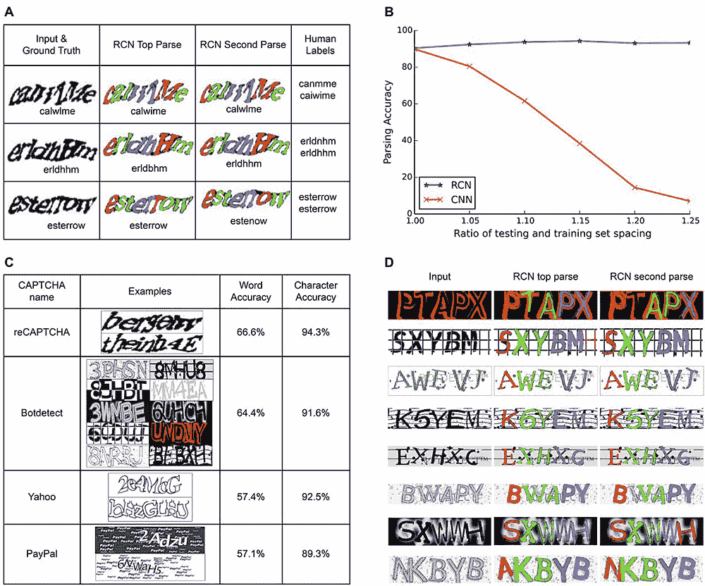
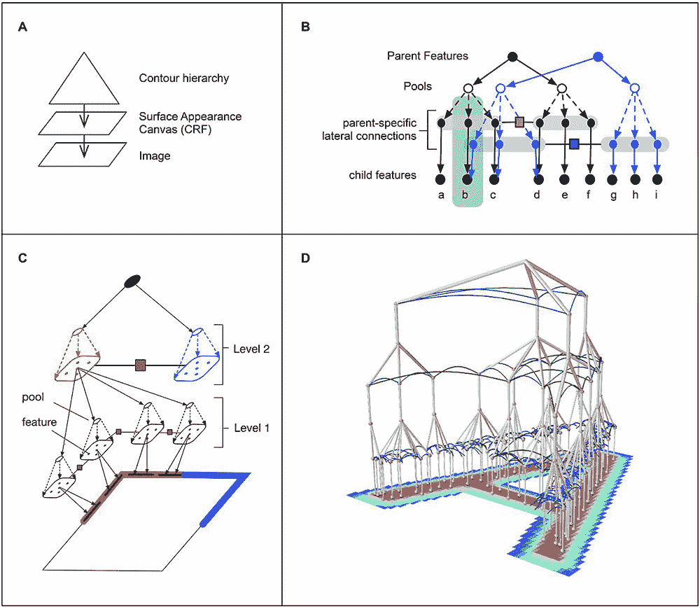
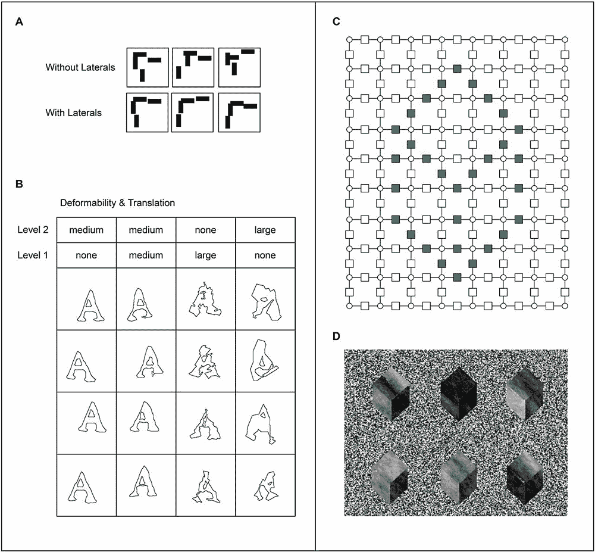
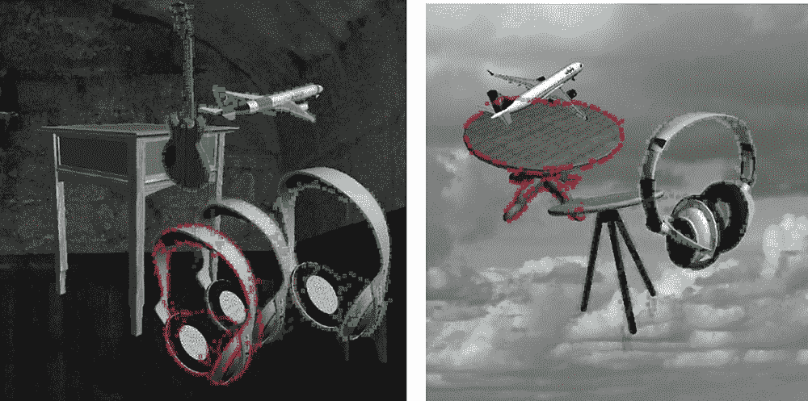

# 人工智能初创公司用类似人类的视觉破解验证码

> 原文：<https://thenewstack.io/ai-human-like-vision-cracks-captcha-code/>

人工智能越来越擅长以前认为机器很难掌握的事情。但在很大程度上，机器在实现类似人类的智能之前还有很长的路要走，然而没有一周没有一些相对重大的人工智能突破成为新闻。

现在，似乎又一个障碍被打破了。旧金山初创公司 [Vicarious](https://www.vicarious.com/) 开发了一种能够可靠地解决[验证码](https://en.wikipedia.org/wiki/CAPTCHA)的人工智能，例如，在能够在网站上发表评论之前，你必须解决那些带有弯曲或扭曲字体的自动安全验证谜题。

## 通过图灵测试

CAPTCHA 代表“完全自动化的公共 T4 图灵测试(Turing test)来区分计算机和人类”，自 20 世纪 90 年代发明以来，一直被用于阻止在线欺诈或垃圾邮件机器人。这是一个基于数学家艾伦·图灵在 20 世纪 50 年代提出的想法的测试，被认为是区分人类和机器，因为它们被设计成对人类来说相对容易，但对机器来说很难解决。

然而，正如 Vicarious' [研究](http://science.sciencemag.org/content/early/2017/10/26/science.aag2612)显示的那样，现在有可能调整计算机视觉技术，使其更接近人类视觉(和智力)的工作方式，这使计算机能够像人类一样解决验证码。给你一个基准的概念，如果一个算法可以解决验证码至少百分之一的时间，那么它被认为是无效的。

当然，有深度学习神经算法能够解码验证码，但这些以前的例子需要大量的训练数据来完成。在这些情况下，这些模型是在数百万张图像上训练的，例如特定字体的实际字母串，而不是像人类能够做的那样，能够从几个训练示例中“概括”并识别扭曲下的单个字母。

比较递归皮层网络(RCN)、卷积神经网络(CNN)和两个亚马逊机械土耳其工人之间的解析结果。

## 递归皮层网络

相比之下，Vicarious' AI 能够通过建立一小组训练样本来解决验证码。为了实现这一目标，该公司开发了一种称为递归皮层网络(RCN)的人工神经网络，能够在“广义”学习中实现这一飞跃。

Vicarious 联合创始人 D. Scott Phoenix 在一份新闻稿中说:“最近的人工智能系统，如 IBM 的 Watson 和深度神经网络，都依赖于蛮力:将海量计算能力与海量数据集连接起来。”“这是第一次实现这种独特的人类感知行为，并且它使用相对少量的数据和计算能力。替代算法实现了更接近实际人脑的有效性和效率水平。”

据该公司称，RCN 能够以 66.6%的准确率解决 [reCAPTCHAs](https://en.wikipedia.org/wiki/ReCAPTCHA) (CAPTCHA 测试包括扫描旧书和报纸上的单词，同时也是数字化书籍的一种方式)。相比之下，僵尸工具检测的比例为 64.4%，雅虎为 57.4%，贝宝为 57.1%。与其他用于文本识别的深度学习模型相比，RCN 能够实现相同或更高的准确性，同时仅使用一小部分训练数据，大约少 300 倍。

RCN 能够通过模仿类似人类的“类脑视觉系统”来实现这种高效率。

Vicarious 的联合创始人[迪利普·乔治](http://www.dileepgeorge.com/)在 [NPR](http://www.npr.org/sections/thetwo-way/2017/10/26/560082659/ai-model-fundamentally-cracks-captchas-scientists-say) 节目中解释道:“在训练阶段，[RCN]会建立接触到的信件的内部模型。”。“所以如果你让它接触 As 和 Bs 以及不同的角色，它会建立自己的内部模型，这些角色应该是什么样子。所以它会说，这些是字母的轮廓，这是字母的内部，这是背景，等等。然后，当一个新的图像出现时…它试图解释这个新图像，试图用它以前见过的字符来解释这个新图像的所有像素。所以它会说，A 的这一部分不见了，因为它在 b 后面。"

除了应用这种模型来计算验证码，该团队还使用 RCN 来识别随机背景图像中的多个对象，这意味着该技术可以在解析文本之外的其他方面使用。

这是人工智能迈出的一大步，它可以学习对它看到的东西进行更广泛的、类似人类的概括，潜在地使机器能够更好地理解，从而更好地互动和操纵周围的世界。但这也意味着面向文本的验证码将很快变得无效，需要开发更好的安全验证措施，因为机器在智能方面变得更像人类。

图像:替代

<svg xmlns:xlink="http://www.w3.org/1999/xlink" viewBox="0 0 68 31" version="1.1"><title>Group</title> <desc>Created with Sketch.</desc></svg>