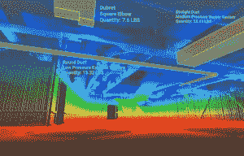
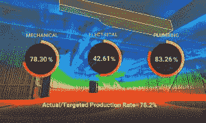
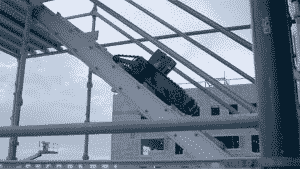

# 人工智能和激光射击机器人如何提高建筑行业的生产率

> 原文：<https://thenewstack.io/ai-laser-shooting-robots-can-boost-productivity-construction-industry/>

尽管最近在计算机辅助设计、制造和项目管理方面取得了进步，但建筑业仍然是效率最低的行业之一。据分析人士称，令人震惊的是，98%的大型建筑项目平均比预算多交付 80 %,比计划晚交付 20 个月。即使在以效率著称的国家，如德、日，建筑业的生产率仍然停滞不前，而在美国，自 20 世纪 60 年代以来，T2 的生产率实际下降了一半。

这种可悲的事态背后有许多[广泛的因素](https://www.economist.com/news/business/21726714-american-builders-productivity-has-plunged-half-late-1960s-efficiency-eludes)，但加州帕洛阿尔托的初创公司 [Doxel](https://www.doxel.ai/) 旨在通过将自主的、[配备激光雷达](https://en.wikipedia.org/wiki/Lidar)的机器人和人类监督的无人驾驶飞机引入建筑工地来提高整体生产率。我们的想法是每天部署这些机器，以便他们可以使用脉冲激光来监控、跟踪和绘制当天的进度:安装了什么，安装是否正确，以及整体生产率目标是否达到。观看 Doxel 的一个机器人的动作:

https://youtu.be/0369vlp_fjg

虽然人类通常会试图在任何给定的项目中管理这些方面，但得益于激光和 3d 视觉技术，Doxel 的机器可以比人类更准确地检测和评估不正确的安装。

这些信息被放置在一个高度精确和标记的三维地图中，然后被发送到云端，在那里由 Doxel 的三维语义深度学习算法进行处理和分析。然后，任何问题都会立即通知人力经理，以便他们可以立即得到解决，而不是几周(甚至几个月)以后。

## 几分钟内反应

Doxel 的机器人和人工智能辅助建筑项目管理方法将解决现场生产力落后的因素之一:在错误逐渐演变成大而昂贵的麻烦之前发现错误，最终导致项目预算超支和延迟交付。

“你不能改善你不能衡量的东西，”Doxel 首席执行官兼创始人[绍拉布·拉达](https://www.linkedin.com/in/saurabh-ladha-3b801812/)说。“如果不能实时了解质量和进度，经理们根本无法提高工作效率。我们的交钥匙解决方案可以跟踪项目预算和时间表中数十万个项目的进度，将实际绩效与原始计划进行比较。这对整个资本项目团队来说是一次变革。有了 Doxel 的系统，项目经理可以在几分钟内做出反应，而不是几个月，提高了 50%的生产率，并使项目比预算低 25%。”

这些数字并不太离谱:在加利福尼亚州圣地亚哥的一个医疗办公楼的最近项目中，Doxel 的三维扫描机器人每天使用 4.5 小时，生产率提高了 38%，项目最终比预算低 11%，从而节省了资金和时间。

这可能看起来不多，但在一个全球价值 10 万亿美元、但几十年来生产率没有显著提高的行业，这可能会改变游戏规则。

## 三维语义算法

据该公司称，这些相对令人印象深刻的改进是由他们的软件实现的，该软件能够区分任何给定建筑工地上复杂的内部组件，从管道系统到电线和通风管道系统。所有这些物品都可以进行三维扫描，并映射到 Doxel 的数据点云中，精确度高达 2 毫米。

Doxel 首席技术官兼联合创始人罗宾·辛格(Robin Singh)表示:“建筑项目涉及数百万个外观相似的组件，它们在黑暗的环境中紧紧地挤在一起。“对于计算机视觉软件来说，这是一场挑战的莫洛托夫鸡尾酒会。通常，这种算法需要的训练数据量将是巨大的，即使如此，结果也可能不可靠。利用我们专有的 3-D 语义算法，我们已经能够用一小部分训练数据获得更可靠的结果。我们的算法不仅根据颜色，还根据形状、位置和大小来识别物体并将其置于特定的环境中。”

【T2

使用这种反馈系统来提高建筑行业的生产率似乎对投资者很有吸引力:最近，该公司设法获得了 450 万美元的资金。他们现在计划为合同价值超过 2000 万美元的项目提供服务，但很可能在未来，这种系统将变得足够广泛，可以用于较小的商业和住宅项目。随着[增材制造](https://thenewstack.io/3d-printed-buildings-made-by-robots-for-the-earth-moon-and-mars/)、[自组装](https://thenewstack.io/shapeshifted-things-4d-printed-materials-programmed-for-self-transformation/)、[增强现实](https://thenewstack.io/smartphone-app-can-control-robots-augmented-reality/)、[开源自动化](https://thenewstack.io/wikihouse-open-source-sustainable-house-designs-that-anyone-can-build/)和人工智能技术的发展，建筑行业将在未来几年内发生翻天覆地的变化，创造出更高效、更安全、更节能、可持续和创新的建筑。

图片:Doxel

<svg xmlns:xlink="http://www.w3.org/1999/xlink" viewBox="0 0 68 31" version="1.1"><title>Group</title> <desc>Created with Sketch.</desc></svg>