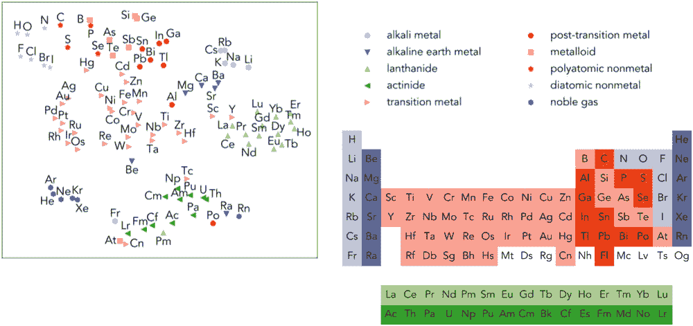

# 艾通过分析旧的研究论文获得新的科学发现

> 原文：<https://thenewstack.io/ai-makes-new-scientific-discoveries-by-analyzing-old-research-papers/>

人工智能可能被用于自动化新的科学发现，正如美国能源部劳伦斯伯克利国家实验室的研究人员最近发现的那样，他们让一个无人监管的人工智能去分析数百万份旧的科学论文。

令人惊讶的是，该算法——之前没有接受过材料科学方面的训练——能够提前预测现在已知的热电材料，这表明它可以用来回顾过去的科学论文，以发现人类专家可能遗漏的新知识。

该团队的论文发表在最近一期的*自然*上，概述了当前的问题，因为它与今天的科学文献站在一起:其中许多是基于文本的，这使得它很难分析，无论是通过传统的统计分析还是通过现有的机器学习方法。

不幸的是，这些论文的作者经常在数据之间建立深刻的联系，并就正在研究的问题得出有价值的结论，因此这些论文中嵌入了许多机器不容易理解的知识，人类消化这些知识也很耗时。虽然之前有人试图使用机器学习方法，如[自然语言处理](https://thenewstack.io/recent-advances-deep-learning-natural-language-processing/)来从科学论文中检索信息，但这种方法的缺点是需要大量的人工监督，也就是说数据集必须手动标记才能训练人工智能模型。

相比之下，劳伦斯伯克利团队的解决方案是使用一种叫做 [Word2vec](https://en.wikipedia.org/wiki/Word2vec) 的机器学习算法，它完全不需要任何人类的监督。相反，它通过建立[单词嵌入](https://en.wikipedia.org/wiki/Word_embedding)来工作，其中来自文本主体的单词和短语被映射为向量，这有助于保留和表示它们的句法和语义关系。这里的想法是，具有相似含义的单词将经常一起出现在相似的上下文中，因此将具有相似的单词嵌入。例如，当该算法在一篇科学论文的足够多的文本上训练时，它将为单词“iron”生成一个向量，该向量将它与单词“steel”的联系比与单词“biological”的联系更紧密。

## 发现新的联系

在他们的测试中，该团队从 1922 年至 2018 年间发表在 1000 多种期刊上的科学论文中收集了 330 万份摘要。然后，该算法处理了摘要中发现的大约 50 万个独特的单词，并将每个单词转换为 200 个向量的数组。尽管人工智能之前没有接受过材料科学方面的训练，但在这个过程之后，它仍然能够“学习”科学概念，并推断数据点之间的关系，只需分析摘要中单词的位置以及它们何时彼此共现。

“在没有告诉它任何材料科学的情况下，它学习了元素周期表和金属晶体结构等概念，”团队领导和论文合著者 Anubhav Jain 在[声明](https://newscenter.lbl.gov/2019/07/03/machine-learning-algorithms-can-uncover-hidden-scientific-knowledge/)中说。“这暗示了这项技术的潜力。但我们发现的最有趣的事情可能是，你可以使用这种算法来解决材料研究中的差距，即人们应该研究但迄今为止没有研究的事情。”

特别是，该算法证明它可以预测新的热电材料，这些材料可以有效地将热量转化为电能。在团队的测试中，该算法对可能的热电材料进行了多种预测，其中前十个预测显示了高于平均水平的热电特性。

此外，该团队测试了该算法“发现”新材料的能力，方法是只输入过去某一年的摘要，比如说只输入到 2009 年，看看它是否会提供该日期之后发现的材料。然后，他们将这些结果与那一年之后的实际发现进行比较，发现大量这些实质性的预测——比随机做出的预测多四倍——出现在截止日期之后的研究中。

“老实说，我没想到这个算法对未来的结果有这么强的预测能力，”贾恩说。“我曾想，也许这种算法可以描述人们以前做过的事情，但不能得出这些不同的联系。当我不仅看到预测，还看到预测背后的推理时，我感到非常惊讶，比如[半赫斯勒](https://en.wikipedia.org/wiki/Heusler_compound)结构，这是目前热电领域非常热门的晶体结构。”

但是这种算法不仅仅局限于发现新材料。因为它一开始没有在特定的数据集上训练，所以该算法可以很容易地推广和用于其他领域，例如发现新药，甚至发现新的跨学科联系，因为它在无人监督的情况下工作，以发现可能被忽略的新联系——甚至可能提前几年。此外，根据该团队的说法，这种方法可以用于自动提取仍然隐藏在旧科学论文中的知识，这些知识可能不会为人所知。

人工智能越来越多地被用来帮助人类完成各种日常任务——从[自动化游戏设计](/deep-learning-ai-generates-realistic-game-graphics-by-learning-from-videos/)，到计算出蛋白质折叠的[复杂性](/deepmind-ai-makes-breakthrough-with-protein-folding-problem/)，甚至“读取”我们的思想[重建我们的记忆](/researchers-use-ai-read-reconstruct-memories/)。正如这些结果所显示的，人工智能也可以用来发现新的科学发现。

图片:劳伦斯伯克利国家实验室

<svg xmlns:xlink="http://www.w3.org/1999/xlink" viewBox="0 0 68 31" version="1.1"><title>Group</title> <desc>Created with Sketch.</desc></svg>