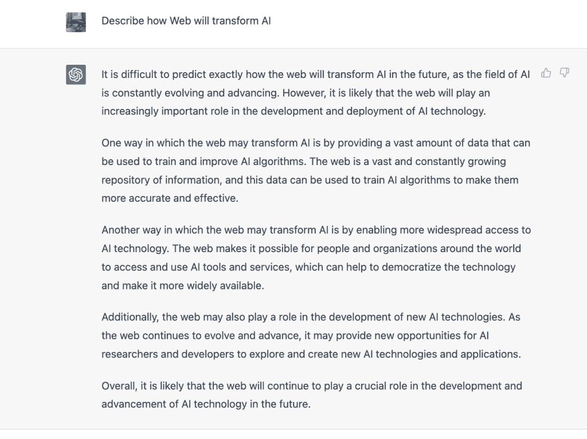

# ChatGPT:人工智能走向网络

> 原文：<https://thenewstack.io/ai-moves-to-the-web/>

人工智能(AI)已经转移到网络上。

就像很多次一样，网络已经将大多数人的抽象概念转变成数百万人开始使用的工具。

最新的例子是 OpenAI 的 chat GPT T1，即 T2 LLM T3，在五天内注册了超过 100 万人，现在当人们接受新的表达形式时，它被用于人类提供的一切。正是 AI 发展所需要的。这是对人工智能如何帮助一些石油公司或警察如何使用它进行监视的所有过于平凡的例子的创造性震撼。现在，基于人工智能的工具掌握在数百万人手中。你应该为此感谢网络。

它不是第一个出现在网络上的人工智能技术，但可以说是最具影响力的。去年，生成式人工智能随着 OpenAI 的 Dall-E 来到了 web 上，然后是 Dall-E 2，它在秋天与 API 一起发布。这为网络用于增强人工智能指明了方向。[稳定扩散’](https://thenewstack.io/top-5-internet-technologies-of-2022/)s 方向指向与 Dall-E 2 相同的方向。Stability.ai 的文本到图像技术现在可以在网上制作图像了。

ChatGPT 绝不是稳定的。它反映了人工智能的新生性质及其在深入网络结构时的影响。发布时，开发人员利用 ChatGPT 来回答 StackOverflow 上有时会出错的问题。数据是新的石油。石油有多种用途，但当数据泄漏时，它会形成一条令人讨厌的油膜，任何人都无法幸免。

但是网络人工智能准备好了吗？ChatGPT 没有 API，开发者批评它是缺失的一部分。OpenAI 确实计划为 ChatGPT 发布一个 API。

但是开发者想要一个 API。看看 GitHub 就知道了。

我们已经看到了 ChatGPT 将如何改变 web 开发的例子。无代码云功能提供商 [Alphi.dev 的联合创始人](https://www.alphi.dev/)写了一篇关于可视化开发人员如何更快地构建 web 应用程序的帖子——原型将比以往更快。

OpenAI 也是 GitHub CoPilot 背后的力量，据微软称，它现在是该公司开发人员工具的主要部分。例如，它现在用于生成 HTML、JavaScript 和 React。一名开发人员使用 GitHub CoPilot 创建了一个在亚马逊上寻找廉价商品的网站。他没有写任何代码。副驾驶做了所有的工作。

网络将使人工智能更容易为人们所用。当然，ChatGPT 也同意这一点:下面是一次交流，我问该服务，网络将如何改变人工智能:

正如我们无数次观察到的那样，网络将加速变化并定义其方向。Restful APIs 连接了服务，并导致了开发者主导的努力，吸引了数百万不同的社区。它导致了改变新闻采集方式、活动人士抗议方式以及极端组织及其国家赞助者如何误导信息的沟通形式。

现在，我们在这里，知道我们可以期待我们以前看到的。一个无尽的分布式网络，将变得越来越神奇、怪异、有用、邪恶和有趣，这取决于你遵循和建立的模型。

<svg xmlns:xlink="http://www.w3.org/1999/xlink" viewBox="0 0 68 31" version="1.1"><title>Group</title> <desc>Created with Sketch.</desc></svg>