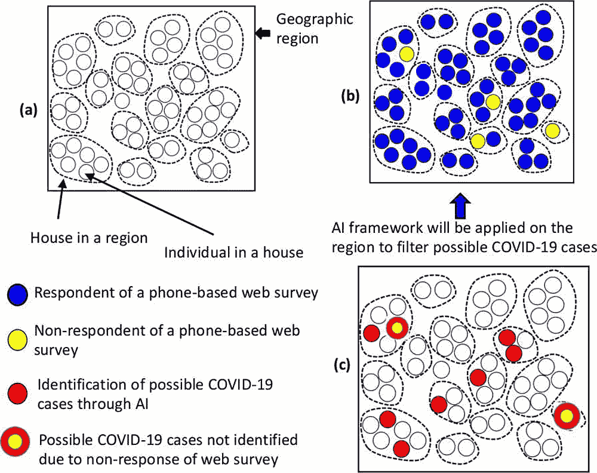

# 人工智能为家庭冠状病毒风险评估的潜在应用提供动力

> 原文：<https://thenewstack.io/ai-powers-a-potential-app-for-at-home-coronavirus-risk-assessment/>

随着关于新冠肺炎的报道继续占据新闻周期，研究人员和医疗保健专业人员正在夜以继日地寻找遏制和减轻新型冠状病毒全球影响的方法。科学家们已经开始对最近开发的[冠状病毒疫苗](https://www.livescience.com/first-person-coronavirus-vaccine-clinical-trial.html)进行人体试验，而其他研究人员正在努力创造诊断工具，这将有助于加快美国的测试速度。随着[各种各样的应对措施](https://www.nytimes.com/2020/03/15/us/united-states-coronavirus-response.html)目前正在联邦和州一级实施，似乎以技术为导向的方法可能会极大地帮助填补空白，特别是当涉及到[美国冠状病毒检测水平不足](https://www.cnn.com/2020/03/18/us/coronovirus-testing-supply-shortages-invs/index.html)的时候。

来自奥古斯塔大学佐治亚医学院的一个这样的小组现在正在开发一个人工智能驱动的应用程序，允许个人在家中舒适地评估他们感染病毒的风险。除了为用户提供快速评估方法，并指导那些风险最大的人去最近的检测机构，该应用程序还将为当地卫生当局提供实时收集的信息，以便他们可以制定更有针对性的治疗和预防措施。

## '家庭评估'

据该团队称，他们的初步论文最近发表在《感染控制医院流行病学杂志》上，其想法是帮助识别感染病毒风险最高的人，并加快筛选和识别真正处于风险中的人的过程，以便只有那些真正需要的人才能获得有限的医疗资源，从而帮助降低冠状病毒整体影响的严重性。

“这是一个基于人工智能模型的框架，用于识别有新冠肺炎风险的人和没有风险的人，”健康科学教授兼佐治亚州医学院[传染病分部](https://www.augusta.edu/mcg/medicine/infdis/)理论和数学建模实验室主任 Arni S.R. Srinivasa Rao 博士说。他说:「我们的目标是以家庭为基础进行评估，以便只有真正有需要的人才能使用医院的设施。我们在几个新冠肺炎病毒感染率高的国家看到，医院没有足够的人力和床位来照顾病人。因此，需要为真正有需要的人腾出与卫生相关的劳动力和设施。”

据 Rao 称，该应用程序将使用“[反应式](https://codeburst.io/four-types-of-ai-6aab2ce57c19)”类型的机器智能，这将帮助专家收集和处理大量数据，以帮助他们根据任何给定地区的新冠肺炎风险状况做出决策。

用户将输入人口统计信息，如年龄、性别、种族，以及重要的详细信息，如个人在过去 14 天内是否去过中国、伊朗或意大利等国家的疫情“热点”。该应用程序还将为个人用户以及那些密切接触但可能无法完成自己的医疗问卷的人收集可能症状的信息，如发烧、咳嗽、呼吸急促、疲劳、痰多、头痛、腹泻和肺炎。

利用这些数据，该应用的算法可以确定用户的风险级别——无风险、低风险、中等风险或高风险——然后自动通知最近的测试中心安排在其场所或远程进行健康检查，或者派遣移动测试团队进行检查。

目前，饶和论文合著者何塞·瓦兹奎博士(医学教授兼 MCG 传染病部主任)正在与开发人员合作，在未来几周内将该应用程序的最终版本发布到网上。它将在奥古斯塔大学的网站上作为免费服务提供，用户可以下载 iOS 或 Android 应用程序。Rao 承认，整个过程进展非常迅速，如果需要的话，可能还需要一些额外的时间来获得 FDA 对这种移动医疗应用的批准。

“作为一名数学建模师，我也会花时间来建模传播，但相反，我选择快速建立人工智能模型，并根据 CDC Atlanta 制定的公开发布的指南，开发了一种可以识别新冠肺炎可能病例的理论，”Rao 解释说。“我认为关键的挑战是识别处于危险中的个人，因为这种病毒是新的。”

该团队的最终目标是提高可及性，加快识别高危人群，降低成本，缓解随着危机的加剧，医疗专业人员目前面临的时间压力和短缺。在未来，两人设想该应用程序可以适用于其他流行病，以便专家可以更好地确定处于威胁下的地区或人口统计数据，使他们能够相应地分配医疗资源，或在大型聚会之前快速预筛选人员。

瓦兹奎说:“我们正努力减少病人与非病人的接触。”。“我们还希望确保受感染的人得到明确的诊断，并得到他们可能需要的支持性护理。”

*看团队论文[这里](https://www.cambridge.org/core/services/aop-cambridge-core/content/view/7151059680918EF9B8CDBCC4EF19C292/S0899823X20000616a.pdf/identification_of_covid19_can_be_quicker_through_artificial_intelligence_framework_using_a_mobile_phonebased_survey_in_the_populations_when_citiestowns_are_under_quarantine.pdf)。*

图片:奥古斯塔大学

<svg xmlns:xlink="http://www.w3.org/1999/xlink" viewBox="0 0 68 31" version="1.1"><title>Group</title> <desc>Created with Sketch.</desc></svg>