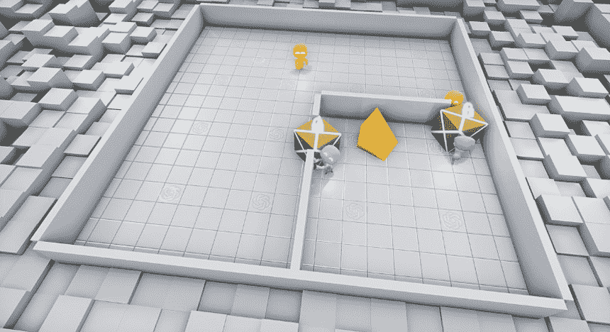
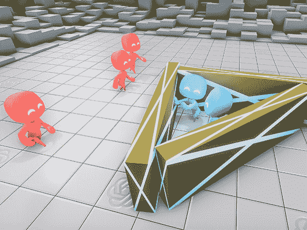
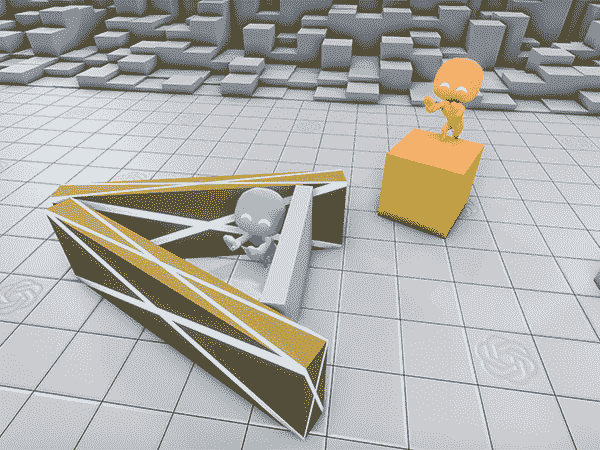
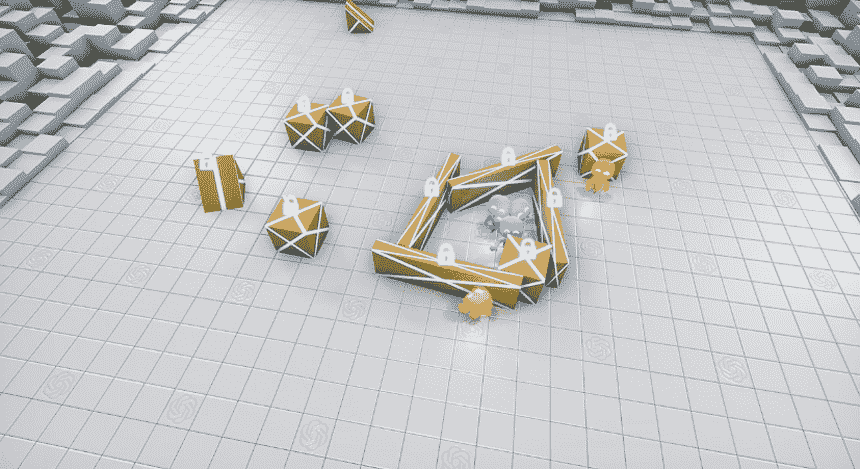

# 人工智能发明新的捉迷藏策略让研究人员大吃一惊

> 原文：<https://thenewstack.io/ai-surprises-researchers-by-inventing-new-hide-and-seek-strategies/>

进化出更高水平的智能需要什么？对于我们人类来说，我们知道经历了数百万年的进化，我们才从单纯的哺乳动物进化到能够使用语言和工具的直立行走的两足动物，此外还在进化过程中建立了复杂的社会。同样，发展类似人类的人工智能(AGI)的道路也不一定是一成不变的；这可能是一个渐进的过程，可能需要不同的研究人员探索一系列不同的技术，以赋予人工智能能力[从错误中学习](/openai-algorithm-allows-ai-to-learn-from-its-mistakes/)，[，【理智】](https://thenewstack.io/googles-deepmind-ai-now-capable-deep-neural-reasoning/)，甚至[发展自己的语言](https://thenewstack.io/ai-bots-create-language-communicate/)。

除了这些重要的里程碑，AI 似乎还能够开发使用工具的能力，并独自发明新的、意想不到的策略，以便在虚拟游戏环境中获胜。来自旧金山研究实验室 [OpenAI](https://openai.com/) 的最新研究表明，当多个 AI 智能体被放置在一个简单的虚拟环境中，只有几个物体，并且只给定关于捉迷藏游戏的基本规则时，随着时间的推移，它们会“训练”自己进行协作，并将这些物体用作工具，此外还会带来研究人员没有预料到的相对创新的获胜策略。观察这个过程是如何展开的:

[https://www.youtube.com/embed/kopoLzvh5jY?feature=oembed](https://www.youtube.com/embed/kopoLzvh5jY?feature=oembed)

视频

## 紧急工具使用

使用工具使我们人类能够在地球上最荒凉的地区生存和发展，反过来，工具和技术的迭代改进进一步加速了人类智慧的集体进化。虽然我们花了数百万年才走到这一步，但在这些新行为和自学策略出现之前，这项研究中的人工智能代理花了大约 5 亿次捉迷藏游戏。

正如研究团队的[博客文章](https://openai.com/blog/emergent-tool-use/)中所概述的那样，这项研究由两种不同类型的人工智能代理组成:一组的任务是寻找隐藏在环境中的代理，另一组的目标是隐藏自己。代理被放置在一个封闭的虚拟空间中，其中还包括一些物体，如坡道、墙壁和盒子(任一小组都可以移动或锁定)。实验使用了强化学习算法，当代理成功完成任务时，它会奖励他们点数，本质上是激励他们通过试错继续学习。此外，还使用了多智能体学习技术，智能体通过与其环境和相互之间的动态交互进行学习。

有了这些要素，代理人的第一个捉迷藏游戏就没什么特别了，只展示了空间内的随机运动。然而，在第一批游戏和 200 万个游戏之间的某个地方，“寻找者”最终学会了追逐“隐藏者”。在经历了 269 万次游戏后，隐藏者学会了用积木抓住和关闭门口。大约在第 800 万次游戏时，搜索者学习使用斜坡跳过路障，促使隐藏者通过将斜坡隐藏在房间内来适应。在这一点上，团队注意到隐藏者自己开发了合作策略，例如协调谁来阻挡门，谁来取斜坡。

但研究人员并没有就此止步:他们在一个更随机、更开放的环境中重新进行了实验，在现有的固定隔断、活动街区和坡道的基础上增加了活动墙。虽然在这种更复杂的随机环境中学习需要更长的时间，但它仍然以与以前类似的方式发展:在隐藏者学会建造庇护所以躲避搜索者之前，搜索者代理人花了 2200 万次游戏来学习如何在这种更复杂的环境中追逐隐藏者。在大约 8800 万场比赛中，搜索者(再次)通过使用坡道来越过这些避难所。在 1.15 亿场游戏中，隐藏者通过锁定斜坡来适应，从而使它们不可用。

接下来发生的事情完全出乎研究人员的意料:在 388 场游戏中，寻求者以“箱子冲浪”策略对这种新的威慑做出反应，将一个箱子带到一个锁着的斜坡上，以便跳到它上面，然后用它“冲浪”越过隐藏者的庇护所——这是代理人自己发明的一种新颖的举动，但研究人员没有预见到。这个实验一直持续到大约 5 亿个游戏，在这一点上，隐藏者通过锁定视线内的所有坡道、盒子和墙壁来适应。

“当代理人在捉迷藏中相互训练时，会出现多达六种不同的策略，”该小组解释说。“每一个新策略都会给代理人带来一种前所未有的压力，促使他们进入下一阶段。请注意，没有直接的动机让代理人与物体互动或探索；相反，新兴战略……是……多主体竞争和简单的捉迷藏动态的结果。”

这些结果强调了事情可能变得多么不可预测，尤其是在现实世界的应用中大规模实施时。与此同时，它还指出了一种可能，即人工智能将找到新的方法来解决我们人类从未想象过的问题，这表明人工智能的共同适应策略可能有一天会产生复杂而智能的行为，只有当它被释放并任由其发展时才会出现——希望能帮助人类而不是伤害人类。

在 [OpenAI](https://openai.com/blog/emergent-tool-use/) 阅读更多内容。

图片:OpenAI

<svg xmlns:xlink="http://www.w3.org/1999/xlink" viewBox="0 0 68 31" version="1.1"><title>Group</title> <desc>Created with Sketch.</desc></svg>