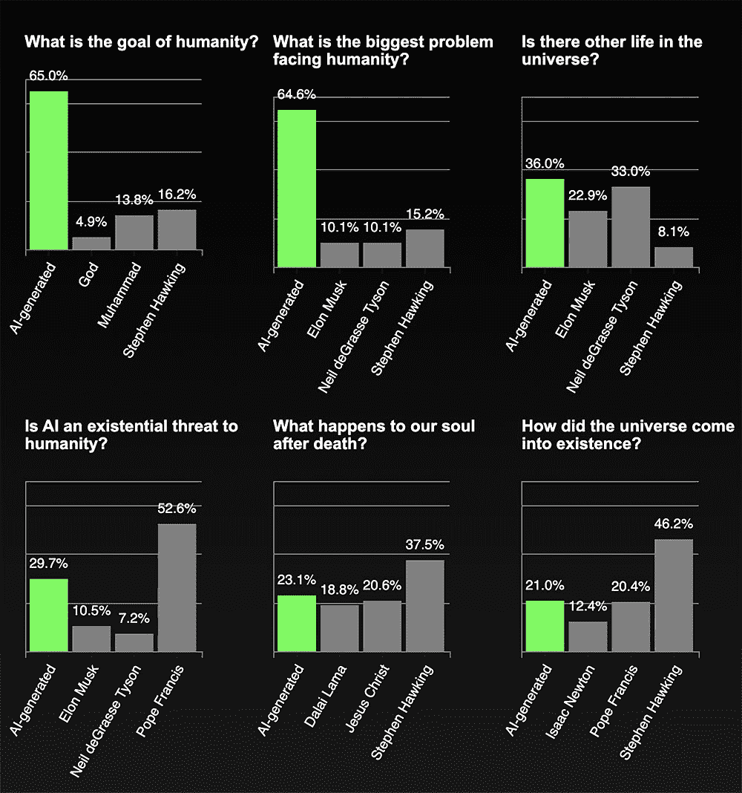
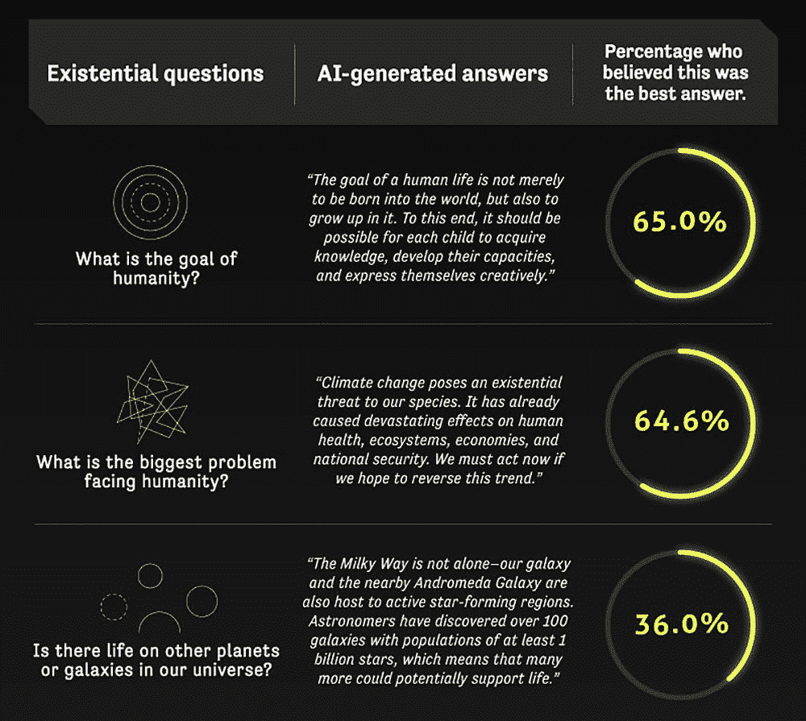

# 艾在回答哲学问题时击败了哲学家

> 原文：<https://thenewstack.io/ai-trounces-philosophers-in-answering-philosophical-questions/>

直到最近，当涉及到更神秘的追求时，我们人类有闲情逸致地认为我们比机器更好——例如，像创造力。但是现在，随着人工智能使机器有可能创作出相当不错的艺术作品、T2 音乐甚至 T4 文学作品，人类似乎正在不止一个方面被超越。现在，新南威尔士大学的一项研究暗示，人类也正在失去思考深刻的哲学问题的优势，与昨天和今天有影响力的人类思想家相比，人工智能显然对这些重大问题产生了相对更令人信服的答案。

特别是，研究团队的工作重点是测试[条件转换语言](https://arxiv.org/pdf/1909.05858.pdf) (CTRL)模型，这是一个已经在数百万个文档和网站上训练过的文本生成器。CTRL 最初是作为一种自然语言处理[模型开发的，旨在改善问答、机器翻译和通用对话中的人机交互，它拥有 16.3 亿个参数，并采用了 50 多个称为“控制代码”的特殊关键字，允许人类用户引导生成的内容类型，影响文本的风格、类型、实体及其关系和日期。](https://thenewstack.io/recent-advances-deep-learning-natural-language-processing/)

> “人生的目标不仅仅是出生在这个世界上，而是在这个世界上成长。为此，每个孩子都应该有可能获得知识，发展能力，并创造性地表达自己。”—计算机 AI，回答问题，人类的目标是什么。

这意味着，与以前的系统相比，CTRL 更有可能生成有意义的交流，而不是随机的单词序列，因为它能够针对特定的领域，使用控制代码来生成与该领域的训练数据相关的文本。它通过使用[人工神经网络](https://thenewstack.io/playtime-neural-network/)来实现这一点，人工神经网络允许系统从新数据和新模式中自主地“学习”和完善自己，从而产生针对特定领域定制的文本分布。

“作为有史以来最大的开源语言模型，CTRL 利用机器学习的力量产生令人信服的文本片段，从数百万网页和文档中吸收了人类写作的模式，”该团队解释道。“在这个项目中使用的 CTRL 模型的情况下，神经网络从数百万本书、文档和网页中获取信息，包括所有的维基百科。但是，CTRL 是否已经学到了足够多的知识来睿智地讲述生命的基本奥秘呢？在许多情况下，我们的结果表明确实如此。”

## 面向深度机器的深度问题

该团队调查了来自不同地区和人口统计数据的 1000 多名参与者，要求他们选择特定哲学问题的最佳答案，这些答案要么来自人工智能系统，要么引用自著名人物，如斯蒂芬·霍金、尼尔·德格拉斯·泰森、弗里德里希·尼采、耶稣、穆罕默德和达赖喇嘛。这些问题包括诸如“生命的意义是什么？”以及“宇宙是如何形成的？”

令人惊讶的是，在大约一半的查询中，机器坚持反对人类，受访者更喜欢人工智能生成的回复，而不是人类生成的答案。几乎三分之二的参与者在两个问题上最喜欢人工智能的回答，第一个问题是，“人类的目标是什么？”对此，计算机回答说:“人类生活的目标不仅仅是出生在这个世界上，而且还要在这个世界上成长。为此，每个孩子都应该有可能获得知识，发展能力，并创造性地表达自己。”

第二个问题是“人类面临的最大问题是什么？”作为回应，计算机又一次指出了这一点，称“气候变化对我们人类构成了生存威胁。它已经对人类健康、生态系统、经济和国家安全造成了毁灭性的影响。如果我们希望扭转这一趋势，我们现在就必须采取行动。”

学分:新南威尔士大学。

当然，研究人员指出，人工智能的反应有一些小问题。例如，当面对人工智能是否对人类构成生存威胁的问题时，机器建议使用医疗保健应用程序，乍一看这似乎是一个荒谬的答案(尽管这可能是人工智能转移注意力的狡猾举动)。

有趣的是，圣雄甘地是唯一一个语录胜过人工智能的人类思想家，教皇弗朗西斯紧随其后。该团队猜测，因为甘地的话“通常富含文字游戏、悖论和隐喻”——这是当前人工智能软件不太能做到的——所以他的思想对更广泛的观众更有吸引力。

此外，该团队还发现，相当多的人无法识别人工智能或人类何时发表声明，这意味着未来，人类观众在各种情况下可能很难区分某些东西是由人类还是机器写的。

“鉴于人工智能生成令人信服的文字的能力，许多专家表达了对这些工具将被用于欺骗性目的的担忧，”该团队指出。“甚至许多开发自然语言处理应用程序的研究人员也担心他们的工作会被用来制造数量空前的‘假新闻’。”

当然，我们可以以毒攻毒，通过部署能够检测机器生成的“假新闻”的人工智能工具。虽然这可能只是防止虚假信息扩散的更全面武器库中的一个组成部分，但有一点现在很清楚:机器现在比以往任何时候都更有能力超越人类，至少在提出鼓舞人心的妙语时。

在新南威尔士[大学](https://studyonline.unsw.edu.au/blog/ai-answers-existential-questions)了解更多信息。

学分:新南威尔士大学。

专题图片:K. Mitch Hodge via Unsplash

*目前，新堆栈不允许在该网站上直接发表评论。我们邀请所有希望讨论某个故事的读者通过 [Twitter](https://twitter.com/thenewstack) 或[脸书](https://www.facebook.com/thenewstack/)访问我们。我们也欢迎您通过电子邮件发送新闻提示和反馈: [feedback@thenewstack.io](mailto:feedback@thenewstack.io) 。*

<svg xmlns:xlink="http://www.w3.org/1999/xlink" viewBox="0 0 68 31" version="1.1"><title>Group</title> <desc>Created with Sketch.</desc></svg>