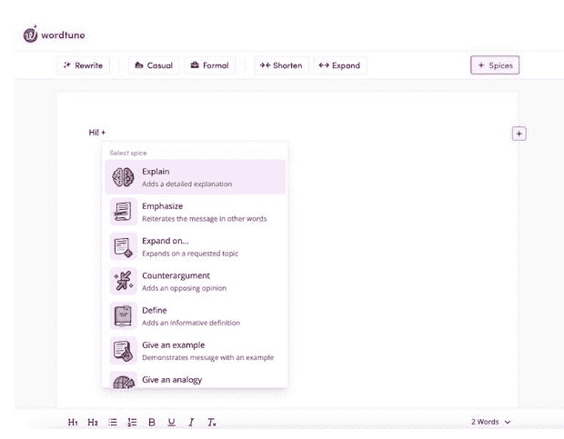

# AI21 实验室押注准确性，开发实际人工智能方法

> 原文：<https://thenewstack.io/ai21-labs-bets-on-accuracy-develops-approach-for-factual-ai/>

ChatGPT 令人印象深刻，但它缺少一个重要的组成部分。这是根据 Ehud Karpas 的说法，他是开发文本生成人工智能的 AI21 实验室的班长。

“ [ChatGPT 很神奇](https://thenewstack.io/5-ways-chatgpt-could-supercharge-chatbots/)。令人印象深刻。它做的事情真的令人兴奋，”[卡帕斯](https://www.linkedin.com/in/ehud-udi-karpas-18084813/?originalSubdomain=il)告诉新堆栈。“我想我应该这样说:一篇好的文章需要通顺，需要引人入胜。但我不认为这是故事的全部。我认为它还需要可靠。”

ChatGPT 不能完全保证这一点，它在 2022 年初结束了训练。众所周知，[聊天机器人](https://thenewstack.io/chatbots-will-bring-ai-smarts-to-your-organization/)可能会转向[不准确的领域](https://thenewstack.io/just-out-of-the-box-chatgpt-causing-waves-of-talk-concern/)。

## 优先考虑准确性

AI21 实验室采取了一种不同的方法，上周推出了 [Wordtune editor 的](https://app.wordtune.com/read) 12 香料——本质上，“香料”是人工智能驱动的过滤器，可以帮助作家完成从建立论点到制造相关笑话的一切事情。

领导该项目的 Karpas 说:“我们非常强调 Wordtune 香料的可靠性和事实准确性。”。“这是这个项目的两个关键支柱之一:抓住作者的意图和事实的准确性。”

为此，12 种香料中的 3 种是事实:统计事实、历史事实和自然事实。但人工智能做了两件事来帮助作者确保他们的作品是正确的:首先，它通过提供原始材料的链接来寻找来源；其次，它进行搜索以确保信息是最新的，Karpas 解释说。

“如果模型产生了一个统计事实——42%的人做这做那——那么它听起来非常有说服力。这可能完全是胡说八道，”卡帕斯说。“所以我们有一个链接，你可以点击链接，你可以看到信息来自哪里。”

图片来自 A121 实验室

最终的结果是一个聊天机器人，它更像是一个合作作者，帮助提示作者事实、鼓舞人心的报价，甚至笑话——取决于作者选择的香料——来推动文章前进。

## 没有“统一的语言模型”

其中一个关键是不要只依赖一个语言模型——这是一个很好的酷演示的方法，Karpas 打趣道——而是使用语言模型的组合，他说，就像该公司的[侏罗纪 X.](https://www.ai21.com/blog/jurassic-x-crossing-the-neuro-symbolic-chasm-with-the-mrkl-system)

“我们的想法是，没有一个模型可以统治所有这些，让我们这么说吧——如果你想建立良好的技术，你必须将各个部分结合起来，”他说。“我们认为，即使是最好的模型也会有弱点，因为它在某些方面是好的，但它也有缺陷。我们认为一套更广泛的工具会给我们带来更强大的功能。”

上周， [AI21 实验室发布了一篇关于其语言模型方法的研究论文](https://uploads-ssl.webflow.com/60fd4503684b466578c0d307/63c6c20dec4479564db21819_NEW_In_Context_Retrieval_Augmented_Language_Models.pdf)。它指出，文本- [生成人工智能](https://thenewstack.io/the-power-and-ethical-dilemma-of-ai-image-generation-models/)通常包含事实上的不准确或错误，这在处理不常见的领域或最新信息时会加剧。该论文提出，解决这个问题的一种方法是通过检索增强语言建模(RALM)来建立语言模型，“通过对从外部知识源检索的重复文档进行条件化来进行生成”

该论文解释说，RALM 系统包括两个高级组件:文档检索，或选择作为条件的文档集；或者确定如何将所选文档合并到[语言模型](https://thenewstack.io/service-simplifies-natural-language-processing-for-developers/) (LM)生成过程中。

“在这篇论文中，我们表明，通过使文档选择机制适应语言建模的任务，也可以获得实质性的收益，这使得在使用现成的 LMs 时，甚至通过 [API](https://thenewstack.io/state-of-the-api-monetizing-apis-deployment-is-on-the-rise/) access，实现 RALM 的许多好处成为可能，”草案称。

该文件提出了一个 RALM 框架，AI21 称之为“背景 RALM”使用这种方法，该公司能够在所有被检查的文本体上看到 ALM 架构中 LM 性能提高了两到三倍，即使使用简单的现成检索器也是如此。该文件还确定了该公司用来提高 LAM 性能的其他方法。

## 开发者的收获

虽然开发人员无法获得特定的人工智能驱动香料，但 AI21 实验室确实为其 A21 平台提供了几个[开发人员 API，用于构建理解和生成自然语言的人工智能应用程序，由该公司的语言模型(LMs)提供支持。](https://docs.ai21.com/docs/overview)

开发人员可以通过调用 Jurassic-1 语言模型的完整 API 来为输入提示生成文本编译，该 API 可以嵌入到应用程序或服务中，或者通过他们的交互式 web 环境，这将允许开发人员试验这些模型。它们还通过调用重写 API 为解释函数提供了专门的模型，通过调用总结 API 为总结函数提供了专门的模型。

Karpas 从他的香料工作中为开发人员提供了一些收获。

“当你在这么大的范围内建造这么宽的东西时，你必须灵活地解决每个问题——在我们的情况下，是每一种香料。所以，是的——我希望所有 12 种香料都有一个解决方案；生活并不总是那么美好。”

但他说，该团队没有编写 12 种不同的解决方案，而是将 12 种解决方案分为四类，并使用类似的解决方案来解决它们，有效地减少了一个令人生畏的问题。

“我的方法是:总是抓住问题，把它分解，然后看看你能把什么放在一起，”他说。“我们开始首先担心质量，然后才是延迟和价格。让它工作，然后让它高效地工作。”

<svg xmlns:xlink="http://www.w3.org/1999/xlink" viewBox="0 0 68 31" version="1.1"><title>Group</title> <desc>Created with Sketch.</desc></svg>