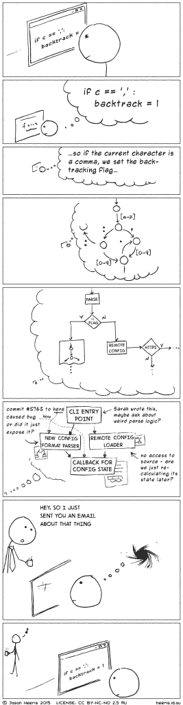

# AIOps 和高效多任务的神话

> 原文：<https://thenewstack.io/aiops-and-the-myth-of-efficient-multitasking/>

 [多米尼克·威灵顿，Moogsoft

多米尼克·威灵顿是 Moogsoft 的全球 IT 宣传员。他从事 IT 运营已经超过 20 年，在 SecOps、云计算和数据中心自动化等多个领域工作。](https://www.moogsoft.com/) 

很难找到任何一个工作场所没有通过鼓励多任务处理来提高生产力，但是当思考“一定有更好的方法来处理这个问题”时，It 部门无疑是一个主要的用例 IT 员工永远处于信息过载的状态，类似于工作场所打地鼠，或者神话中的九头蛇，一个失败的任务变成了两个新的挑战。这不是任何人的错，只是这个角色的要求太高了。虽然战略和解决方案已经存在了几十年，但持续的斗争仍然存在。

在当今的 IT 环境中，错误或缓慢的响应时间会直接影响企业的底线。多任务处理可能会增加这些问题，因此，被认为是生活窍门的事情实际上是一个灾难。通常的想法是，“我能同时处理多项任务，而不是把时间和精力集中在一项挑战上吗？”虽然这是一个光荣的目标，但最近的科学研究报告了一个不幸的答案:不，多任务处理不会让你更有效率。

### 直面多任务处理能提高生产率的神话

简单地说，生活在当今世界意味着你必须能够快速调整任务并克服新出现的障碍，但每个人都面临着自己的平衡行为失败的问题。我们的大脑，从一个孩子到一个首席执行官，无论是比喻还是现实，在处理 的能力上，都是有限的。麻省理工学院的研究人员最近证实了这一事实，神经科学家兼麻省理工学院 Picower 学习与记忆研究所和大脑认知科学部主任 Earl K. Miller 教授在接受 Moogsoft 采访时就此话题分享了更多信息。

“当我们认为自己在同时处理多项任务时，我们实际上并没有同时做两件事。米勒说:“我们正在做的是在不同的任务之间快速切换。这种在任务之间切换的过程——尽管多任务者不会有意识地注意到——伴随着米勒所说的“切换成本”

当进行多任务处理时，人类大脑需要用一个新的“网络”来重新配置自己，并回溯以找出上一个任务停止的地方。米勒分享道，“这让你效率低下，因为你花了大量宝贵的大脑计算时间在任务之间来回切换，而不是真正用这些时间去思考。”

从一个任务切换到另一个任务的成本——上下文切换——在编程界早就知道了，可以追溯到 Joel Spolsky 2001 年的文章 [“认为有害的人工任务切换”](https://www.joelonsoftware.com/2001/02/12/human-task-switches-considered-harmful/) 。编程需要维护程序当前状态、输入和输出的心理模型。由于该模型的复杂性，它很容易被中断所破坏，并且需要很长时间来重建——程序员将这一过程称为“重新加载状态”

对 IT 运营的关注较少，但同样的问题也适用:上下文切换，尤其是重复的切换，可能会导致重大问题。例如，一名 IT 操作员同时处理各种支持请求，却无法跟踪每个请求的进度或解决方案。此外，现代基础设施非常复杂，而且通常至少是部分自动化的，这意味着在做出改变的同时，应该考虑它们对许多不同的远程移动部件的影响。在任何情况下，随着向开发运维、基础设施即代码和不可变基础设施的转变，通过自动化版本控制管道,“开发人员”和“操作人员”之间的区别变得前所未有的模糊。

不管你的正式工作描述是什么，底线是，试图兼顾多个复杂的任务很可能会因为信息和任务过载而导致错误，从而导致潜在的严重后果。

### 停止杂耍任务，开始单一任务

米勒认为一心多用是有害的，但是那些认为一心多用有好处的人大错特错了，“这是自欺欺人。那些一心多用的人这样做是因为他们无法抗拒一心多用的冲动。他们这样做，然后合理化，”他声称。"大脑真正擅长的一件事是欺骗自己."

更简单地说:

1.  如果你认为你特别擅长多任务处理，那么事实可能正好相反。
2.  没有人比他们更擅长多任务处理。

相反，一个有益的工作环境会尽可能优先考虑单一任务。“我们的大脑不能忽视肩膀上的信息轻拍，对新信息的渴望，”米勒分享道。“你必须用你的执行大脑来计划单任务，并排除干扰。”

当把它应用到 IT 中时，单一任务意味着尽可能地组织、简化和优先处理单个任务。在一定程度上，IT 运营部门必须对问题通知做出反应，但这种情况应该很少。一个经常处于救火模式的 IT 部门也不可能对未来进行战略性思考。试图进行广泛的战略变革，同时还要抓住新的机会并密切关注事件队列，这肯定会导致某个地方缺少分号，从而导致重大生产中断。

过去曾试图将被动工作限制在一线员工，有时被称为“电话防火墙”，保护更多高级人员免受干扰。然而，这种结构往往适得其反，导致不必要的升级，而没有适当的支持流程来管理它们，并且除了之前记录的分心影响之外，还会导致有经验的操作员精疲力竭。换句话说，试图只是部分反应是行不通的；需要对整个组织进行安排，以便积极主动。

在过去，重组整个组织以适应这种类型的工作流似乎是一项艰巨的任务。幸运的是，像 IT 运营的人工智能、 [AIOps](https://www.moogsoft.com/resources/aiops/guide/everything-aiops/) 这样的新技术解决方案，可以自动完成对永无止境的警报进行分类和优先排序的琐碎任务，可以提供急需的缓解。从本质上讲，这种方法将处理无休止的事件和警报的被动、重复工作委托给自动化流程，结合大数据、算法和机器学习技术来确定哪些是重要问题，专家操作员应该主动参与、关注和战略性地思考这些问题，而不要分心。

强大的员工队伍，无论是在 IT 部门还是在会计部门，都专注于手头最重要的任务。当将单任务策略与在后台处理任务的技术相结合时，员工最终可以管理他们大脑的带宽，以实现推动品牌前进的创造力和创新。

通过 Pixabay 的特征图像。

<svg xmlns:xlink="http://www.w3.org/1999/xlink" viewBox="0 0 68 31" version="1.1"><title>Group</title> <desc>Created with Sketch.</desc></svg>