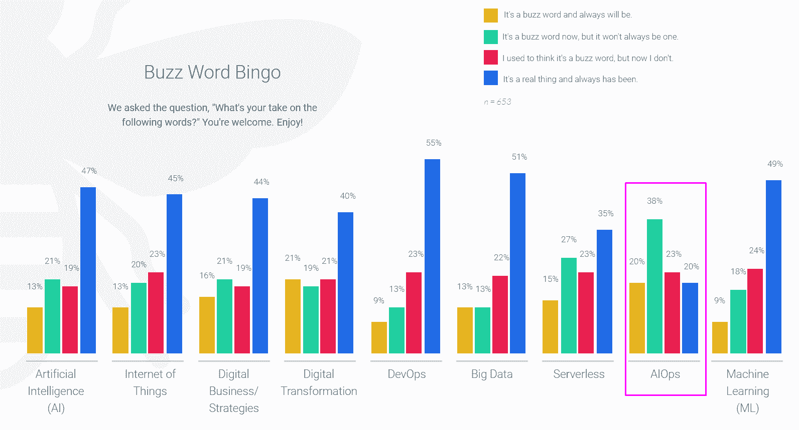
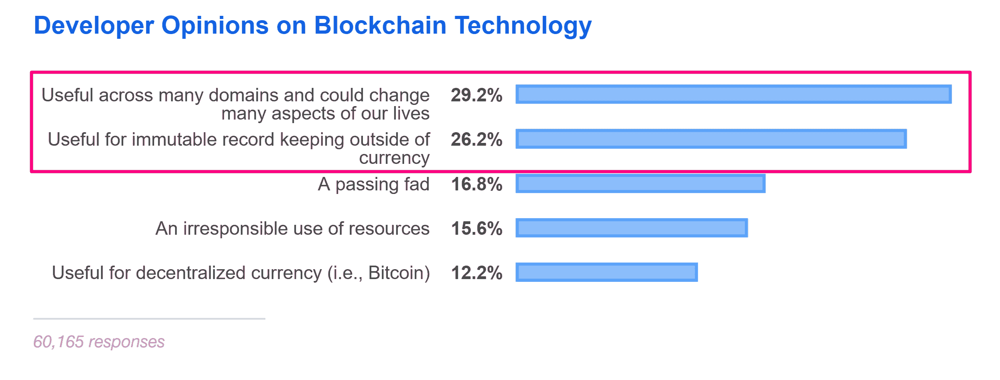

# AIOps、区块链等流行语

> 原文：<https://thenewstack.io/aiops-blockchain-and-other-buzz-words/>

区块链泡沫已经破裂，现在看起来 AIOps(人工智能辅助的 it 运营)可能是下一个被夸大的时髦词。根据 Turbonomic 的 2019 年多云状态报告中的一项调查，58%的 IT 专业人士认为 AIOps 是一个时髦词。如果这个术语代表了一组既独特又能提供真正好处的技术，它将在几年后存在。DevOps 和大数据就是这种情况，现在被认为过度炒作的人还不到一半。

在比特币价格暴跌后，对推动网络货币的区块链技术的大量肤浅兴趣也随之消失。现在，根据最新的堆栈溢出调查，32%的开发者认为区块链是一种时尚或者是对资源不负责任的使用。然而，在 T2 的幻灭低谷之后，区块链有一个相对强大的增长基础。超过一半的开发者认为，除了支持加密货币，区块链还有其他用处。

此外，14%的开发人员表示，他们的组织不仅接受比特币或其他代币作为支付方式，还利用了区块链技术。

我们都讨厌营销人员玩世不恭地用最新的流行语重新包装他们现有的产品。只是不要因为这种俗不可耐的现象而对真正的行业趋势视而不见。

来源:Turbonomic 的 2019 年多云状态

* * *

来源:2019 年 StackOverflow 开发者调查

通过 Pixabay 的特征图像。

<svg xmlns:xlink="http://www.w3.org/1999/xlink" viewBox="0 0 68 31" version="1.1"><title>Group</title> <desc>Created with Sketch.</desc></svg>