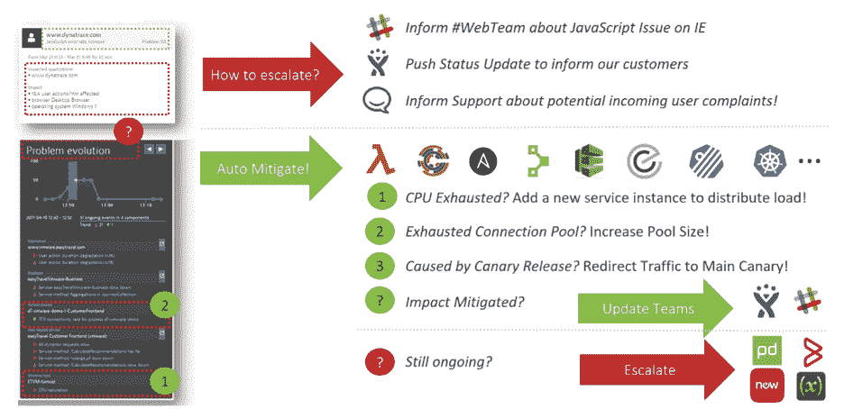

# AIOps 做得好:自动化补救和弹性

> 原文：<https://thenewstack.io/aiops-done-right-automating-remediation-and-resiliency/>

 [安德里亚斯·格拉布纳

安德里亚斯是 Dynatrace 的 DevOps 活动家。他拥有 20 多年的软件开发、测试和架构师经验，是高性能云操作的倡导者。作为 DevOps 计划的倡导者，Andreas 致力于帮助开发人员、测试人员和运营团队利用 Dynatrace 的软件智能平台提高工作效率。](https://www.dynatrace.com/) 

在之前的两篇文章中，我一直在分解 DevOps 和站点可靠性工程师(SREs)如何更好地利用 AIOps，并从这些解决方案中获得全部价值。随着 IT 环境变得越来越复杂、越来越动态、越来越难以手动管理，AIOps 将在推动业务价值和帮助团队更快地创建更好、更安全的软件方面发挥更大的作用。但是许多组织仍然停留在 AIOps 解决方案的“第 1 代”阶段，这些解决方案跟不上当今环境和生产部署的速度。从 AIOps 中获得最大价值意味着超越这些传统解决方案，采用新的用例及应用。

我之前已经强调了其中的几个用例，包括[将 AIOps 左移以创建更多测试驱动的操作](https://thenewstack.io/aiops-done-right-make-sre-more-proactive-by-shifting-left/)，以及[扩展和改进交付自动化](https://thenewstack.io/aiops-done-right-delivery-automation-for-devops-and-sres/)以将更高质量的代码投入生产并增加交付管道的吞吐量。在这最后一部分，我想为希望以正确方式进行 AIOps 的开发运维团队和 SRE 团队介绍另一个关键使用案例:使用 AIOps 解决方案来构建运营弹性和自动修复。

## **通过自动化运营建立弹性**

您组织的信息技术系统如何对用户行为的变化做出反应？在负载和压力测试期间怎么样？或者如果升级后某个组件出现故障，或者相关系统突然不可用？弹性和对变化的适应能力是生产质量的关键标志。确保 IT 系统的恢复能力是 sre 的一个重点，AIOps 解决方案可以提供自动化手动操作任务的能力，进而促进持续的恢复能力、可用性和系统健康。

将您的 AIOps 解决方案与交付自动化相集成，可以将配置和部署更改方面的关键上下文信息直接馈送到解决方案中。添加的上下文使 AIOps 解决方案能够:

*   更快、更准确地查明系统中异常行为变化的根本原因。
*   如果生产中正在进行的负载测试开始影响系统的整体运行状况，请提醒相关团队。
*   如果关键后端服务的新版本的推出无意中为该服务造成了高故障率，则提醒应用程序团队。
*   提供根本原因及其对用户的最终影响的详细纲要。

## **利用尸检后的 AIOps 找到恢复能力的“关键路径”**

AIOps 应用程序的最终目标是尽可能多地自动化这些通知和补救步骤。AIOps 解决方案提供的关于根本原因和影响的详细信息有助于实现这一目标。这些事后分析使 sre 能够研究其系统中恢复能力的“关键路径”在哪里。通过识别导致系统变得不稳定的应用程序、流程或行为变化，以及哪些操作最终解决了问题，架构师和工程师可以利用这些见解来创建一个更具弹性的系统。增强的弹性导致更少的行为异常、更一致和可靠的性能以及总体上更好的数字体验。

这种反馈不仅有利于提高弹性；它对于自动化 runbooks 也很有用，这确保了如果将来发生类似的行为问题，解决和解决问题的补救步骤将自动完成。自动修复和更快的修复时间意味着更短的系统停机时间。停机时间越短，对用户体验的影响就越小。

以下是这种工作流的示例:

在这里，我们可以看到问题被立即上报给了相关团队，因此他们可以采取适当的应对措施(通知客户潜在的问题，处理收到的投诉等)。).同时，自动补救脚本会确定根本原因，解决问题，并向团队发出结果警报，然后让客户知道一切恢复正常。

当然，虽然这只是一个例子，但它有望为 SREs 提供一个关于如何利用 AIOps 解决方案的有用指南。AIOps 可以利用系统反馈来构建更加自动化和灵活的操作，从而缩短平均修复时间、减少停机时间，并在问题发生和解决时向相关团队发出警报，所有这些都是实时的。

如果操作得当，AIOps 可以让 sre 更快地解决问题，让他们的生活更轻松，他们现在可以将更多的时间和精力花在创新、增值的项目上，而不是追逐每一个警告。

<svg xmlns:xlink="http://www.w3.org/1999/xlink" viewBox="0 0 68 31" version="1.1"><title>Group</title> <desc>Created with Sketch.</desc></svg>