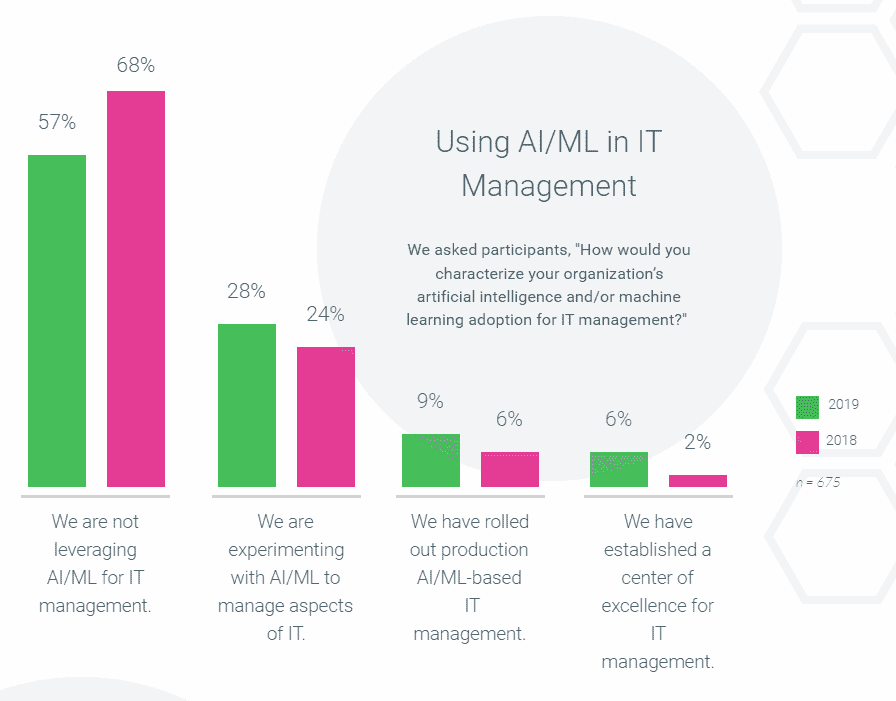
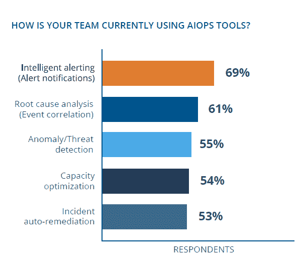

# 在野外发现的 AIOps 用户

> 原文：<https://thenewstack.io/aiops-users-found-in-the-wild/>

AIOps 的早期采用者已经确定。在一项涡轮经济调查的 846 名受访者中，有 9%的人已经将人工智能或机器学习(AI/ML) IT 管理应用到生产中。另外 28%的人正在“试验”将 AI/ML 用于 IT 管理，但我们不知道这是否意味着内部专家正在创建算法，或者是否有一个在引擎盖下吹捧 AI/ML 的供应商产品正在进行试点。

这是否准确地代表了 AIOps 的采用程度？

人工智能、人工智能和智能自动化的采用数字遍布整个地图，这取决于这些术语是如何定义的以及谁会被问到这个问题。例如，EasyVista 调查的 74%的 IT 经理[表示，他们的组织实施了机器学习，而同一群体中只有 50%实施了人工智能。这些数字高于许多其他调查，因为受访者绝大多数是 IT 服务管理(ITSM)工具的用户，这些工具一直处于使用聊天机器人和其他自动化技术的前沿。](https://www.easyvista.com/state-of-service-transformation-report)

AIOps 作为一个[时髦词](https://thenewstack.io/aiops-blockchain-and-other-buzz-words/)受到猛烈抨击，因为它是一个笨拙的尝试，试图附加术语“人工智能”来描述许多 it 监控和管理工具中部署的功能。在现实世界中，这意味着任何利用机器学习或预测分析实现“智能自动化”的产品都可以描述自己处于 AIOps 中。

试图提供 AIOps 的供应商数量很难跟踪。在这两篇由 [Mary Branscombe](https://thenewstack.io/author/marybranscombe/) : [《操作的机器学习》](/machine-learning-for-operations/)和[《ai ops:devo PS 为人工智能的注入做好准备了吗？》的 TNS 文章中，提到了超过 15 个](/aiops-is-devops-ready-for-an-infusion-of-artificial-intelligence/)虽然有些是纯粹的初创企业，但大多数 AIOps 供应商似乎只是在重塑自己的品牌。话虽如此，如果他们使用人工智能或人工智能让你的生活变得更容易，他们如何营销自己真的很重要吗？

来源:Turbonomic 的 2019 年多云状态

OpsRamp 没有狭隘地定义 AIOps，[调查了](https://info.opsramp.com/state-of-aiops) 200 名 IT 运营、开发运营或现场可靠性工程职位的人员，这些人员已经在其组织中实施了 AIOps 解决方案。他们发现 AIOps 工具最常用于智能警报和根本原因分析。这是可信的，但我怀疑有 53%的人使用该工具进行事件自动补救。这只是恢复到以前的环境吗？从 OpsRamp 提出问题的方式来看，似乎 AIOps 自动化了繁琐的任务，减少了警报数量，并减少了事故单的数量。然而，人们对这些工具的准确性有着压倒性的担忧，这可能会严重抑制未来的增长。

资料来源:OpsRamp 的 AIOps 状态报告

通过 Pixabay 的特征图像。

<svg xmlns:xlink="http://www.w3.org/1999/xlink" viewBox="0 0 68 31" version="1.1"><title>Group</title> <desc>Created with Sketch.</desc></svg>