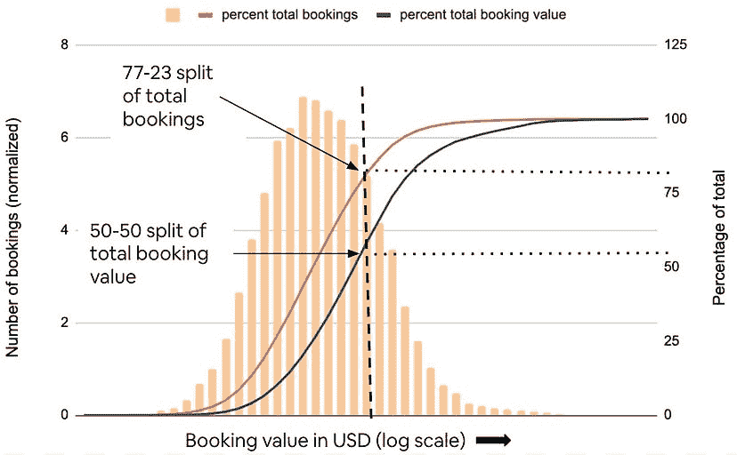
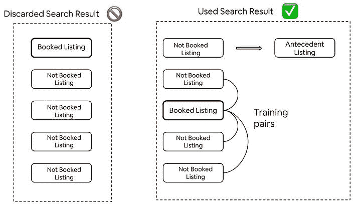
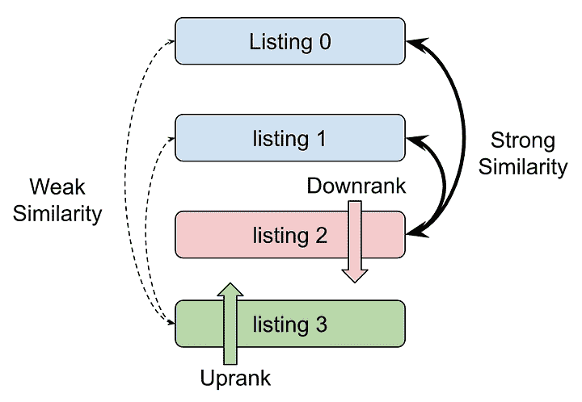

# Airbnb 建立了第二个神经网络来使房源多样化

> 原文：<https://thenewstack.io/airbnb-builds-a-second-neural-network-to-diversify-listings/>

寄宿家庭经纪人 Airbnb 发现，用其[机器学习](https://thenewstack.io/ai-short-term-overhype-but-underhyped-for-the-long-haul/)算法创造多样性的关键是让一个神经网络进行标准学习，另一个专门使结果多样化。从这个意义上说，多样化意味着增加用户在预订住宿时看到的选项的多样性。

这个概念花了几年时间才发展起来，因为它直接违背了公司工程师最初的核心信念，即有人预订一个列表的概率可以独立于列表本身来确定。Airbnb 发表了一篇[的技术论文](https://arxiv.org/pdf/2210.07774.pdf)和一篇[的博客文章](https://medium.com/airbnb-engineering/learning-to-rank-diversely-add6b1929621)，详细描述了这种方法不为人知的缺点:单个神经网络产生精确但同质的一组结果。

为了增加多样性，Airbnb 的工程师们经历了创建和迭代更多神经网络的过程。一旦通过在结果页面中添加新的网络列表位置获得成功，工程师们再次迭代实用性和可伸缩性。结果是一个由两个神经网络组成的搜索结果页面，这两个神经网络一起工作，返回一组更多样化的页面，这对用户来说是一个可衡量的收益。

这种新方法产生了良好的效果:Airbnb 观察到未取消预订增加了 0.29%，预订价值增加了 0.8%。预订价值的增加为衡量质量的提高提供了一个可靠的替代指标，尽管这不是唯一的目标:五星评分增加 0.4%表明整个旅行的客人满意度更高。

## 丰富多彩为生活添趣

神经网络是一种模仿人脑的深度学习模型，可以识别数据之间的关系。在 Airbnb 的例子中，它很擅长根据价格、位置或评论来确定哪个房源的预订概率更高，每项标准的权重都不同。

神经网络学习哪些列表和标准更成功，哪些不成功。下图显示了 Airbnb 预订是如何倾向于低价的。

神经网络学习成功上市之间的关系是一回事，理解以下对立的商业原则是另一回事:

*   多数原则:多数人的偏好应该决定排名。
*   帕累托原则:用户偏好以长尾平滑分布，通过 80/20 分割大致二进制化。(这对我来说很有意义，因为每年我都会被提醒，当我们为朋友预定假期时，我就是那 20%。)
*   这种压力来自于确保第一页能打动人的重要性，因为之后注意力就会减弱。

最初的神经网络结果如此偏向多数，引用技术论文的话，“这是多数人的暴政。”

暴政！==多样性。

## **为美国增加了 20%的 N 款车型**

缺乏多样性意味着一件事:OG 神经网络非常善于识别和利用与搜索标准完全匹配的列表。不是重新开始，而是保留原始模型，并添加用于 N 个附加列表位置的 N 个模型进行比较。

## ***位置一:第一款新车型***

如果最初的选择，或者说“零号位置”，没有成功，那么第一号位置的列表就会出现在舞台的中央(对于以后的每一个列表都是如此)。这意味着位置 1 有一个额外的输入—位置 0 的列表现在被称为“先行列表”

对于条件成对预订概率模型的这些新训练示例，在零位置的列表被预订的所有搜索都被丢弃。对于零号位未被预订的所有情况，基于“已预订”和“未预订”列表创建配对，类似于原始神经网络如何对预订概率进行排名。

位置二的设置与位置一相似，但现在可以获得更多信息。当这个列表被签出时，位置 0 和位置 1 的列表都没有被预订，使得两个先行列表可用于比较。对于 N 个模型，该过程重复 N 次。

正如人们可能怀疑的那样，这个理论很简单，但在实现上并不实用，并且具有 𝑂 ( 𝑁 3)时间复杂度。

## **重构**

在重构过程中，研究人员在技术论文中报告说，“我们从为 N 个位置中的每个位置构建的 N 个不同的模型开始，并逐一简化它们。”结果是两个模型，原始神经网络和新的相似性神经网络。

Airbnb 预计，原始神经网络和“相似性网络”的结果将相当接近，因为它们共享训练模型的很大一部分。但人们的预期是，相似性模型会表现得更好，因为相似的列表会排名下降，而不同的列表会排名上升。

重要提示:这只适用于清单零和一不同的情况。如果它们是相同的，那么只需要考虑一个前提，因为一个列表不算，目标是 d-i-v-e-r-s-i-t-y。下面是一个例子:

## **给人民他们想要的**

对多样性的探索并不是从这个项目开始的。这是 Airbnb 多年来的一个过程，始于 2017 年，以类别为基础的多样化。首先，它是一个单一的维度(价格、位置、便利设施)，然后沿着多个维度多样化。失败和失败。

突破出现在 2019 年，当时该模式被赋予了相应的多元化自由。包括训练数据本身对多样性有偏见也很重要。Airbnb 预计，未来的培训将包括更多可供学习的例子，并实现多元化的良性循环。

<svg xmlns:xlink="http://www.w3.org/1999/xlink" viewBox="0 0 68 31" version="1.1"><title>Group</title> <desc>Created with Sketch.</desc></svg>