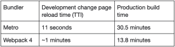

# Airbnb 从 Webpack 迁移到 Metro，构建时间更短

> 原文：<https://thenewstack.io/airbnb-moves-from-webpack-to-metro-enjoys-shorter-build-times/>

像许多 webscale 公司一样， [Airbnb](https://www.airbnb.com/) 随着代码库的增长，也经历了与 bundlers 一起成长的烦恼。但即使在其代码库翻了两番后，该公司仍能够加快 UX 向前端的变化，2018 年， 将其 JavaScript 代码捆绑器从 [Webpack](https://webpack.js.org/) 迁移到 [Metro](https://facebook.github.io/metro/docs/configuration) 。

根据 交互时间( [TTI](https://developer.mozilla.org/en-US/docs/Glossary/Time_to_interactive) )指标，随着构建性能的显著提高，UI 更改速度加快了 80%。即使是最慢的生产版本，一个编译 49，000 个模块(JavaScript 文件)的版本现在也快了 55%**—**使用 Webpack 从 30.5 分钟减少到 13.8 分钟。

Airbnb 自己的页面性能分数也提高了约 1%。

作为参考，在 2018 年前后代码库翻了两番后，简单的一行代码更改的平均页面刷新时间在 30 秒到两分钟之间，具体取决于项目规模。

Airbnb 软件工程师 Rae Liu 在最近的[博客](https://medium.com/airbnb-engineering/faster-javascript-builds-with-metro-cfc46d617a1f)中讲述了 Webpack 和 Metro 之间的一些差异，并讨论了一些迁移挑战。

## **什么是地铁？**

Metro 由 Meta 开发，是 React Native 的开源 JavaScript 代码捆绑器。本文将介绍 Metro 的定制版本，因为 Airbnb 的堆栈不包括 React Native。Airbnb 的工程师直接与 Metro 在 Meta 的工程师以及团队本身合作，进一步开发这项技术。

Metro 按照以下顺序将捆绑分解为三个步骤:解析、转换和序列化。

*   **解析**:解析导入/要求报表
*   **转换**:trans file code(source to source 编译器，将现代的 Typescript/ JavaScript 源代码转换成 JavaScript 并向后兼容旧浏览器)，一个示例工具是 babel
*   序列化:将转换后的文件组合成包

在开发中，Airbnb 的工程师创建了一个带有自定义端点的 Metro 服务器，以处理构建依赖图和源地图、翻译以及捆绑 JS 和 CSS 文件。对于生产版本，他们将 Metro 作为一个节点 API 来处理解析、转换和序列化。

迁移分两个阶段进行。第一优先是 Metro 开发服务器，因为速度慢的 Webpack 开发服务器是开发效率成本的主要来源。第二个迁移阶段的重点是让 Metro 具备与 Webpack 对等的特性，并在生产环境中运行 Metro 和 Webpack 之间的 A/B 测试。

## **Metro 和 Webpack 的两个关键区别**

### **按需处理 JavaScript 包**

Webpack 在启动时预编译整个项目，而 Metro 只编译需要的部分。这是什么意思？从技术上讲，JavaScript bundle 只是一个序列化的依赖图，其中入口点是图的根。

在 Airbnb，每个前端项目都有一个节点服务器，它将一条路径匹配到一个特定的入口点。当请求一个 web 页面时，DOM 包含带有开发 JavaScript URLs 的脚本标记。Webpack 需要知道所有页面的所有入口点，然后才能开始捆绑，而 Metro 只需要一个入口点，可以根据请求处理 JavaScript 包。

在下图中，开发人员对页面 A 进行了更改:

在上图的 1a 和 1b 中，浏览器加载页面 A (1)，从捆绑器请求 entryPageA.js 文件(2) ，捆绑器用适当的捆绑包响应浏览器(4)。图 1a 和 1b 之间的区别在于动作(3 ),因为 Webpack 图编译了页面 B 和 C 的入口点，而 Metro 没有编译，因为在这个例子中，只有开发人员修改了页面 A。

Airbnb 最大的前端项目之一拥有 26，000 个独立模块，每页模块数的中位数约为 7.2 个模块。由于使用了服务器端渲染，Airbnb 最终需要处理的模块数量增加了一倍，达到约 48000 个。将 Metro 的按需编译模型付诸实施后，大约 70%的工作正在进行。

## **多层缓存**

Airbnb 利用 Metro 的多层缓存功能，提供持久和非持久缓存。Metro 允许工程师定义缓存实现，包括混合不同类型的缓存层，从而提供了更大的缓存灵活性。

Airbnb 按照优先级顺序对缓存层进行排序。如果在一个缓存层中没有找到结果，将使用下一个层，直到找到结果。与没有缓存的默认 Metro 实现相比，在编译 22，000 个文件的项目中，使用远程只读缓存可以使服务器构建速度提高 56%。

第三个缓存层是远程只读缓存，而不是读写缓存，因为写入远程缓存会导致昂贵的网络调用，尤其是在慢速网络上。这个决定在开发中节省了额外的 17%的构建时间。

Webpack 确实有一个缓存层，尽管它与 Metro 提供的不同。

## **捆分裂**

Airbnb 的博文中详细描述的技术挑战之一是捆绑包拆分。这是通过动态导入边界分割包的过程，也称为代码分割。开箱即用的 Metro 解决方案在每个入口点产生了大约 5mb 的巨大捆绑包，这些捆绑包占用了大量浏览器资源、网络延迟，并且无法进行 HTTP 缓存。

上图中，导入(*)。/file* ')代表动态导入边界。左侧的束(3a)被分解成右侧的三个更小的束(3b)。导入(*)时需要额外的捆绑包。/file* ')语句被执行。

假设 fileA.js 发生变化，需要重新下载整个包，以便浏览器获取 fileA.js 中的变化。对于图 3b 所示的通过动态导入拆分的包，fileA.js 中的变化只会导致 fileA.js 包的重新下载。其余的包可以重用浏览器缓存。

在生产中，没有开发服务器，捆绑包是预先构建的。Airbnb 的工程师从 Webpack 的捆绑分裂算法中获得了一些灵感，并实现了类似的机制来分裂 Metro 依赖图。与通过动态导入边界进行的开发分割相比，在 airbnb.com 上产生的包大小减少了约 20%(1549 KB–>1226 KB)。

开发包的优化有所不同，因为运行包拆分算法需要时间，工程师不想在开发中浪费时间拆分包的大小。在开发实例中，页面加载性能优先于最小化包大小。

Metro 和 Webpack 捆绑包大小指标是可比的。

## **总结**

编译了约 48，000 个模块(包括服务器和浏览器编译)的最大 Airbnb 前端项目的平均构建时间下降了约 55%，从 30.5 分钟降至 13.8 分钟。Airbnb 页面性能分数在使用 Metro 构建的页面上提高了大约 1%,这是一个很好的惊喜，因为目标是一个中性的结果。总体而言，Metro 的实施非常成功。

Metro 解决了 Airbnb 面临的捆绑问题，但工程师们也认识到，自从他们决定与 Metro 合作以来，新技术已经出现，Metro 不是通用的 JavaScript 捆绑器。

<svg xmlns:xlink="http://www.w3.org/1999/xlink" viewBox="0 0 68 31" version="1.1"><title>Group</title> <desc>Created with Sketch.</desc></svg>