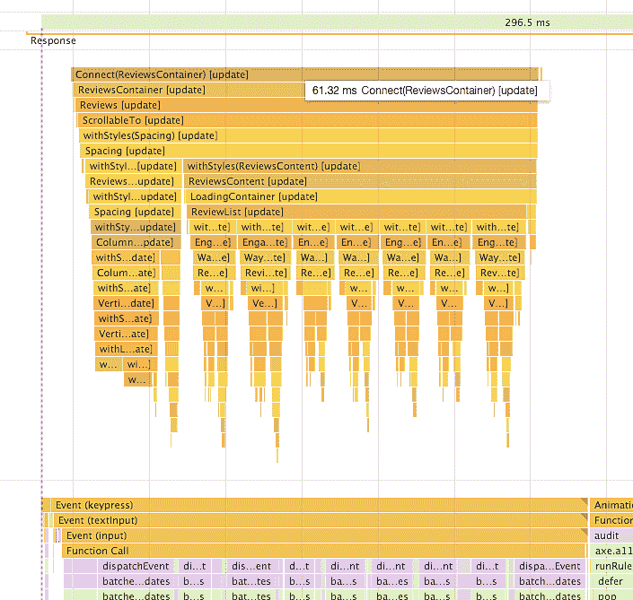
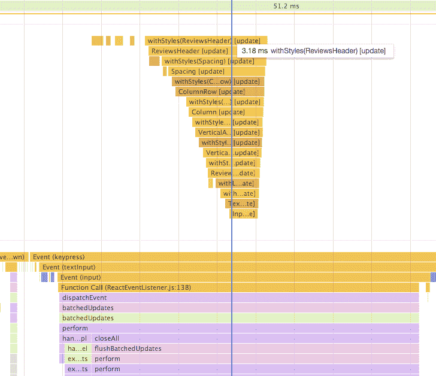

# Airbnb 利用 React 路由器和 Hypernova 收获低挂的性能果实

> 原文：<https://thenewstack.io/airbnb-uses-react-router-hyperactive-harvest-low-hanging-performance-fruit/>

就在一年多前，个人对个人的度假租赁网站 Airbnb 开始采取措施，通过更有效的堆栈设置来加快预订服务。想法是:建立一个单页面、服务器渲染的应用程序，由 [React Router](https://github.com/ReactTraining/react-router) 和 [Hypernova](https://github.com/airbnb/hypernova) 支持，这是 Airbnb 自己的开源服务，用于服务器端渲染 JavaScript 视图。在应用程序外壳架构中开发用于服务工作人员脚本的渐进式 web 应用程序，有望实现潜在的重大性能升级，即使对于像巴厘岛海滩这样充满异国情调但面临互联网挑战的地区的用户，也能实现快速交互和平滑过渡。

在成功迁移了网站的登录页面和搜索结果之后，是时候解决 Airbnb 预订流程的核心问题了:房源详情页面。在这里，用户可以查看特定有趣租赁可能性的详细信息和照片，并最终点击完成交易。因此，这是 airbnb.com 最重要的页面之一——缓慢或古怪的页面行为会破坏预订。

该公司委托前端/网络基础设施工程师 [Joe Lencioni](https://github.com/lencioni) 为核心预订流程优化新的 SPA 架构，特别是列表详情页面。Lencioni 与 New Stack 分享了使他成功[挖掘“低挂果实”](https://medium.com/@lencioni/6cd8d93df6f4)的灵感和方法，以提高 React 性能，同时可靠地将游客与他们梦想的度假住宿联系起来。

**Airbnb 的网站流量如何使移动到单页应用成为最有效的选择？**

在过去，许多 SPAs 根本不是服务器渲染的，你得到的典型体验是长时间的初始加载，因为它一次下载所有需要的 JavaScript。这对于某些类型的页面来说非常好，因为一旦你进入，一切都变得非常快——都是 AJAX，不用担心入口点或 SEO，比如说 Gmail。

不过，对于 Airbnb 来说，人们需要从各种各样的入口进入——我们不能只是把所有的东西都一股脑地运下来，然后说，‘好了，谢谢等待，现在一切都很快了！’我们必须尽可能快地为尽可能多的不同入口点获取它。因此，服务器渲染成为设置的一个重要部分，因为你可以在任何页面登陆。让你在 JS 被解析和执行之前点击链接成为可能，这就是我们的目标。

即使在 SPA 或渐进式 web 应用之外，server rendered React 也能提供很大帮助。因此，为了利用这一点，我们已经建立了一个名为 Hypernova 的开源项目，这是一个节点服务，您可以向其发送 React 组件，这些组件将呈现它并返回 HTML。然后 Rails 会将它放入 Rails 模板并交付。

**关于服务器渲染**有什么争论吗？

在应该渲染多少和为什么渲染之间总是存在矛盾。太多，你失去了性能，太少，你失去了搜索引擎优化。根据你的目标市场，搜索引擎优化可能是一个重要的考虑因素。你可以通过考虑给定页面的目标来进行校准。显然，机器人不会登录，所以您可以对经过身份验证的请求进行不同的权衡。这是一个你一直在玩弄的平衡动作。

我个人在服务器渲染方面做得足够好，让页面合理地位于折叠之上——让它感觉好像有什么事情正在尽快发生，然后让它尽可能快地交互。一旦你理解了页面和里面发生的事情，以后再担心搜索结果。

> Airbnb 的目标是页面快速启动并保持快速。

服务工作者和服务外壳架构运行良好，因为我们可以服务器呈现我们的应用程序外壳。把 airbnb.com 想象成一系列相关但独立的温泉。例如，想象一个客人找到一个预订的地方，进入这个应用程序的人几乎只会在那里导航。但如果你想在 Airbnb 上列出你的新空间，那是一个完全独立的应用程序。或者一个主机想管理你的日历，那是它自己的 app。那么，如果每个应用程序都有自己的应用程序外壳，那么可以设置服务人员，这样即使您退出应用程序，当您回来时，它也可以快速重新呈现。

使用 [Webpack](https://webpack.js.org/) 和[代码拆分](https://brotzky.co/blog/code-splitting-react-router-webpack-2/)和 React 路由器，我们基于路由和组件，基于我们试图优化的包大小，对 SPA 进行代码拆分。在一个页面被下载后，我们继续下载 JavaScript，例如，如果你点击了我们的首页，然后几秒钟后想点击搜索按钮，JavaScript 已经被预取，以使转换超快。我们还没有找到完美的解决方案，但我们正在不断改进。我们最大的性能问题基本上是我们向客户发送了太多的 JavaScript。

让我们听听那个唾手可得的水果吧！

Airbnb 的目标是页面快速启动并保持快速。预订流程重组就绪后，我们经历了一个分析页面交互的过程——滚动、点击、输入——然后进行修复，然后再次分析。我们能够显著改善列表详细信息页面的交互性能，让用户的预订体验更加顺畅和满意。

这更多的是小而重要的调整，而不是巨大的变化。例如，当我在这个页面上工作时，滚动动画非常慢。所以我深入研究，发现所有这些小事情加起来都不算是一次精彩的经历，我越是探索，发现的就越多。

作为另一个例子，在我的分析中，我发现每一次按键都会导致整个 review 部分标题及其下的每个 review 被重新呈现。为了解决这个问题，我提取了头部的一部分作为它自己的组件，这样我就可以让它成为一个 React。PureComponent，然后撒在几个 React 里。纯组件贯穿整个树。这使得每次按键只重新呈现需要重新呈现的组件:输入。

之前:61.32 毫秒。

之后:3.18 毫秒

在博客文章中有很多非常详细的信息[关于我如何追踪事情以及我对每一件事情做了什么。加上许多漂亮的火焰图！](https://medium.com/@lencioni/6cd8d93df6f4)

**而剖析是开发人员如何收获它的**？

我几乎成了“剖析，做出改变，然后再剖析”的传道者。那是你收获成果的地方。如果我是一名对页面进行修改的工程师，那么让我理解我所做的代码修改的性能影响的反馈循环是一件广泛而复杂的事情，对我来说，时间上的代价太大了，以至于我不能停下来弄清楚。我们经常在压力下把事情做好，如果我们有时间的话，侧写是我们以后担心的事情。但我们通常不会。

但是我们在 Chrome 开发工具中有一个工具:性能标签对此非常有用。和我交谈过的大多数开发人员从未使用过它，尽管它就在那里。但我明白为什么——如果你以前从未使用过它，它可能会令人生畏。然而，一旦你能带领人们通过，他们就能自己看到剖析是多么强大的工具。

工作流程非常简单:在一个隐蔽的窗口中打开页面，这样浏览器扩展就不会干扰分析。然后访问本地开发页面。查询字符串中的 react_per，以启用 react 的用户计时注释。然后单击“录制”按钮，与页面进行交互—滚动、单击、键入—然后再次单击“录制”按钮停止。然后解释和比较你的结果。

**对整个行业的开发者有什么建议吗**？

在 JavaScript 社区中，事情变化得如此之快——既有新的东西，也有旧的东西，我们必须设法让所有的东西都协同工作。

**那么，从性能的角度来看，你是如何理解这个**的呢？

所以我的第一条建议是尽可能经常地做侧写。

也许不是每天，那是不现实的，但是至少一个月一次——描述你的东西。习惯这些工具，时不时花一个小时用开发工具学习一些新东西，并分析和解释结果。最终，您可以开始看到代码中的模式，并开始本能地避免它们。比如，我这里有一个巨大的数组，也许我不应该迭代它 45 次，或者在 react 中想想我的对等组件应该在哪里，我真的需要传递这个 prop 吗？了解您的应用程序在现实世界中的表现，因为它与生产数据放在一起。唯一的方法就是通过侧写。

通过 Pixabay 的特征图像。

<svg xmlns:xlink="http://www.w3.org/1999/xlink" viewBox="0 0 68 31" version="1.1"><title>Group</title> <desc>Created with Sketch.</desc></svg>