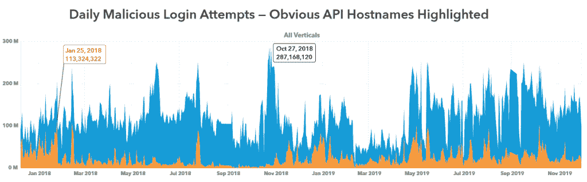
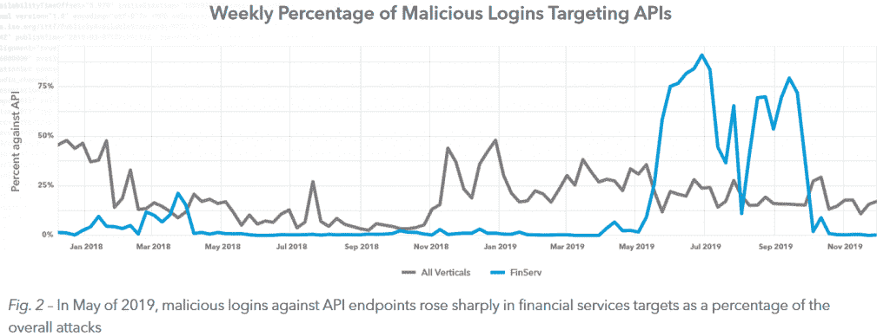
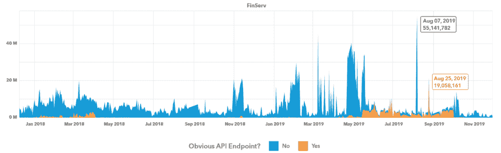

# Akamai:金融领域正面临更多基于 API 的攻击

> 原文：<https://thenewstack.io/akamai-the-financial-sector-is-seeing-more-apis-based-attacks/>

根据内容交付网络 Akamai 的最新季度“互联网状况”报告，网络攻击者现在越来越多地瞄准 API，特别是在金融领域。

这提醒我们，第三方开发者并不是唯一对使用 API 感兴趣的人。它还强调了安全实践需要不断发展。

“如果没有别的，金融服务组织应该意识到针对其 API 的凭证滥用的转变，”该报告总结道，然后警告说“这不仅仅是金融服务；每个人都是犯罪分子的目标，他们使用和滥用窃取的凭据来推动他们的犯罪事业。”

来自 Akamai《2020 年 1Q 互联网安全报告》的信息图截图。

## **敌意收购**

Akamai 在发现这些趋势方面具有独特的优势。就在 2015 年，路透社估计该公司承载了所有网络流量的 15%到 30%之间的[。这家总部位于马萨诸塞州剑桥的公司在全球 136 个国家拥有 275，000 台服务器和近 1，500 个网络，这是其广泛分布的内容交付网络业务的一部分。Akamai 网络上 83%的流量是 API 点击量——使 HTML 流量相形见绌。](https://www.reuters.com/article/us-akamai-tech-results/-strong-dollar-hurts-akamais-profit-forecast-shares-fall-idUSKBN0NJ2IV20150428)

利用来自两个产品的数据——身份云和企业应用程序访问——它研究了 REST 和 SOAP APIs 的流量。

“在过去的两年中，在我们所有的垂直行业中，我们已经看到了 846 亿次恶意登录尝试。大约 20%的攻击是针对 API 的，而不仅仅是针对 web 服务器本身，”Akamai 首席战略官 Andy Ellis 在一段强调报告的视频中简洁地总结了结果[。](https://youtu.be/KJOyJQy3qO0)

在近两年的时间里，从 2017 年 12 月到 2019 年 11 月，Akamai 发现了 16，557，875，875 次“凭据滥用”攻击，这些攻击的目标是明确识别为 API 端点的主机名。“这表明犯罪分子从普通登录页面向 API 登录页面的急剧转变，”他说。

在这些 API 攻击中，有 473，518，955 次是针对金融服务网站的。仅在 2018 年的一天——1 月 25 日——就发生了 113，324，322 起此类攻击，是单个最大的一天。从去年 5 月到 10 月，针对金融服务行业的攻击通常有 75%以上是针对 API 的。Akamai 在一份 TL 中写道，大约 74%的应用程序和服务仍然允许使用传统的用户名/密码登录；博士部分。

该报告指出，在 8 月的一天，Akamai 发现仅一家“知名金融服务公司”就有 55，141，782 次恶意登录尝试——这是该公司有史以来针对金融行业的有针对性的登录滥用攻击的最大高峰的一部分。

其中一个最有趣的图表计算了从 2018 年 1 月到 2019 年 11 月，每周的攻击中有多少百分比涉及 API。果不其然，它显示，2019 年 5 月至 10 月期间，API 对金融服务部门的攻击百分比突然增加-至少有一次-高达 87%。但是至少有一半的时间，绘制的百分比看起来是所有部分中 API 攻击百分比的两倍。

Akamai 认为，这一激增很可能是由“犯罪市场上凭证列表的泛滥”引起的(加上它们在身份欺诈和金融盗窃中的明显用途)。“犯罪分子仍在快速买卖和交易银行卡、金融凭证、受损礼品卡余额和网上银行账户，因为对这些东西的需求仍然很高。”

## 要堵塞的孔

问题的一部分是，一些 API 的安全性很差，这使得它们成为攻击者的诱人目标。Akamai 的报告指出了一个可能的弱点:允许无限次数的错误登录尝试。"犯罪分子利用限制的缺乏，在几分钟内处理成千上万的凭证."

报告指出，其他 API 只是“抑制”尝试的次数，只要暴力攻击随着时间的推移而扩散，就仍然存在暴力攻击的可能性。一些错误响应消息甚至无意中验证了登录名的存在，这使得攻击者更容易将注意力集中在这些有效的帐户上。

但是，当攻击者能够大规模探查这些漏洞时，薄弱的安全实践的危险就变得更大了。“API 的使用和广泛采用使得犯罪分子能够自动进行攻击，”报告警告说。一张信息图表警告称，尽管这种策略在金融服务行业越来越多，“在这里奏效的可能会在其他行业找到出路。”

在给 VentureBeat 的一封[电子邮件中，Akamai 解释了自动化的一些优势:犯罪分子“使用允许线程或多个同时连接的机器人和工具，试图一次多次登录。”通过瞄准 API，“他们希望避免一些前端防御，并加快他们的验证时间。”CSO Online](https://venturebeat.com/2020/02/19/akamai-cybercriminals-are-attacking-apis-at-financial-services-firms/) 最近的一篇[文章总结了 API 为网络攻击者提供的一些便利。“通过 API 查询和提取信息是标准化的，非常适合自动化。毕竟，API 的真正目的是促进应用程序之间的对话和自动交换数据。”](https://www.csoonline.com/article/3527858/apis-are-becoming-a-major-target-for-credential-stuffing-attacks.html)

可能还有一个推动 API 流行的监管因素:欧盟的支付服务指令(PSD2)，该指令推动开放银行业务，并于去年 9 月生效。“PSD2 要求持有客户账户的银行和其他金融机构使第三方服务能够检查资金的可用性，启动支付或在账户所有人同意的情况下访问账户数据。满足这一要求的最常见方式是开发 web APIs。”

“即使在非欧盟国家不存在类似的监管要求，市场力量也在推动金融机构朝着同一方向发展，因为它们需要创新并跟上竞争。”

## 零信任

Akamai 的报告推荐[零信任](https://thenewstack.io/how-to-start-applying-googles-zero-trust-model/)作为减轻一些风险的方法，引用了亚马逊网络服务和 Azure 都遵循的做法。“这两个平台都在与客户一起成长，并为网络和服务架构提供更定制的解决方案，包括零信任模型。”但它也认为，零信任并不是灵丹妙药。“你不能把钱扔在一个问题上，采用许多不同的技术，并期望事情像魔法一样发生——安全不是那样工作的。零信任的最大成功来自于拥抱这个概念并围绕它建立你的运营，这将包括所需的投资…

“但是，脱离外围防御的概念是未来的发展方向，因为我们所知的世界正在快速扩张，并将每个人联系在一起。”

亚马逊网络服务是新堆栈的赞助商。

由[弗兰克诉](https://unsplash.com/@franckinjapan?utm_source=unsplash&utm_medium=referral&utm_content=creditCopyText)在 [Unsplash](https://unsplash.com/s/photos/attacks?utm_source=unsplash&utm_medium=referral&utm_content=creditCopyText) 上拍摄的特写图片。

<svg xmlns:xlink="http://www.w3.org/1999/xlink" viewBox="0 0 68 31" version="1.1"><title>Group</title> <desc>Created with Sketch.</desc></svg>