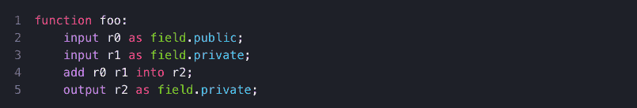

# Aleo 推出区块链私人应用开发

> 原文：<https://thenewstack.io/aleo-introduces-private-application-development-for-blockchain/>

零知识(zk)证明作为一种对各种不同挑战的解决方案，正在区块链空间中获得牵引力。这个概念在密码学领域已经存在很长时间了，起源于 1985 年的论文[交互式证明系统的知识复杂性](https://epubs.siam.org/doi/10.1137/0218012)。直到最近，由于计算的复杂性，实际使用案例一直受到限制。

Zcash 建立了一个数字货币和交易协议[利用 zk 证明](https://z.cash/technology/)作为一种手段，当双方从事商务时，保持交易细节的私密性。这解决了使用区块链进行交易的一个挑战，在这种情况下，你可能不想让地球上的每个人都知道你向谁支付了多少钱，就像大多数人也不会公开分享他们银行账户的类似信息一样。

以太坊虚拟机兼容的第二层区块链，像 Polygon 一样，都是[实现 zk-Rollups](https://polygon.technology/solutions/polygon-zkevm/) ，本质上是由第二层区块链聚合的大批量交易，并以验证其真实性的零知识证明呈现给以太坊区块链。这意味着更少的以太坊交易，进而导致更高的吞吐量和更低的与以太坊区块链交互的燃气费。

第 1 层区块链 Aleo 正在扩展这些概念，以创建一个生态系统，用于构建分散式应用程序，在这些用例中，您可能希望从 zk 汇总中获得一些性能优势，并认为区块链事务的某些方面受益于保持一定的隐私级别。

## 为什么 dApps 需要隐私

区块链技术经常被吹捧的一个方面是所有交易的公开性。有一些用例，比如维护某种程度的银行隐私的 zcash 例子，完全公开的交易数据并不理想。在接受 New Stack 采访时，Aleo 的联合创始人兼首席执行官霍华德·吴(Howard Wu)说:“在很多垂直领域，Web3 都缺少隐私。这不是因为我们需要把它栓上，而是因为许多应用程序需要某种信息不对称或隐藏知识，才能正常运行。”

吴举的一个例子是用打扑克。“庄家可以将牌分发给七八个其他玩家，并要求每个玩家过牌或下注，”他说。“每个玩家可以产生一个零知识证明，跟随每个先前的玩家，并将其编织成一个单一的交易，然后在链上广播，玩一轮游戏，然后进入下一轮。”这一切都发生在个人玩家不知道谁持有哪些牌的情况下。

其他真实世界的应用程序依赖于公共状态和私有状态的组合。Aleo 为开发人员提供了一种方法，使他们能够针对公开信息和保密信息做出实现决策。投票是另一个需要这种灵活性的实际用例。吴说:“在选举中，人们想投票，但他们不想向其他人展示他们是如何投票的。计票结果需要公开，以了解结果。拥有私人投票和公共投票最终成为了应用程序中的一项强大功能。”

比我更聪明的人可能会挑出启用支持的投票流程是否有其他风险，但在低风险决策中，如 DAO 投票，我当然可以看到这可能是有用的。

从开发人员实现的角度来看，任何被指定为私有的元素都是加密的。零知识证明是用来证明用户正在用他们的公共地址加密数据，这意味着可以验证采取行动的人是他们所说的人，但公共地址是加密的，所以它在 chain 上是不可见的。零知识证明最终证明了加密算法、解密算法和在引擎盖下运行的逻辑。

## 和利奥一起写 Aleo dApps

Aleo 的 dApp 开发方法的一个独特方面是附带的 leo 编程语言。在我与吴的访谈中，我提出在空间中增加另一种编程语言可能不利于采用。“当我们开始的时候，”他回答说，“我们想把这个栓在 Rust 或 Typescript 上，这样我们就不用重新发明轮子了。事实证明这真的很难做到，因为在一个编程模型中你可能认为便宜的东西在这个模型中是非常昂贵的。我们最终构建了一种新的语言，因为在引擎盖下，编译器所做的与传统架构非常不同。”

Leo 到底和 Rust 或者 Typescript 有什么不同？“我们拥有的是一种高级语言，它被编译成多项式，并在验证系统中执行，”他说。“证明系统对多项式进行运算，得到最终的输出。最终的输出看起来就像一个普通的 CPU 输出，但它带有一个零知识证明，可以证明这样一个事实，即计算是在一些隐藏的输入上从一个特定的程序运行的，这些输入也可以由用户决定是否公开。这是建筑的基本区别。”

“如果你用 LLVM 做 Rust 或 C++，”他继续说，“你基本上需要脱离 LLVM 架构，发明一个新的架构。挑战在于，你通常认为在高级语言中很便宜的语法最终会变得非常昂贵。”

您可以在下面的 Leo 中看到用于确定哪些值是公共的或私有的示例语法。

Aleo 试图克服与实现新编程语言相关的摩擦的方法之一是将[包管理](https://aleo.pm/)作为 Aleo 生态系统设计的核心部分。当开发人员为以太坊构建时，每次部署一个 ERC-20 令牌，也部署了[安全数学](https://github.com/OpenZeppelin/openzeppelin-contracts/blob/master/contracts/utils/math/SafeMath.sol)契约。Aleo 允许您引用包，而不是每次都在代码中重用它们。正如吴所说，“我们的目标是建立一个包的生态系统，在这里你可以开始编写[粘合代码](https://en.wikipedia.org/wiki/Glue_code)，而不是重新发明以前编写的函数。”

Aleo 还使得继续使用现有工具进行构建成为可能。吴说，“在上互动的大多数用户都是从他们各自的 dApps 的现有 SDK 中调用的。从我们的角度来看，我们的立场是从第一天起就加入 JavaScript、Wasm 和 Rust 支持，以便与 Leo 和 Aleo 程序进行交互，从而尽可能轻松地调用已经使用您已经熟悉的传统软件堆栈部署的应用程序。”

Aleo 目前正在进行第三次测试网(T1)，在测试网的最后阶段于 10 月完成后，将发布 mainnet。Howard Wu 最近也在 [GitHub](https://github.com/howardwu/awesome-aleo) 上发布了一份 Aleo 资源列表。无论 zk 证明是否从根本上改变了区块链技术，它们也在寻找进入非区块链应用的方法。早在 2021 年 5 月，Cloudflare 就在其 Privacy Pass 中实现了 zk 证明，以减少个人可能需要填写 captcha 的次数。

<svg xmlns:xlink="http://www.w3.org/1999/xlink" viewBox="0 0 68 31" version="1.1"><title>Group</title> <desc>Created with Sketch.</desc></svg>