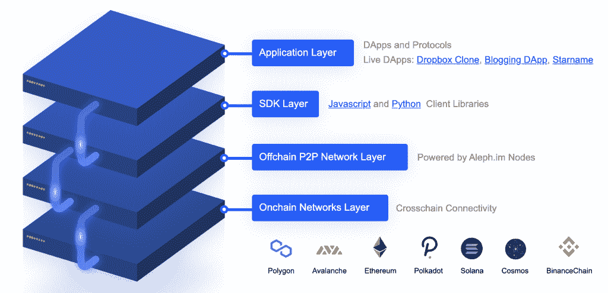

# Aleph.im 就像是 Web3 DApps 的去中心化 AWS Lambda

> 原文：<https://thenewstack.io/aleph-im-is-like-a-decentralized-aws-lambda-for-web3-dapps/>

分散式应用程序与传统应用程序一样依赖于计算基础设施，但堆栈通常看起来略有不同。这导致人们熟悉的云计算架构正在以去中心化为核心进行重组。这个领域的参与者之一， [Aleph.im](https://aleph.im/) 正在为计算、数据库和存储需求提供按需无服务器资源，类似于 [AWS Lambda](https://aws.amazon.com/lambda/) 在云计算部署中为开发人员提供的服务。

## 去中心化的规模方法

 [杰克·卢丁顿

Jake 是一名自由记者和博客作者，对 Web3 技术、企业 IT 和流媒体视频充满热情。在推特上关注他@ jakeludington。](https://twitter.com/jakeludington) 

在接受新一轮采访时，Aleph.im 创始人 [Jonathan Schemoul](https://www.linkedin.com/in/jonathanschemoul/) 解释说“Aleph.im 本身是一种新型网络——不是区块链，而是使用区块链相关技术。”其中一些技术包括哈希、椭圆曲线签名、对等网络和 [gossipsub](https://github.com/libp2p/specs/tree/master/pubsub/gossipsub) (基于网格和八卦的 pubsub 协议)。

至此，Aleph.im 结构已经由大约 70 个核心通道节点组成。[最近宣布的资金](https://medium.com/aleph-im/aleph-im-raises-10m-in-strategic-bid-to-become-web3s-decentralized-answer-to-amazon-lambda-4d97df5623fc)正用于将其扩展到由 150 家计算节点运营商组成的网络。Schemoul 继续解释说，“这个概念的核心是消息(因此。im 域)。它们定义数据库条目、存储、遗忘请求，甚至无服务器计算虚拟机创建。该网络接受由支持的网络的任何地址签名的消息(验证签名是有效的并且对应于对应于该地址的公钥)，并且在区块链上写入消息列表的散列以避免历史篡改。这里的诀窍在于，网络偶尔会在区块链上写点东西，而成千上万条信息只有一个散列。”

“一个节点可以订阅通道，”他继续说，“消息在通道中流动(有点像即时消息通道)，如果它不订阅通道，它就看不到所有的消息。我们称这部分为 aleph.im 网络的分片。它将在今年晚些时候实现自动化。”

图片 via Aleph.im

## 与云提供商的成本比较

我问 Schemoul 在 Aleph.im 和 AWS 上部署的成本比较，这是大多数开发人员熟悉的定价模式。目前，直接比较具有挑战性，因为当前的模式需要持有 ALEPH 令牌才能获得服务——这与 [AWS 定价](https://thenewstack.io/7-tips-for-cutting-down-your-aws-kubernetes-bill/)非常不同。

Schemoul 解释说，Aleph.im 路线图的目标是“由于市场动态，提供商竞相以最有效的方式提供服务，因此与集中式替代方案(如 AWS 或谷歌云)相当或略便宜。无论网络另一端的提供商是什么，API 和端点都是相同的。”

目前，运行一个节点需要在钱包里放 200，000 [ALEPH](https://www.coinbase.com/price/aleph-im) ，在撰写本文时，这相当于每个节点大约 156，000.00 美元。一些成本可以通过在你的钱包中同时下注 ALEPH 来抵消，并且节点也可以通过加入网络来获得 ALEPH。

## 部署节点

节点本身是通过像 [NodeForge](https://nodeforge.io/) 这样的合作伙伴来配置的，或者你可以[用 Docker、MongoDB、IPFS 和 PyAleph 节点软件的组合来部署你自己的节点](https://pyaleph.readthedocs.io/en/latest/guides/docker-compose.html)。

在查看部署 Aleph 节点的 Node Forge 文档时，我注意到他们托管在一个多云基础设施上。由于这通常意味着利用 AWS、Azure 或 Google Cloud 的某种组合，我问 Schemoul 这如何避免云计算中面临的同样的集中化问题。

“整个想法是有各种各样的托管场所和类型，”他回答说。“网络越多样化越好。所以，是的，虽然有些人可能会选择在 AWS、Azure 或谷歌云基础设施中托管他们的节点，但这也没有听起来那么糟糕。无论如何，我们正在创建一个多样化的、分布式的、非集中控制的节点网络，其运行方式是，即使一个节点出现故障，或者即使一个‘大节点’(例如 AWS)出现故障，其他节点仍有可能正常运行。”

## 分散的能力和规模

扩建任何基础设施的挑战之一是资源需求超过能力的风险。根据 Schemoul 的说法，Aleph.im 是这样考虑容量风险的:“目前有大约 70 个核心渠道节点由长期可信的 Aleph 社区成员运营，每个即将到来的资源节点都将链接到这些核心渠道节点中的一个。这意味着，如果某个资源节点因任何原因关闭，网络可以在核心通道节点关闭的情况下继续满负荷运行。在我们 2021 年的所有合作伙伴关系和索引工作中，这些核心渠道节点一直是整个 Aleph.im 网络的关键基础设施。”

Aleph.im 已经看到了与育碧合作的一些早期成功，为区块链驱动的[育碧石英](https://quartz.ubisoft.com/welcome/)游戏平台中使用的动态 NFT 提供分散存储。在元数据作为数据库条目被推送到网络的情况下，Ubisoft 正在利用 Aleph.im 的按需计算。Aleph.im 计算节点根据请求启动虚拟机，将数据编译为二级市场可读的格式，元数据 url 指向一个微虚拟机。众所周知，游戏玩家不能容忍性能问题，因此 Aleph.im 正在迎接支持育碧这样规模的公司的游戏 dApp(分散式应用程序)的挑战，这似乎是一个积极的信号。

另一个潜在的机会是分散融资。在这里，Schemoul 再次解释说，“DeFi 行业仍然有许多集中的部分(中间件服务器、集中索引、数据库等。).所有这些代码都可以作为微管理系统运行，并通过自上而下的完全去中心化来减少监管问题。”

你可以在他们的[开发者资源](https://aleph.im/#/developers)中查看额外的示例 dApp 源代码，包括运行 aleph.im 的 CMS 和一个博客 dApp。

<svg xmlns:xlink="http://www.w3.org/1999/xlink" viewBox="0 0 68 31" version="1.1"><title>Group</title> <desc>Created with Sketch.</desc></svg>