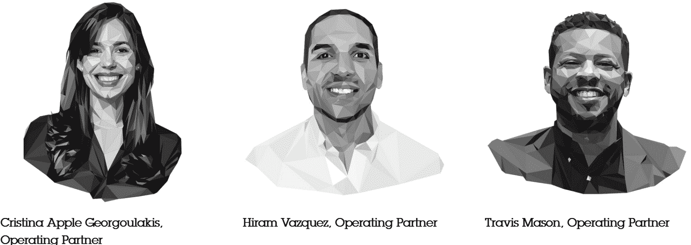

# 亚历克西斯·奥哈尼安讨论多元化与投资的结合点

> 原文：<https://thenewstack.io/alexis-ohanian-discusses-where-diversity-meets-investment/>

你如何授权给大众——不仅仅是在线交流，而是建立可行的业务？连续创业者亚历克西斯·奥哈尼安正在思考解决方案，以及与代表性和多样性相关的问题。

作为 Reddit 的联合创始人和前负责人，以及两家风险投资公司(Initialized 和 776)的联合创始人，Ohanian 在硅谷有着很高的声誉，他最近在 Jack Conte 的一个新播客中分享了他的宏伟抱负。

但康特本身就是一个有趣的人——他对在线创作者面临的困境并不陌生。

## 造物主的故事

孔蒂和他的妻子娜塔莉·道恩(Nataly Dawn)组成了一个名为 Pomplamoose 的音乐二人组，仅在 2009 年就在网上销售了大约 10 万首歌曲，[据 NPR](https://www.npr.org/templates/story/story.php?storyId=125783271) 报道。两人后来通过 YouTube 计划扩大了收入，该计划向流行音乐人提供 50-50 的广告收入分成。

在【their 的播客“我如何与盖伊·拉兹一起建立这一切”的采访中，孔蒂回忆了在他们的巅峰时期，Pomplamoose 每年仅 mp3 销售就能赚 40 万美元。自 2011 年首次亮相以来，他们古怪的封面《愤怒的小鸟》视频游戏的主题已经获得了 5372140 次点击 Pomplamoose 的 YouTube 频道现在有超过 130 万订户。

[https://www.youtube.com/embed/2vEStDd6HVY?feature=oembed](https://www.youtube.com/embed/2vEStDd6HVY?feature=oembed)

视频

因此，他对奥哈尼安的采访几乎成为了一次历史性的思想碰撞，因为在此过程中，孔蒂也成为了 Patreon 的联合创始人，该公司目前估值超过 10 亿美元(根据 NPR 一月份的简介)。

但更重要的是，Patreon 至少为超过 20 万名创作者提供了部分资助解决方案。本周，Conte 宣布 Patreon 本身将成为一个视频托管平台。最终。孔蒂将此次发布视为一场更大运动的一部分，并希望在一个名为“[创造者经济](https://www.creatoreconomypodcast.com/)的新播客中探索这一愿景

显而易见，第一位嘉宾是奥哈尼安，他是最初为帕特里翁首轮融资贡献 1500 万美元的 17 位天使投资人和风险投资人之一。

奥哈尼安与康特一样，相信网络大众的潜力尚未开发。2014 年，奥哈尼安[告诉《时尚先生》](https://www.esquire.com/news-politics/interviews/a30749/alexis-ohanian-interview-2014/)，“我的整个职业生涯都建立在这样一个认识上，我不仅不是房间里最聪明的人，也绝对不是世界上最聪明的人。相反，我将努力创造尽可能多的机会，将这些伟大的想法联系起来，并帮助它们变得伟大。

“如果我能在接下来的许多年里完成任何事情，那就是:帮助一代人认识到，或者认为自己不仅仅是消费者，也是创造者。”

## 向他人倾斜

奥哈尼安在康特的播客上开始露面，他列举了对 Instacart 和比特币基地等公司的其他成功早期投资，然后将这些选择归因于“依靠强大的创始人网络——让自己真正接受新事物，并对聪明人在想什么、说什么、做什么保持好奇和永不满足。”

这是奥哈尼安后来在采访中提到的一个主题，他说，他对投资一个“深刻理解市场或客户或其他东西，并能教会我一些新东西”的创始人很感兴趣。

但这也是奥哈尼安仔细思考过的一个深有感触的话题。在[6 月的一篇博客文章](https://sevensevensix.com/out-of-the-blocks/)中，奥哈尼安写道，乔治·弗洛伊德之死让他走上了自省和改变人生决定的道路(包括离开 Reddit 董事会)。

奥哈尼安后来[在他的新风险投资公司七七六的网站上写道](https://sevensevensix.com/this-is-the-starting-line/)“当然，如果我更有意识的话，我可以投资更伟大的创始人、更伟大的企业和更大的回报。”他甚至在网站上宣称，他的风险投资公司“将是我的遗产，我希望你们所有人都能加入我和我们团队的旅程。我们不会尽善尽美，但我们会不断努力变得更好。”

该公司在社交媒体上的一个雄心勃勃的口号中总结了它的雄心:“回到最初的起跑线，重新想象我们如何识别、支持和扩大伟大。”Ohanian 在播客中指出，40%的风投都去了哈佛或斯坦福，然后问道，“想想看，随着越来越多的人能够投资，会发生什么？”

《福布斯》最近的一篇文章总结了奥哈尼安对“后大流行时代的新风投公司”的希望，讽刺地说它“按照奥哈尼安时间运作，这意味着完全遥远、异步，在外界看来可能是时区和项目的混乱(如果有创意的话)。”(776 使用定制软件，使公司能够在整个投资过程中异步沟通——包括介绍和联网。)

Ohanian 在播客中说，最终的希望是“开始在网络中出现更多我们甚至没有意识到的东西。”就连该公司的网页也将它描述为一家风险投资公司，“由建设者建立，用软件构建，目的是最好地支持改变世界的创始人。”

但该公司也采取了一种独特的方法来寻找经营伙伴。“我们没有要求简历，LinkedIn 链接或 MBA 证书，”创始合伙人 Katelin Holloway [在博客文章](https://sevensevensix.com/announcing-our-2021-operators-in-residence/)中说。“我们要求建筑商。我们询问了他们的观点。

“在作业上线后的九个小时内，第 101 次提交被记录。我们庆祝了，不是因为我们达到了目标，而是因为我们被候选人的素质、真诚和渴望所折服。”

## 培训中的风险投资伙伴

我们希望推出一个年度“常青树”项目，吸引来自各种背景的优秀人才，将他们培养成运营伙伴——最终扩大获得资助的公司种类，并为他们提供更好的支持。

“我们的项目旨在教育和吸引下一代高回报投资者——他们广泛的经营背景、网络和视角使他们能够识别更复杂和全面的趋势，”霍洛韦写道。她写道，作为公司的常驻操作员，他们会用自己的专业知识支持创始人，“到年底，我们会支持他们在风险投资领域找到梦想中的工作。”

精心挑选的团队——[海勒姆·瓦兹奎](https://youtu.be/ldQeLyBPyMo)、[特拉维斯·梅森](https://youtu.be/Nb0qemyt_u4)和[克里斯蒂娜·乔治拉基斯](https://youtu.be/1vXWhiNdTfg)——于 1 月开始工作，最终获得了“建设这家新公司的每一个部分的前排席位，包括交易审查、推出一只新基金，以及学习风险投资的机制，”霍洛韦写道。“我们认为，如果我们继续沿着这条道路走下去，我们可以轻松地每年扩大这一计划，创造更深层次的支持，并邀请更多独特的声音进入我们的行业。”

在播客中，Ohanian 谈到了更多关于七七六最初的常驻操作员团队。“我们选择的三个人都在 Hitters 这样的顶级创业公司有十年以上的经验，”Ohanian 说。但他也表示自豪的是，81%的申请人认为自己的代表性不足，“这真的意味着你不是白人，但这表明，有很多人才不仅准备好并有兴趣进入这个行业，而且还拥有创始人想要的确切技能。”

Ohanian 告诉播客观众，他希望这将开启风险投资的新时代，因为如果风险投资公司不变得更加复杂，他看到的未来将是新的分散自治组织(或 Dao)最终分配所有的资本。(想想在区块链上追踪交易的开放、分散、由社区驱动的投资工具。)

他发现底层技术“非常有趣。一小部分将会非常强大和有效。”奥哈尼安自己也是区块链的一员，他曾在网上的群聊中看到该公司的集体讨论投资事宜，“我就在想，天哪，这行得通吗？”

“再说一次，我们仍处于早期，有很多现金，”他补充道。“有很多骗子，但底层技术是真实的。它似乎在起作用。我认为集体投票能比一大群人单独投票做得更好吗？是啊，肯定的。”

## 金融公民权

但他对社交媒体的信心依然闪耀。在播客的某一点上，奥哈尼安描述了我们的时代，“一个能够协调、对话、分享想法和合作的赋权全球社区”，尽管他认为其中的一些热情来自经济上被剥夺权利的人。(“我讨厌老是回到像金融部分这样基础的东西，但是…”)

采访者 Conte 看到了创造力的即将到来的重生——这是由创造和分发内容的廉价工具的可用性所驱动的——但也同意融资有着至关重要的作用。

“剩下的最后一块拼图是商业模式，这是帮助这些有创造力的人建立自己的企业并成为全职艺术家的基础设施，”孔蒂说。“当这种货币化架构达到一定规模时，我们将经历第二次复兴，其精神和能量让第一次复兴看起来像是孩子在冰箱上画的蜡笔画。”

奥哈尼安在节目的后面总结了他自己的普遍热情。“我绝不会反对一个社区的创造力，即使是资金最充足、传统的自上而下的创造者，他们也会团结一致。一个人的创造力无法与集体相提并论。”

在节目接近尾声时，讨论转向了对创造者经济未来的希望——奥哈尼安已经准备好了答案。“我想生活在这样一个世界里，一个孩子可以在生活中有一个独特的抱负，那就是创造，并为她如何谋生找到一条清晰的道路，为自己和家人创造美好的生活。”

他补充说，“我相信我们将继续自动化，我们将继续扩大所有类型的其他工作……我们将需要人们，作为一个社会……每天都感到充实。我们需要为人们提供途径，如果这是他们的激情，创造并以此为生。

“我变得特别有动力，因为我认为这意味着人们不需要那些传统的看门人。这也意味着许多社区，尤其是有色人种社区将最终得到他们应得的东西，因为下一代创作者不需要看门人让他们上唱片公司或给他们一个平台。他们可以创造，他们可以建造。”

* * *

# WebReduce

<svg xmlns:xlink="http://www.w3.org/1999/xlink" viewBox="0 0 68 31" version="1.1"><title>Group</title> <desc>Created with Sketch.</desc></svg>