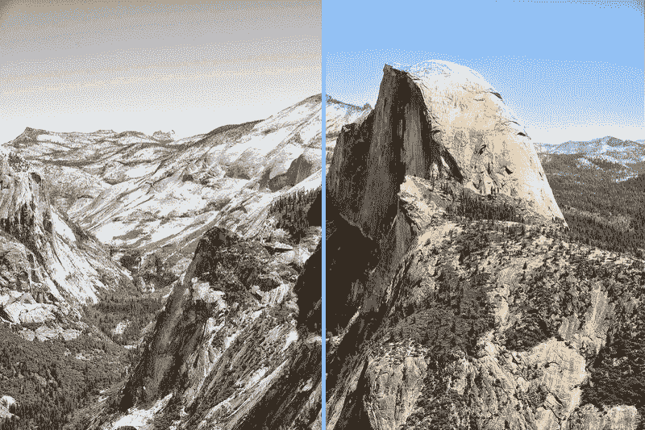

# 算法和新兴的算法经济

> 原文：<https://thenewstack.io/algorithmia-new-algorithm-economy/>

在学术界，有许多令人着迷的研究正在开发算法，即计算机执行任务、处理数据或解决问题时遵循的基本指令集。算法智能支撑着许多我们今天认为理所当然的服务，从搜索引擎到其他新兴技术，比如帮助无人驾驶汽车识别行人的算法，T2 音乐推荐的算法，甚至 T4 帮助机器学习如何学习的算法。

但另一方面是，许多这些从学术界最聪明的头脑中孵化出来的令人敬畏的算法通常无法进入更广阔的世界。除了在传统的会议上展示或在学术期刊上发表之外，研究人员的创新算法通常很难进入开发者和小企业的手中，在那里它们可以被应用到新的、广泛的和潜在有用的应用中。

## 新算法经济

然而，随着所谓的[算法经济](http://www.gartner.com/smarterwithgartner/the-algorithm-economy-will-start-a-huge-wave-of-innovation/)的出现，所有这一切都在慢慢改变，开发者可以通过在线市场生产、分发和商业化他们的代码，其他开发者、企业和组织也可以轻松地发现、选择和堆叠不同的算法来创建不同的应用程序。

一个这样的在线市场是总部位于西雅图的创业公司 [Algorithmia](https://algorithmia.com) ，它提供算法即服务，将学术研究人员和他们的算法与想要使用它们的开发者和企业联系起来。Algorithmia 不仅使用基于云的平台托管和分发训练有素的深度学习模型，还通过在一个简单的 REST API 上无缝地统一一切，使这些代码行更容易集成并可供所有人访问。原始算法的创造者也可以从版税中获益，也就是说，每当他们的代码被调用和使用时，他们都会得到一部分利润。

“工程师每天都在开发新的算法，但通常发生的事情是他们写一篇关于它的论文，发表它，然后继续前进，”Algorithmia 联合创始人兼首席技术官 [Kenny Daniel](https://twitter.com/platypii) 告诉[南加州大学新闻](https://news.usc.edu/80646/building-a-market-for-algorithms/)。“这些算法无法进入世界，在那里它们可以真正造福人类。有大量的算法供应和对它们的巨大需求；他们只是不见面。我认为这是建立市场的绝佳机会。”

## 作为微服务的算法

Algorithmia 的方法是将算法容器化，将它们打包为微服务，托管在可扩展的无服务器云基础设施上，并通过几行代码通过其 API 调用。

Algorithmia 联合创始人兼首席执行官迭戈·奥本海默[在最近的一篇博客文章](http://blog.algorithmia.com/2016/02/algorithm-economy-containers-microservices/)中表示:“通过将算法容器化，我们可以确保代码始终‘在线’，始终可用，并且能够自动扩展以满足应用的需求，而无需配置、管理或维护服务器和基础设施。”。“容器化算法缩短了任何开发团队从概念到原型，再到生产就绪型应用程序的时间。这种结构使得软件开发更加敏捷和高效。它减少了所需的基础设施，并将应用程序的各种功能抽象为微服务，使整个系统更具弹性。”

自该公司 2013 年成立以来，它已经在其在线图书馆中积累了来自 19000 名作者的 2200 多种算法，其中一些作者来自世界上最优秀的研究型大学。该公司现在正在云中使用 GPU 托管和分发经过训练的深度学习模型(其中十几个是开源的)。 [Caffe](http://caffe.berkeleyvision.org/) ，Theano， [TensorFlow](https://thenewstack.io/look-inside-tensorflow-googles-open-source-deep-learning-framework/) 深度学习框架原生支持，对 [Torch](http://torch.ch/) 和 [MxNet](https://mxnet.readthedocs.io/en/latest/) 的支持正在进行中。

一个最近发布的微服务工具使用了一种计算机视觉深度学习算法，该算法已经在一百万张图像上进行训练，可以自动为黑白照片着色。正如下面的前后照片所示，该工具可以很好地区分风景和主题。这里有一个演示[这里](http://demos.algorithmia.com/colorize-photos/)用户可以粘贴图片的网址来测试它。

丹尼尔说，在云中使用 GPU 托管深度学习模型并非没有挑战。“我们必须构建大量技术，并配置让 GPU 在云中与这些深度学习框架一起工作所需的所有组件。GPU 从未被设计为在这样的云服务中共享。存在驱动程序问题、系统依赖性和配置挑战。这是一个尚未被充分探索的新领域。没有多少人尝试在 Docker 容器中运行多个 GPU 作业。”

正是这种方法使算法成为可组合、可互操作和可扩展的元素，可以大规模重组，丹尼尔补充道:“我们正在处理云提供商、硬件和依赖性之间所需的协调，以智能地调度工作和共享 GPU，这样用户就不必这样做了。”

图片:算法

<svg xmlns:xlink="http://www.w3.org/1999/xlink" viewBox="0 0 68 31" version="1.1"><title>Group</title> <desc>Created with Sketch.</desc></svg>