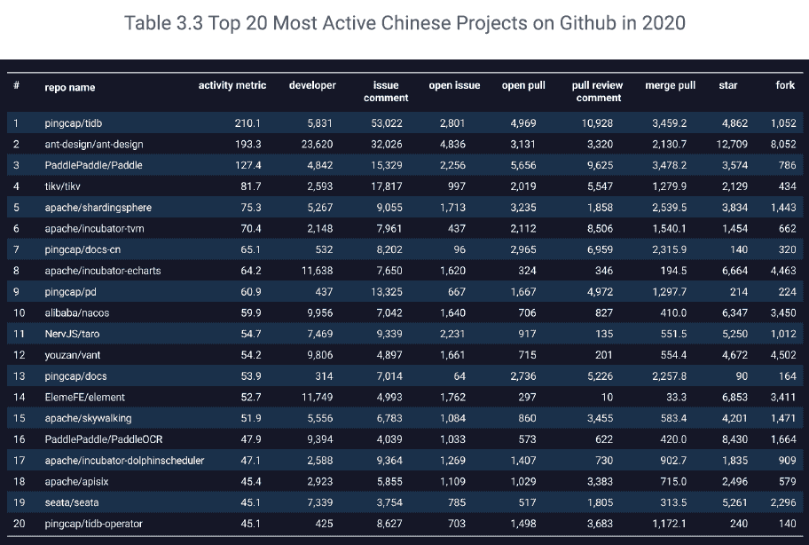
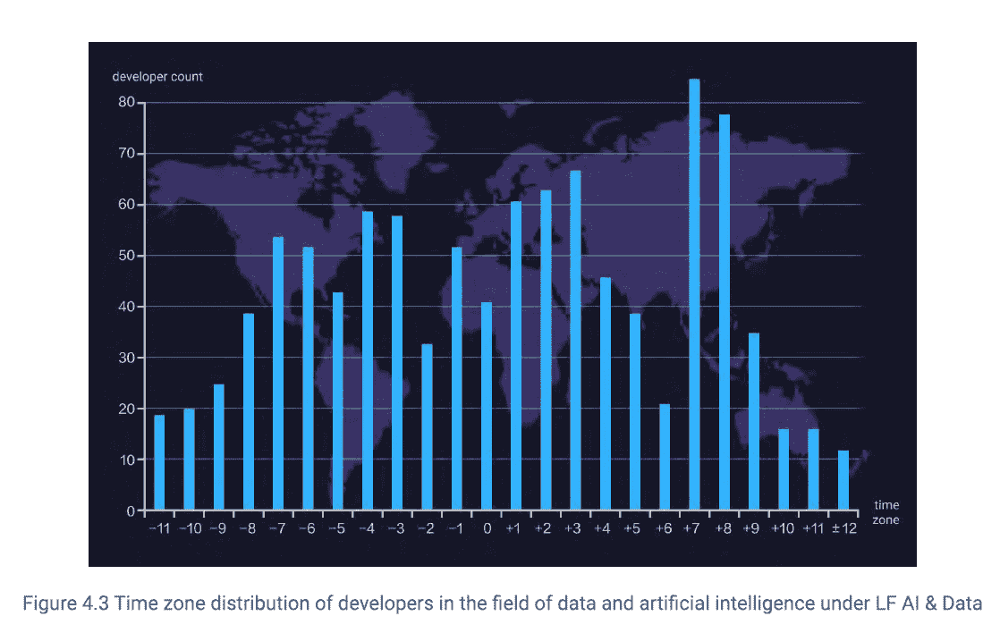
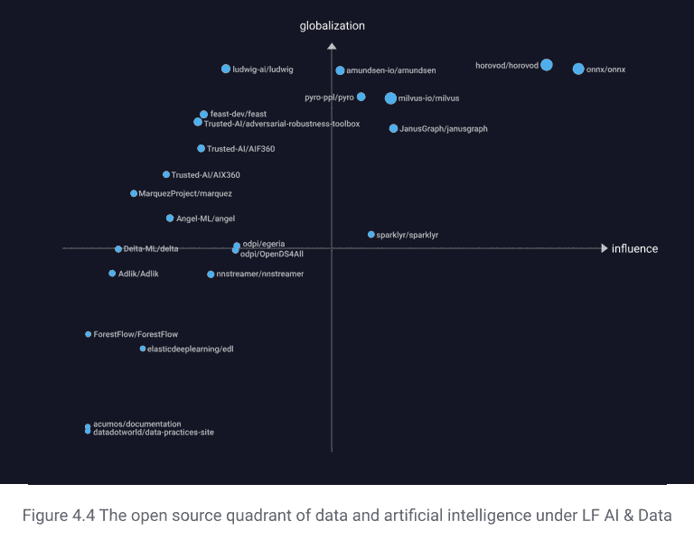

# 阿里巴巴 GitHub 回购在中国最活跃

> 原文：<https://thenewstack.io/alibaba-github-repos-most-active-in-china/>

[根据](https://www.alibabagroup.com)[《GitHub 2020 数字洞察报告》，阿里巴巴的](http://oss.x-lab.info/github-insight-report-2020-en.pdf)开源项目是目前中国企业中最活跃的相对较小的 [PingCAP](https://pingcap.com/) 位居第二，紧随其后的是更知名的百度、腾讯、京东和华为。这还远非定论，但是 X-Lab 研究小组的报告提供了一个在中国和世界范围内开放源代码的新视角。

活跃度是通过评论、拉、叉、星(包括手表)出现的频率来衡量的。在许多实体中，包括其[云操作](https://github.com/aliyun)，阿里巴巴在 2020 年拥有的代码库数量几乎是 PingCAP 的十倍，但后者的 TiDB 是全球最活跃的数据库项目之一和中国最大的 GitHub repo，根据该报告。

这些排名与[开源贡献者指数](https://opensourceindex.io/)中的排名有很大不同，后者根据个人电子邮件地址的域名来识别个人的公司关系。虽然美国公司名列榜首，但阿里巴巴、华为和腾讯都进入了全球前 25 名。

使用 GitHub 统计数据有局限性。它没有涵盖非英语国家的所有发展，尤其是那些没有高等学位的人。让 Gitee 成为中国替代方案的努力取得了有限的成功。有些人已经将 Java 应用程序迁移到了这个平台上，但是这可能是来自于公司领导的项目，而不是草根开发者。

阿里巴巴最活跃的项目涉及前端和云原生用例。 [Ant Design](https://ant.design/) 是 React UI 库， [Nacos](https://github.com/alibaba/nacos) 是用于构建云原生应用的动态服务发现、配置和服务管理平台。值得注意的是缺少与数据相关的项目，这些项目要么是公司内部进行的，要么是从阿帕奇的角度进行的。

来源:《GitHub 2020 数字洞察报告》。

来源:《GitHub 2020 数字洞察报告》。

Linux Foundation AI 和 Data Foundation 项目开发人员的最大集群位于中国的时区。百度、华为和腾讯在基金会的董事会中都有代表，但阿里巴巴开辟了一条不同的道路，过去它的一些数据项目已经转移到了阿帕奇软件基金会。来源:《GitHub 2020 数字洞察报告》。

使用图形分析，一个项目的影响程度部分基于开发者和项目之间的关系强度。该基金会的许多项目都很年轻，而且专注于一个狭窄的利基主题，因此它们的影响范围迄今相当狭窄。来源:《GitHub 2020 数字洞察报告》。

<svg xmlns:xlink="http://www.w3.org/1999/xlink" viewBox="0 0 68 31" version="1.1"><title>Group</title> <desc>Created with Sketch.</desc></svg>