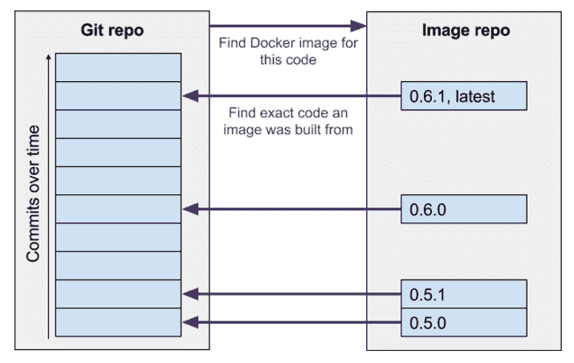

# 微型广告和容器标签的惊人力量

> 原文：<https://thenewstack.io/all-about-microbadger-com/>

这篇文章是我们将从演讲者那里收集的一系列介绍性文章中的第一篇

[To the Cloud and Beyond](http://cloudnativecomputing.softwarecircus.io/)

，这是一个为期三天的关于云计算的精彩会议

[Software Circus](https://twitter.com/softwarecircus)

集体研讨会，8 月 31 日至 9 月 2 日在阿姆斯特丹举行。

容器有能力改变基础设施架构，使其更安全、更节能。这是因为容器化的应用程序可以在几秒钟内从一台机器启动、停止或在另一台机器之间切换，这远远快于应用程序在虚拟机或裸机上的移动速度。这一速度为智能容器感知工具打开了大门，这些工具可以近乎实时地控制数据中心的运行。

结合巧妙的工具，容器可以帮助数据中心减少静态，更像一个有机整体:根据需要重新分配资源或抵御威胁。

但是为了实现这一愿景，未来的智能工具需要信息。他们需要知道这样的事情:一个特定的容器化图像是任务关键的吗？它是否包含安全漏洞？能安全停下来吗？如果它崩溃了，应该呼叫谁？

## 形象意识？尝试标签

好消息是 Docker 容器有一个灵活的机制，允许图像创建者指定信息:[标签](https://docs.docker.com/engine/userguide/labels-custom-metadata/)。标签是在 Docker 1.6 中引入的，它是为容器图像提供元数据的一种直接方式，比如谁维护图像或者图像受什么许可。标签元数据可以简单地指定为任意的键/值对。

太好了。然而，坏消息有两种味道。首先，标签不是很常用。根据[来自 PuppetLabs](https://speakerdeck.com/garethr/shipping-manifests-bill-of-lading-and-docker-metadata-and-container) 的 Gareth Rushgrove 的说法，看起来不到 20%的图片有标签。我们对 DockerHub 的分析表明，真实数字可能更低。这很遗憾，因为没有任何类型的元数据，容器图像有点像黑盒。

 [安妮·柯里

Anne Currie 已经在软件行业工作了 20 多年。她在 90 年代的黑暗时代开始做工程师，现在非常享受容器启蒙时代。](http://www.microscaling.com) 

第二个问题是目前没有标签的标准模式。Docker 鼓励在标签名称中合理使用命名空间(com.thenewstack.mylabel ),但之后他们就让开发人员自行其是了。这意味着当人们开始使用它们时，标签将会变得不一致或因应用而异，因此不再有用。Red Hat 在原子项目上做了一些很好的工作，T2、OpenShift 和 Kubernetes 也做了一些，但后者是针对特定应用的，而不是通用的标签定义。但是还需要更多。

我们认为获得一个最小的一致同意的标签模式对于充分利用容器作为操作和开发工具是至关重要的。因此，在 Docker 工作的基础上，Red Hat 和其他人正在与许多供应商合作一个名为 label-schema.org[的社区项目。该项目旨在定义一组通用的有用标签，图像创建者可以通过 Dockerfiles 轻松应用这些标签。此外，我们正在努力将标准化标签应用到下一代容器构建工具中。](http://label-schema.org)

## 我不想纠缠你，但是…

为了鼓励开发人员从标签开始，我们建立了 MicroBadger.com，在这里你可以看到 DockerHub 上任何公共图像的所有标签，并找到有用的信息，如谁维护它，它有多大，何时建成。例如微尺度图像。

MicroBadger 的目的是鼓励图像创作者使用标签，使这些标签保持一致，并获得有用的元数据徽章，例如，将 DockerHub 图像链接到构建它的 GitHub 代码。

通过给容器贴上源代码详细信息的标签，MicroBadger 使得在源代码库和图像中心之间放心地移动变得容易。

我们认为每个人都应该因为做了正确的事情而获得徽章，所以我们鼓励开发人员在他们的容器图像上定义和使用标准元数据，并使用微博客徽章来传播消息。要了解更多关于标签的信息，请观看我 8 月 31 日至 9 月 2 日在阿姆斯特丹 SoftwareCircus 的演讲，或者欢迎光临。

Docker 和 [Red Hat OpenShift](https://www.openshift.com/) 是新堆栈的赞助商。

特征图像:软件马戏团。

<svg xmlns:xlink="http://www.w3.org/1999/xlink" viewBox="0 0 68 31" version="1.1"><title>Group</title> <desc>Created with Sketch.</desc></svg>