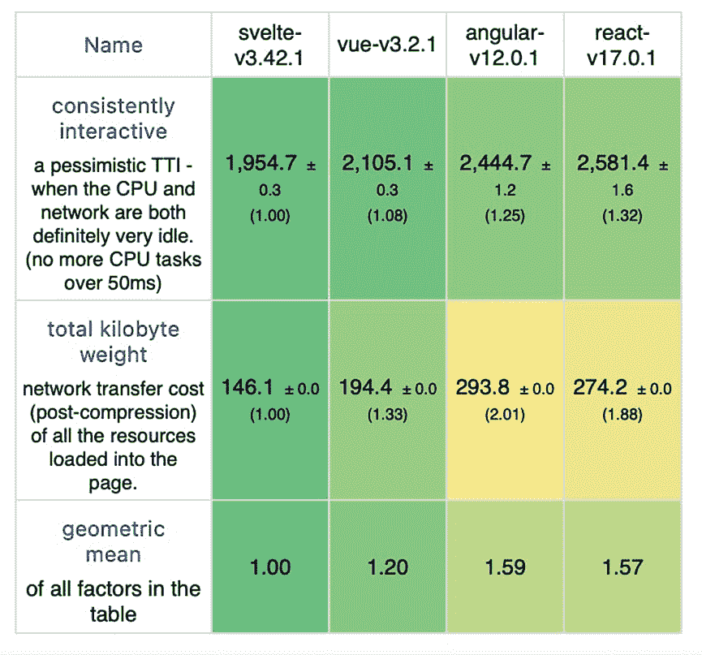

# 关于 Svelte，这个备受喜爱的，国家驱动的网络框架

> 原文：<https://thenewstack.io/all-about-svelte-the-much-loved-state-driven-web-framework/>

最新的 Stack Overflow 开发者调查显示，在被调查者中，[最受欢迎的 web 框架是 Svelte](https://insights.stackoverflow.com/survey/2021#most-loved-dreaded-and-wanted-webframe-love-dread) ，这是一个相对年轻的开源 web 用户界面框架，用于定义带有组件的 web 界面。

Svelte 是作为编译器实现的，用 TypeScript 编写，旨在在构建时完成尽可能多的工作，而不是在浏览器中。这个框架最初是由曾在《卫报》工作、目前是《纽约时报》图形编辑的里奇·哈里斯创建的，现在被许多公司使用——[svelte . dev](https://svelte.dev)网站列出了《纽约时报》,不出所料，与 Square、 [IBM](https://www.ibm.com/cloud?utm_content=inline-mention) 和 Chess.com 等公司并列。

在 Twitter 上稍微明智地搜索一下，就会发现苹果公司和 Spotify 公司在某种程度上也在使用这个框架。

与许多现代 web 框架一样，Svelte 支持 web 应用程序的状态驱动(而不是事件驱动)用户界面。希望以这种方式工作的基于浏览器的应用程序面临的挑战是，DOM 操作过于昂贵，无法将每个 DOM 对象都存储在内存中，也无法按照 W3C DOM level two API 规定的方式进行分配。

为了克服这一点，React 和 Vue 都使用了虚拟 DOM。这种方法的工作原理是，针对每个状态变化，在虚拟 DOM 中将整个应用程序重新呈现为所需的状态，然后让框架计算出使浏览器的实际 DOM 符合所需状态所需的最少数量的变化。

这种方法比您想象的更有效，但是虚拟 DOM 仍然是纯粹的开销，因为对它执行的所有操作，包括 diffing 都是对真实 DOM 执行的操作的补充。

开发人员有多种方法可以手动优化这一点——例如，使用`[shouldComponentUpdate](https://reactjs.org/docs/react-component.html#shouldcomponentupdate)`等方法让 React 知道组件的输出是否不受当前状态或道具变化的影响——但这种情况显然不理想。

## 苗条的优点

苗条的关键在于它消除了对虚拟 DOM 的需求。要在 Svelte 中创建一个组件，您可以在一个带有`.svelte`文件扩展名的 HTML 文件中编写代码，然后 Svelte 编译器将它转换成一个抽象的语法树，为您提供一个可以导入到您的应用程序中的 JavaScript 类。

Svelte 在标记中传递初始状态，而不是作为 DOM 对象，这样更便宜，加载更快。然后，它跟踪顶级组件变量的变化，只直接更新 DOM 受影响的部分，而不是重新呈现整个组件。

这种方法的一个优点是,[马克·沃克曼](https://twitter.com/mark_volkmann), Object Computing 的合伙人和杰出的工程师,《行动中的苗条和萨珀》的作者，告诉新的堆栈,“你可以更自由地进入实际的 DOM 并修改它。在 React 中，这是一件危险的事情，因为虚拟 DOM 将在下一个周期中改变，并清除您所做的一切。但在《苗条》中却不是这样。”

Svelte 采用的方法也带来了高性能的应用程序，例如通过查看软件开发商 [Stefan Krause 的基准](https://krausest.github.io/js-framework-benchmark/current.html)就可以看出这一点。这个测试呈现了一个有 4 列 1000 行的表格。您可以选择使用哪些框架。在下表中，我选择了 svelte-v3.42.1、vue-v3.2.1、angular-v12.0.1 和 react-v17.0.1。

启动指标(带有移动模拟的灯塔)

Svelte 在 2020 年由[亚采克·夏](https://medium.com/@jacekschae)举办的"[前端框架的真实世界对比"](https://medium.com/dailyjs/a-realworld-comparison-of-front-end-frameworks-2020-4e50655fe4c1)中获得了类似的令人印象深刻的结果，它在其中名列前茅。

同样，Svelte 生产的应用程序包往往比使用竞争框架生产的同等应用程序要小。同一篇 2020 年的真实世界比较文章显示，Svelte 产生的文件下载大小最小——一些流行框架报告的 gzipped 应用程序大小为:

*   React + Redux 193
*   角度 141.2
*   Vue 71
*   苗条的 15 岁

这种性能优势和较小尺寸的结合意味着您可以构建更具雄心的 web 应用程序，也使 Svelte 成为针对智能电视、智能手表和销售点系统等低功耗设备的良好选择。

在 2019 You Gotta Love Frontend code camp 的演讲中， [Harris 引用了一家生产信用卡销售终端的巴西公司 Stone](https://www.youtube.com/watch?v=AdNJ3fydeao) :

“他们试图用 React 和 Vue 以及一整套其他框架来构建这些接口，但他们无法获得他们想要的结果，因为速度太慢了。他们用苗条代替它，它工作得非常好。巴西街道上有 20 万台这样的设备在苗条地运行。”

苗条的应用程序通常需要更少的代码来实现。虽然代码行数是衡量开发人员生产力的一个糟糕的指标，但是， [Harris 认为](https://svelte.dev/blog/write-less-code)，代码行数越少的项目缺陷越少:前提是代码本身是可读的。相同的前端比较基准给出:

*   React + Redux 2050
*   角度 2145
*   Vue 2076
*   苗条 1057

但是是什么让苗条的信徒喜欢这个框架呢？“对我来说，最大的吸引力是开发人员的经验，”沃尔克曼说。

“我认为，这主要围绕着三件事，”他说。“一个是反应性方面。当我在 React 中实现一个需要某种状态的组件时，我可能会使用 useState 钩子，然后我访问一个变量并得到一个 set 函数，现在当我想改变它时，就由我来调用那个 set 函数。

“然而，在 Svelte 中，它只是一个变量，我只是将变量设置为一个新值，”Volkmann 补充道。“如果那个变量被用来生成 HTML，那么它将被正确地重新呈现，我没有更多要考虑的了。

“第二，我可以让响应式语句在需要时重新执行。第三，是商店的整个主题。”

Volkmann 说，存储在任何组件之外保存应用程序状态。每个存储保存一个 JavaScript 值，但是该值可以是一个数组或一个对象，当然可以保存许多值。每个商店都有一个 subscribe 方法，它返回一个函数，您可以调用该函数来取消订阅。

对存储的内置支持消除了对其他框架中常见的状态管理库的需要，例如 Angular 中的@ngrx/store、React 中的 Redux 和 Vue 中的 Vuex。

## 工具作业

由于`.svelte`文件与`.HTML`文件非常相似，您可以在您选择的文本编辑器中将`.svelte`扩展名与 HTML 相关联，并以这种方式获得基本的语法高亮显示。

VS 代码也有一个[细长的扩展，包括语法高亮、自动完成和林挺。VS 代码扩展由](https://marketplace.visualstudio.com/items?itemName=svelte.svelte-vscode&ssr=false#overview) [Svelte 语言工具](https://github.com/sveltejs/language-tools)提供支持，这是一个实现语言服务器协议(LSP)的开源库，可用于添加对许多其他 ide 的支持。

此外，IDE 供应商 JetBrains 有一个支持其产品家族的细长扩展，包括 [Intellij IDEA](https://www.jetbrains.com/idea/) 和 [WebStorm](https://www.jetbrains.com/webstorm/) 。

## 使用案例和限制

Svelte 是一个用于构建 web UI 组件的编译器，但它不是构建 web 应用程序的完整解决方案，并且缺少诸如服务器端呈现、路由以及 JS 和 CSS 代码拆分等功能。

“我的感觉是，Svelte 和 Vue 都喜欢更轻的东西，感觉更像是有组件的网站，或者有一些轻量级应用程序的网站，” [Living Spec](https://www.livingspec.com) 的首席执行官、 [Dojo](https://dojo.io) 框架的创建者[迪伦·席曼](https://www.linkedin.com/in/dylans/)告诉新堆栈。

“但如果你要建立一个像 Living Spec 这样的应用程序，你可能会选择一个更完整的框架，因为会自动为你做更多的事情，即使从建筑的角度来看，使用 Svelte 可能更好，”他补充道。“举例来说，我还没有看到下一个用 Svelte 构建的 Gmail。可能做过，但没见过。”

Sapper 是一个建立在 Svelte 之上的应用程序框架，是当前获得更多功能的合理方式，但它还没有，现在也永远不会达到 1.0 的地位，因为它已经被 SvelteKit 取代，目前也在公开测试中。

SvelteKit 本身令人兴奋，它承诺为不同的无服务器平台添加适配器，同时支持引擎盖下的 [Vite](https://vitejs.dev) ，提供快速启动、JavaScript 和 CSS 的简单缓存以及即时热模块重载。Volkmann 认为它已经成熟，但在正式发布之前，Svelte 可能不是复杂应用程序的最佳选择。

还应该注意的是，在 Svelte 采用的方法中存在潜在的性能权衡。虽然初始开销比传统的 JavaScript 框架低，但向一个苗条的应用程序添加更多组件的增量成本通常会更高——所以，换句话说，你最终会到达一个转折点，在那里苗条的应用程序比使用传统框架更大。

然而，事实上，这可能更多的是一种理论上的风险，而不是真实的风险。[一位自称为“牛仔程序员”的 Acmion](https://svelte-scaling.acmion.com) 的[进行了一项分析](https://acmion.com/)得出结论,“Svelte 和 React 之间的拐点在于大约 137 KB 的组件源代码，之后 gzipped Svelte 应用程序的初始下载量将高于 gzipped React 应用程序。对于未压缩的应用程序，拐点大约在 178 KB。”

另一个潜在的问题是，作为一个相对年轻的框架，Svelte 比一些更成熟的竞争对手拥有更少的预构建组件库。

“React 有大量的高质量的东西，你可以进口和使用，但还没有苗条，”Schiemann 说。也就是说，还有更多的组件一直在构建中，包括一个[材质 UI](https://sveltematerialui.com) 的实现。

最后，如果您的应用程序需要支持 Internet Explorer，Svelte 不是一个特别好的选择。[在 Internet Explorer 11](https://github.com/sveltejs/svelte/issues/2621) 中运行苗条应用程序需要 Polyfills，苗条应用程序不太可能在以前版本的浏览器中运行。如果你确实需要支持 IE，Volkmann 的博客提供了[详细说明](https://mvolkmann.github.io/blog/topics/#/blog/svelte/supporting-ie11/?v=1.0.18)。

## 学习苗条

如果你想了解更多关于 Svelte 的知识，一个好的起点是官方教程，它提供了一个如何构建一个组件的交互式演示。哈里斯也做过前端大师的[培训课程，沃克曼的书](https://frontendmasters.com/courses/svelte/)[《行动中的苗条工蜂》](https://www.manning.com/books/svelte-and-sapper-in-action)曼宁都有。

<svg xmlns:xlink="http://www.w3.org/1999/xlink" viewBox="0 0 68 31" version="1.1"><title>Group</title> <desc>Created with Sketch.</desc></svg>