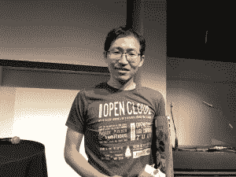

# 柏林 OpenStack 峰会上的所有热门基础设施技术

> 原文：<https://thenewstack.io/all-the-%f0%9f%94%a5hot%f0%9f%94%a5-infra-tech-at-openstack-summit-berlin/>

虽然本周柏林的天气有点冷，但最近在这里举行的 OpenStack 峰会似乎激发了人们对围绕 [OpenStack 开源私有云软件](https://www.openstack.org/software/)的新兴技术的热情。

也许一些能量来自于 OpenStack 基金会的决定，[在展会](/openstack-foundation-expands-into-open-infrastructure/)上宣布，扩大其范围以涵盖过去几年围绕 OpenStack 成长起来的其他开源基础设施软件。尽管 OpenStack 本身也在继续接纳新用户，解决新的使用案例。以下是一些在柏林四四方方的会议中心引起热议的项目:

## 飞艇

峰会见证了开源飞艇云供应工具的 1.0 版本候选，该工具最初由 AT & T 开发(随后作为开源发布)以供应其自己的基于 OpenStack 的公共云和私有云。

“我们希望构建一个声明式平台，能够快速适应新环境，并管理我们所有应用的完整生命周期，”首席系统架构师艾伦·梅多斯在一次演讲中说道。“用户应该能够操作 Airship，而不必围绕它编写额外的编排或包装，以免提方式工作。它能够通过单一的部署工作流 API 实现这一目标。”

这里有一个工具，组织可以使用它来使他们自己的基础设施可编程，使用声明性 YAML 配置文档来描述所需的环境。因为它们运行在 Kubernetes 和 Helm 上，飞艇部署可以很容易地扩展、升级和实现高可用性。

美国电话电报公司自己现在使用飞艇来管理 20 多种不同的环境，所有这些现在都可以快速复制。这将是该公司明年推出 5G 网络的工具。

Airship 的完整 1.0 生产版本是 OpenStack 的试点项目，预计将在下一次 OpenStack 活动中推出，即明年 5 月在丹佛举行的开放基础设施峰会。

## 祖尔语

去年五月在温哥华[举行的 OpenStack 峰会上，我们第一次介绍了开源平台](/openstack-spins-off-zuul-a-gated-ci-pipeline-for-multiple-repositories/) [Zuul CI/CD platform](https://zuul-ci.org/) ，除了管理 OpenStack 本身复杂的代码库之外，它还在继续获得关注。Zuul 比 Jenkins 等传统的持续集成(CI)系统更有优势，因为它可以支持跨多个存储库的代码协调开发。

宝马软件工程师托拜厄斯·汉高

例如，宝马软件工程师[托拜厄斯·汉高](https://github.com/tobiashenkel)在一次演讲中指出，宝马已经采用了 Zuul 来跟踪它正在为其汽车开发的软件。每辆汽车现在都有多个软件程序来驱动从防抱死刹车到仪表板娱乐系统的一切。在许多情况下，需要在汽车内的各个系统之间协调操作，以及与数据中心的控制进行协调。

汉高说，所有这些都意味着宝马内部的开发必须由多个团队并行完成，他们必须相互协调，同时不能妨碍彼此。

他解释说，Zuul 的自动化门控已经成为宝马的“游戏规则改变者”。在使用传统 CI 平台的代码库上测试变更将需要“串行门控”和多个库，这限制了一天中可以完成的测试数量，因为每个团队测试其变更，而其他团队在合并他们自己的变更之前等待。Zuul 的自动选通“将这一过程并行化，以便用推测的未来状态测试每个更改，以及在其前面排队的所有补丁。如果都变绿了，它们就被合并了，”他解释道。

Zuul 还驱动开源虚拟网络软件[钨架构](https://tungsten.io/)(以前的 OpenContrail)的构建系统，根据钨的包维护者 [CodiLime](https://www.codilime.com/) 的另一个演示。来自 Tungsten Fabric 的代码分布在大约 30 个存储库中，最终的包作为一组容器交付。CodiLime 严格地将 Zuul 作为一个构建工具，它可以运行一个管道来为不同的平台(CentOS，Windows 等)构建多个包。)以及针对 Kubernetes、OpenStack 和公共云的不同配置。可以按计划(对于每日构建)、按命令或每当提交新代码时触发管道。

## Kata 容器

一年前[在](/kata-containers-secure-lightweight-virtual-machines-container-environments/)作为 OpenStack 试点项目被引入， [Kata Containers](https://katacontainers.io/) 因为其独特的构造吸引了稳定的兴趣，它提供了既高性能又像传统虚拟机一样安全的容器。在今年的峰会上，关于形的讨论是出席人数最多的。

Hyper HQ 联合创始人兼首席技术官许旺。

该技术使用硬件支持的虚拟化来提供容器之间的边界，这为多租户奠定了基础，以便服务提供商或大型组织可以安全地将其用户的容器集彼此分开。

Kata 容器的大部分工作由 Hyper HQ 完成，以构建 Hyper.sh，这是一个兼容 Docker 的无服务器容器托管服务。在峰会上，Hyper HQ 联合创始人兼首席技术官许旺提供了一些表征 Kata 容器性能的基准，既与[开放容器倡议](https://www.opencontainers.org/)的 runC(业界用作互操作性标准规范的轻量级容器运行时)进行了对比，也与 [gAdvisor](https://github.com/google/gvisor) 进行了对比，gAdvisor 是由谷歌创建的容器运行时沙箱，用于提供[更强的容器安全控制](/google-launches-gvisor-an-open-source-sandboxed-container-runtime/)。

像 gVisor 一样，卡塔容器提供了比普通容器更小的攻击面。与只提供 Linux 调用子集的 gVisor 不同，gVisor 不限制容器可以对主机操作系统内核采取的操作。在性能方面，Wang 展示了 Kata 容器可以与普通 runC 运行时的 CPU、I/O 和网络响应能力相媲美，而 gVisor 则难以保持同等性能，并且网络性能非常慢。

## 讽刺的

上述所有技术都是在 OpenStack 本身之外创建的(即使在许多情况下，它们是为了帮助部署和管理 OpenStack 而创建的)。但是，即使核心 OpenStack 组件的开发开始降温，为其他用途扩展软件的项目仍在继续激增。

OpenStack 最近的一个令人惊讶的用途是提供裸机服务器，即通过名副其实的[讽刺性的](https://wiki.openstack.org/wiki/Ironic) OpenStack 集成。在他的主题演讲中，OpenStack 基金会执行董事 [Jonathan Bryce](https://twitter.com/jbryce) 指出，在 OpenStack 社区中，讽刺的使用已经从 2016 年的 9%上升到 2018 年的 24%。

讽刺提供了一个 API 和一组插件来与裸机虚拟机管理程序交互，PXE 和 IPMI [来控制机器](https://docs.openstack.org/ironic/latest/user/index.html)。欧洲基础设施提供商 [OVH](https://www.ovh.com/world/) 的首席技术官 [Alain Fiocco](https://www.linkedin.com/in/alainfiocco) 在新闻发布会上指出，对于云服务提供商来说，这种能力已经证明非常有用，因为它允许他们更容易地向客户提供裸机服务器。OVH 通过自己的定制 API 提供裸机资源，但转向讽刺将为最终用户提供一种标准化的方式来采购采用云定价模式的裸机服务器。他说，这还可以帮助 OVH 更容易地为内部运营提供这些服务器。

并且它的使用不仅限于服务提供商。“讽刺一直是一个非常运营商驱动的项目，”红帽首席软件工程师 Julia Kreger 指出。大约 13%的代码贡献来自运营商和管理员，他们希望提供内部托管。

## 电子人项目

OpenStack 的另一个新兴用例是运行大型机器学习作业，这需要大量处理器来进行密集建模。为了在这项大规模工作中获得更好的性能，研究人员正在转向替代处理器架构，最著名的是 GPU(用于矢量处理)和 FPGAs，它们可以针对特定任务进行动态重新配置。

众所周知，为这种硬件加速器准备作业是一项单调乏味的工作。Cyborg (之前称为 Nomad)通过 OpenStack 的 Nova 计算资源接口提供了一种利用这些处理器的简单方法。实际上，OpenStack 以裸机速度命令行驱动的“设备即服务”的形式提供 FPGAs， [Melissa Evers-Hood](https://www.linkedin.com/in/melissaevershood/) 指出，他是英特尔边缘和云协调堆栈的主管，英特尔已经投资了 Cyborg。

在主题演讲的第一天，OpenStack 基金会首席运营官[马克·科利尔](https://twitter.com/sparkycollier)提供了一个 Cyborg 驱动 FPGAs 的演示，用于对人们谈话的视频进行实时情绪分析。通过 Nova 命令行，用户可以找到可用的 FPGA，将比特流上传到 FPGA 并执行模型推理工作。这个演示分析了美国前总统巴拉克·奥巴马和他当时的白宫办公厅主任约翰·波德斯塔之间的一段对话。

除了 ML 任务之外，利用 OpenStack 的 FPGAs 还可以为更高效的视频转录和网络功能虚拟化铺平道路。

## StarlingX

OpenStack 开始应对的另一个新兴市场是边缘计算，一些计算资源被放在网络的边缘，而不是回到数据中心。这个想法是边缘网络可以更好地响应终端用户，或者可以从物联网终端节点收集和管理数据，并控制物联网终端节点。然而，这种潜在的收益可能会被分布式多层架构通常带来的额外复杂性所抵消。

上个月推出的， [StarlingX](https://www.starlingx.io/) 旨在降低这种复杂性。基于自以为是的 OpenStack 发行版，该发行版已经精简，并配备了新的功能，该软件包的设计使得它可以在这些潜在的较小环境中运行。StarlingX 背后的[动机是在 edge 上提供完全自主的计算，可以在最少的监督下运行。它被设计为仅在两个内核上运行，提供完整的控制平面，以及托管基于虚拟机的应用程序的能力。](https://www.openstack.org/edge-computing/cloud-edge-computing-beyond-the-data-center)

英特尔 OpenStack 开发人员 [Dean Troyer](https://twitter.com/dtroyer) 表示:“从初始配置和安装完整的云，到为硬件和软件库存、故障和警报处理管理、硬件和流程故障的检测和恢复以及补丁和升级的零影响协调添加 API，这一切都可以完成。

*open stack 基金会支付了记者参加本次会议的差旅费和住宿费。*

开放堆栈基金会，红帽是新堆栈的赞助商。

专题艺术:柏林死鸡巷[的街头艺术。所有照片由约阿布杰克逊。](https://www.minube.net/place/dead-chicken-alley--a443321)

<svg xmlns:xlink="http://www.w3.org/1999/xlink" viewBox="0 0 68 31" version="1.1"><title>Group</title> <desc>Created with Sketch.</desc></svg>