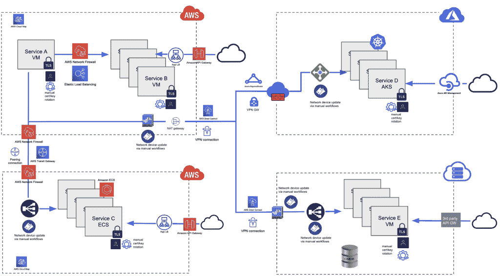
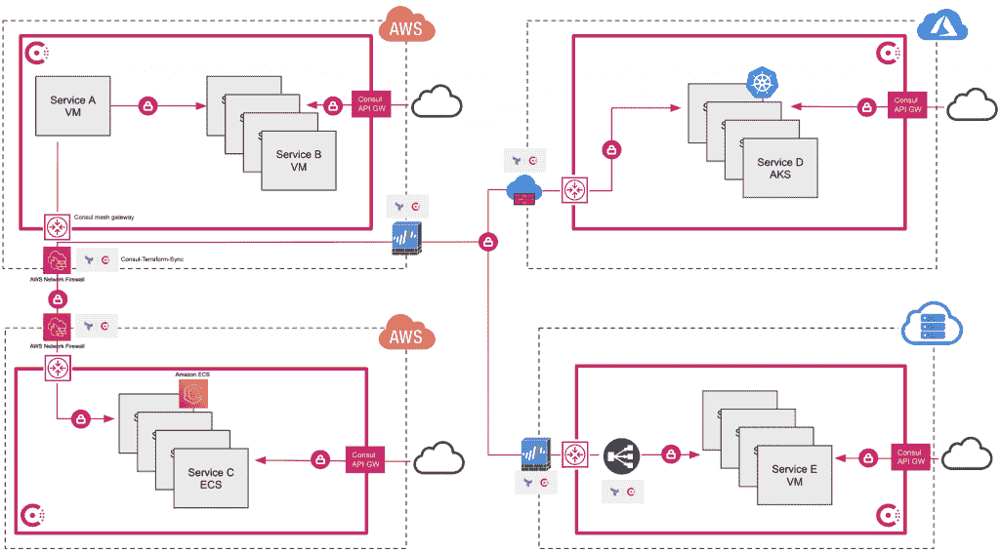
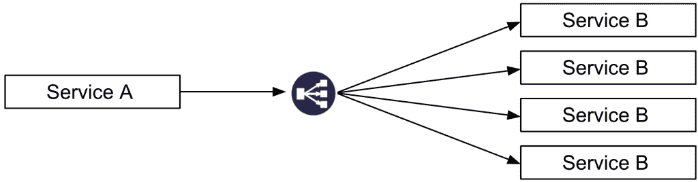
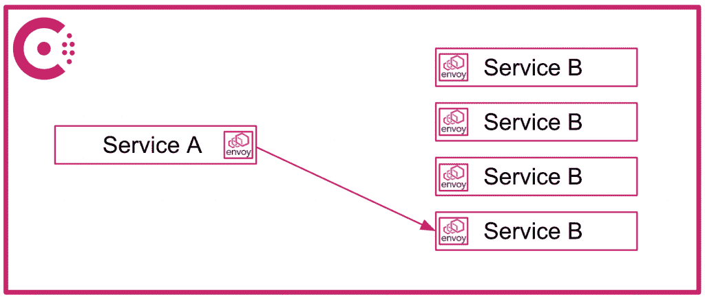

# 服务网格可以做的所有事情

> 原文：<https://thenewstack.io/all-the-things-a-service-mesh-can-do/>

 [范·潘

范是哈希公司领事部门的技术产品营销经理。他职业生涯的大部分时间都在基础设施领域，喜欢学习新技术和动手实践。当他不盯着电脑屏幕时，他会分享食物的照片，这让他的妻子感到沮丧。](https://www.linkedin.com/in/van-phan-726a823/) 

即使服务网格的采用持续增长，一些组织仍然试图理解服务网格能做什么和不能做什么的全部范围。

他们可能没有意识到服务网格不仅仅是另一个单一用途的工具，而是一个解决各种网络需求的工具。服务网格实际上可能有助于整合多个现有工具，从而帮助减少管理工作和成本。

看看这两种多云网络架构就知道了。

将网络服务和安全相关功能自动化并卸载到与云无关的服务网格上，有助于简化多云环境中的管理。

使用云供应商特定网络解决方案的多云架构:

使用与云无关的服务网格:

许多服务网格产品包括服务发现、零信任网络和负载平衡功能，而其他一些服务网格产品甚至扩展到提供多云/多运行时连接、网络自动化和南北流量控制。让我们来看一看与云无关的服务网格的功能，以及它在跨环境整合现有工具以帮助减少管理工作和费用方面的潜力。

## 服务发现

服务发现允许开发人员对其网络上所有注册服务的网络位置和健康状况进行分类和跟踪。在服务不断扩大和缩小的动态环境中，这是一项重要的功能。这通常是采用服务网格之旅的第一步。

有许多方法可以获得服务发现功能。但内置于 Kubernetes、亚马逊 EKS、Azure AKS、谷歌 GKE 或服务发现工具(如 AWS 云图和配置管理数据库(CMDB))的常用功能通常特定于它们运行的平台或云。他们可以发现的服务范围受限于其特定平台或云的边界。然而今天，大多数组织跨多个平台或云环境运行应用程序，这意味着他们需要学习、安装和管理多个服务发现解决方案。

更好的方法是跨多个运行时的与云无关的服务网格。例如，[hashi corp consult](https://www.consul.io/)是一个不可知的服务网格，包括对 Kubernetes、虚拟机、亚马逊 ECS 和 HashiCorp Nomad 的支持，允许组织跨多个异构环境集中全球服务发现。

通过将服务发现整合到一个服务网格中，平台团队可以将服务发现作为一项全球共享服务来提供，与依赖单个团队在没有任何监督的情况下运行和管理他们自己的服务发现工具相比，降低了成本，提高了合规性并简化了管理。

## 零信任网络

组织不再仅仅依赖传统的网络外围保护方法，而是越来越多地寻求零信任网络来保护其网络和基础设施。

[零信任安全](https://thenewstack.io/what-is-zero-trust-security/)不同于传统的城堡和壕沟安全方法，后者依赖于防御现代基于云的环境中可能不存在的边界，它认为任何服务——无论是边界内部还是外部——都不应被授予访问权限，直到它被授权和认证，并且所有通信都被加密。

应用认证、授权和加密的零信任网络原则是主要的服务网格能力。服务网格通过代理，通常是[特使](https://www.envoyproxy.io/)，自动重定向服务之间的入口和出口流量。这允许授权、认证和加密责任被卸载到代理上。

服务网格使用服务身份而不是 IP 地址作为允许或拒绝授权的单位，极大地简化了服务到服务通信的管理。

管理员可以配置一个由代理强制执行的全部拒绝策略，以阻止所有服务到服务的通信。开发人员可以添加更细粒度的策略来授权特定服务根据需要进行通信。

服务网格代理还将确保所有服务对服务的通信被自动认证和加密。在任何服务通信之前，代理确保 TLS 证书被交换，并且网络上的所有流量被加密。这就形成了一个更安全的网络，防止了服务之间的横向移动，即使在网络遭到破坏后也是如此。

最后，服务网格通过在开发周期的早期为管理员和开发人员提供授权、认证和加密其网络服务的能力，从本质上帮助组织向左转变。通过左移，组织可以降低在投入生产之前由于不可预见的安全漏洞而导致的最后一分钟延误的风险。此外，服务网格的左移使网络管理员能够专注于保护网络边界，而不是管理单个 IP 地址。

服务网格是网络管理员的力量倍增器，也是一个抽象层，允许开发人员专注于他们的应用程序，而不是安全逻辑，并避免管理和轮换证书和密钥的辛劳。

## 负载平衡

由于服务网格上的数据流量流经代理，因此服务网格还可以控制流量整形等功能。一个简单的例子是服务的多个实例之间的负载平衡。服务网格允许自定义流量模式直接在实例之间分发，而不是通过单独的负载平衡设备进行额外的网络跳跃。即使实例规模扩大或缩小，服务网格也可以动态调整流量分布。使用服务网格可以大大降低跨多个不同环境和云管理多个不同负载平衡设备的成本和复杂性。

对比:

## 多云连接

许多组织都有不同的团队和服务，分布在不同的网络和特定云区域。许多公司还在多个云环境中部署了服务。跨不同的云网络安全地连接这些服务是一个非常理想的功能，通常需要网络团队付出巨大的努力。此外，子网之间要求非重叠无类域间路由(CIDR)范围的限制可能会阻止虚拟专用云(VPC)和虚拟网络(VNETs)之间的网络连接。服务网格产品可以安全地连接运行在不同云网络上的服务，而不需要同等程度的努力。

例如，HashiCorp Consul 支持多数据中心拓扑，该拓扑使用网状网关在跨云的不同网络中运行的多个 Consul 部署之间建立安全连接。A 队可以在 EKS 部署一个咨询集群。团队 B 可以在 AKS 上部署一个单独的 Consul 集群。团队 C 可以在私有内部数据中心的虚拟机上部署 Consul 集群。可以在三个 Consul 集群之间建立多数据中心配置，允许在 EKS、AKS 和虚拟机之间运行的服务的安全连接，而无需额外的网络配置，如 VPN、直连或 ExpressRoutes。Consul 网状网网关允许多个 Consul 部署的集群，即使 IP 范围在网络上重叠。

## 自动化

自动化在动态环境中尤其有利。波动的需求要求运营商扩展服务实例的数量，这是一项相当琐碎的任务。但是，可能需要更新网络防火墙、负载平衡器或其他网络基础设施，才能访问新实例。同样，新的应用程序服务可能需要更新网络设备，客户端才能访问它们。

由于大多数组织都有独立的网络和安全团队，这些工作流通常需要手动申请网络设备更新，这可能需要几个小时甚至几天才能完成。缩减或淘汰服务可能会导致额外的问题。这是因为网络团队从网络设备中删除 IP 地址的请求很容易被忽略，从而导致潜在的安全漏洞。

为了应对这些挑战，一些服务网格构建了与基础设施供应工具(如 HashiCorp Terraform)的独特集成。Consul 与 Terraform 进行了独特的集成，能够自动触发网络设备更新和重新配置。运营商可以配置[Consul-Terraform-Sync(CTS)](https://github.com/hashicorp/consul-terraform-sync)根据 Consul 目录中服务的变化自动更新防火墙和负载平衡器等设备。这些任务的自动化减少了对人工售票系统的依赖，提高了工作流程效率，并增强了组织的安全态势。

## 南北交通控制

除了在组织网络内的服务之间调整和路由流量之外，还需要提供从外部客户端对这些服务的访问。AWS API Gateway、Azure API Management 和 Google Cloud API Gateway 等云原生选项对于不打算扩展到单一云之外的组织来说是不错的选择。然而，对于在多个云上运行的组织来说，在单个通用平台上实现标准化是有价值的。

一些不可知的服务网格，包括 Consul，有一个内置的 [API 网关](https://www.consul.io/docs/api-gateway)，可以提供与云本地选项类似的功能。这使得组织可以使用一个一致的管理平面来管理服务网格流量(东-西)内的流量以及来自外部客户端(北-南)的流量，从而无需在不同环境中部署多个不同的 API 网关。

谁会从服务网格的工具整合中受益？

如果服务网格可以帮助整合不同运行时之间的许多不同工具，那么每个组织是否都应该将服务网格整合到他们的基础设施中呢？嗯，那要看情况。

对于已经在多个云中的 [86%的组织，或者计划成为](https://www.hashicorp.com/state-of-the-cloud)的组织，服务网格肯定有助于遏制工具的蔓延。

即使是致力于单一云提供商的组织也可能要处理由不同开发团队选择的不同运行时。在服务网格上实现标准化以提供全球服务发现、零信任网络和负载平衡，也可以帮助这些组织减少工具蔓延。像 Consul 这样的不可知服务网格可以通过内置功能提供进一步的工具整合，以连接云之间的服务，自动更新网络设备并控制外部客户端对服务的访问。

虽然一些较小的组织可能不会看到工具的重大整合，但至少他们仍然可以通过采用服务网格作为力量倍增器来改善他们的整体安全状况，而不会给开发人员、平台工程师或网络工程师带来额外的负担。

## 后续步骤

要了解更多信息，请访问[网站，探索 consul 的使用案例和特性。](https://www.consul.io/)

有兴趣在您的环境中测试服务网格功能吗？前往 [HashiCorp Learn](https://learn.hashicorp.com/consul) ，在那里你可以按照一步一步的教程来尝试 Consul 的所有服务网格特性。教程在多个运行时上提供，包括 [Kubernetes](https://learn.hashicorp.com/collections/consul/gs-consul-service-mesh) 、[亚马逊 ECS](https://learn.hashicorp.com/tutorials/consul/consul-ecs-ec2?in=consul/cloud-integrations) 、[虚拟机](https://learn.hashicorp.com/collections/consul/getting-started)等。

<svg xmlns:xlink="http://www.w3.org/1999/xlink" viewBox="0 0 68 31" version="1.1"><title>Group</title> <desc>Created with Sketch.</desc></svg>