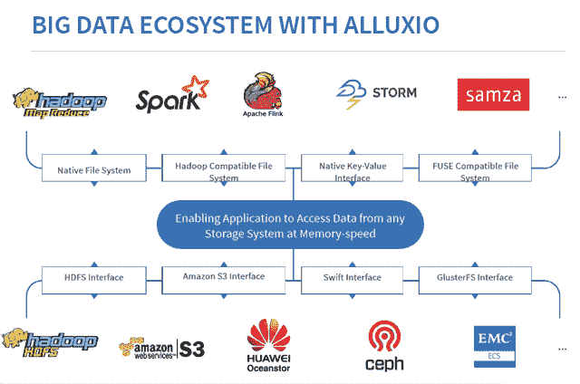

# Alluxio 以内存速度提供分布式存储

> 原文：<https://thenewstack.io/alluxio-provides-distributed-storage-memory-speeds/>

对于试图管理一系列存储选项的公司来说， [Alluxio](http://www.alluxio.org/) 提供了一种将所有这些存储库集中到同一个畜栏中用于其大数据项目的方法。

Alluxio 已经成为增长最快的开源大数据项目之一，四年后已经有超过 500 名贡献者，首席执行官[李皓原](https://people.eecs.berkeley.edu/~haoyuan/)在三月份的 Vault 大数据会议上告诉观众。

传统上，大数据生态系统是针对计算的 MapReduce 和针对存储的 HDFS，但现在有许多不同的存储选择，都具有不同的属性。因此，企业正在经历来自所有不同存储系统的孤岛，它们变得难以管理。

他说，这些类型的存储中有许多不是为这些类型的工作负载而构建的，因此性能也成为一个大问题。Alluxio 的目标是统一来自所有不同存储系统的数据，并向上层应用程序呈现全局命名空间的统一视图，同时使运营商能够快速访问数据。

“我们将 Alluxio 放在计算和存储系统之间。我们统一来自不同存储的数据，并将这个全局命名空间呈现给上层应用程序，使它们能够以内存速度与数据进行交互，”他说。

本质上，它是 Spark 和 MapReduce 等计算框架与底层存储系统之间的可编程接口，即基于分布式节点的内存。然后，它使用分层存储架构，将最常用的数据缓存在内存中，不常用的数据存储在固态硬盘和传统硬盘上。

正如 [Jowanza Joseph](https://github.com/josep2?tab=repositories) ，One Click Retail 的高级软件工程师所说:

“理想情况下，我们会有一些方法来指定我们希望在缓存中保留哪些数据，以及何时释放这些数据，并能够围绕这些数据进行规划。Alluxio 正是这样，它有一个复杂的 API，支持许多现成的数据存储。”

Alluxio 支持一系列存储系统，包括亚马逊 S3、谷歌云存储、Gluster、Ceph、HDFS、NFS 和 OpenStack Swift。

缓存功能帮助巴克莱银行将其工作流程迭代时间从数小时减少到数秒。

“尽管 Spark 提供了缓存功能，但每次我们重启上下文、更新依赖关系 jar 或重新提交作业时，加载的数据都会从内存中删除，恢复数据的唯一方法是从中央仓库重新加载，”它在一份白皮书中说道。

它可以将其用作任何文本格式的存储，包括[拼花](https://parquet.apache.org/)、 [Avro](https://avro.apache.org/) 、 [Kryo](https://github.com/EsotericSoftware/kryo) 以及压缩算法(如 [Snappy](https://github.com/google/snappy) 或 [LZO](http://www.oberhumer.com/opensource/lzo/) )，以减少内存占用。

在 Vault，李强调了中国旅游网站去哪儿如何使用 Alluxio 管理不同存储系统的数据，以及中国搜索公司百度如何在以前需要 15 分钟的批量查询现在只需不到 30 秒。

百度管理着一个 Alluxio 集群，它可以扩展到 1000 个节点和超过 2TB 的容量，包括 50TB 的内存存储和磁盘上的余额。

## 从超光速粒子到阿鲁西奥

Alluxio 始于 2012 年左右加州大学伯克利分校 AmpLab 的一个项目，最初被称为 Tachyon。2013 年是[开源](https://github.com/Alluxio/alluxio)，2016 年改名。李说，1.5 版本将于本季度推出。

它已经宣布与存储供应商 [EMC](http://searchstorage.techtarget.com/blog/Storage-Soup/Alluxio-in-memory-storage-software-gains-EMC-mindshare) 和华为合作，并且在 3 月份发布的最新[DC/操作系统平台](https://techcrunch.com/2017/03/14/mesospheres-dcos-adds-more-one-click-integrations-and-better-support-for-machine-learning-workloads/)中，Mesosphere 包括了与 Alluxio 的一键式集成。

商用[企业版](https://www.alluxio.com/blog/alluxio-releases-data-analytics-solution-for-alluxio-enterprise-edition-and-dell-emc-elastic-cloud-storage)1 月亮相；可以从 Alluxio 网站下载免费的社区版。

替代技术包括[阿帕奇点火](https://ignite.apache.org/)、[阿帕奇 Geode](https://thenewstack.io/apache-geode-spawns-sorts-memory-things/) 和 [Spark 配合 Redis](https://redis.com/press/redis-accelerates-spark-by-over-100-times/) 使用。

Alluxio 的与众不同之处在于，根据 [Evaluator Group](http://www.evaluatorgroup.com/document/alluxio-memory-file-system-industry-announcement/) 的报告，它使用日志数据的重新计算来提供容错，而不是像分布式文件系统通常所做的那样，在接收时创建三个分布式副本。这提高了性能，意味着它可以从故障前的某个时间点重建数据集。

[Gartner](https://www.gartner.com/doc/3637017/market-guide-hadoop-operations-providers) 将其与其他 Hadoop 运营提供商 [Attunity](http://www.attunity.com/) 、 [BlueData 软件](https://www.bluedata.com/)、DriveScale、 [GridGain Systems、](https://www.gridgain.com/) [Pepperdata](http://www.pepperdata.com/) 等进行对比。这家分析公司指出，这是一个在技能差距和技术不成熟中挣扎的市场。

特征图片:[夕阳下的畜栏](https://www.flickr.com/photos/lorenkerns/9460249648/in/photolist-fpYfCy-H3VV5q-bcYfj-7YXcoZ-3D9j5a-qdcjti-gwmAC2-962y7q-gwmN7H-g1EDcJ-oV5Qdv-mueF7D-jwU2Mo-HZDgwc-bcYfi-RpbJyG-oMri5p-gHAzxk-nNiide-95YwWV-nvNPyU-kerFTR-bbUcen-95YvRV-8k8t4r-aNtAJ6-5oVR4n-5oVQJP-5oVQQk-cceTpG-962yRy-95YwAZ-5dCN9n-bE7wJy-bcYfh-iBDp1V-dtAEA-aNtCht-rgRrB4-95YvGv-bxi8Q4-r1yRZ3-dtADy-962ykW-unJBUQ-a3JbsF-de1S95-unG2rC-671Vyx-unPr3F)**由[洛伦·克恩斯](https://www.flickr.com/photos/lorenkerns/)，持**下 [CC BY-SA 2.0](https://creativecommons.org/licenses/by/2.0/)** 。**

**<svg xmlns:xlink="http://www.w3.org/1999/xlink" viewBox="0 0 68 31" version="1.1"><title>Group</title> <desc>Created with Sketch.</desc></svg>**