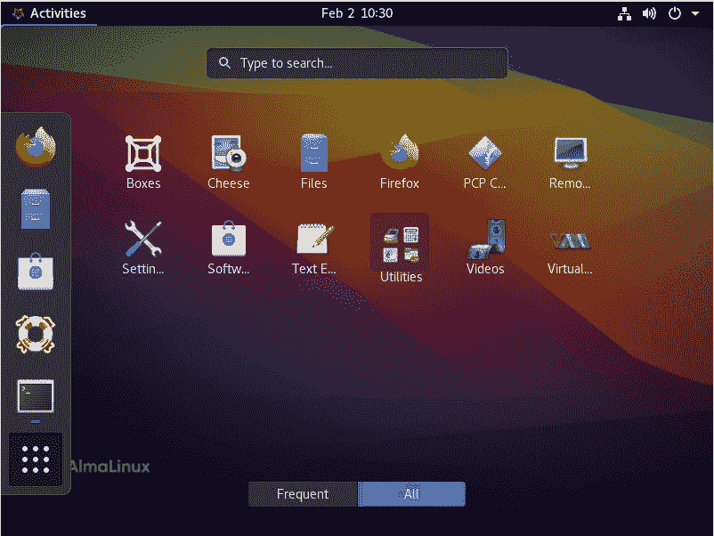

# AlmaLinux 抓住了 CentOS 的灵魂

> 原文：<https://thenewstack.io/almalinux-captures-the-soul-of-centos/>

“Alma”在拉丁语中是灵魂的意思；因此，一家公司， [CloudLinux](https://www.cloudlinux.com/) ，致力于理解 Linux 如何影响商业，以及理解那些让 Linux 为公司工作的核心，是的，灵魂，将它的 CentOS 分支命名为 [AlmaLinux](https://almalinux.org/) ，这是完全合理的。

AlmaLinux 的想法是在[红帽](https://www.openshift.com/try?utm_content=inline-mention)宣布[它正在用我们所知道的 CentOS 做 awa](https://thenewstack.io/wherefore-art-thou-centos-rocky-linux-cloudlinux-and-centos-stream/) y 之后产生的。推出的是常规的基于点的版本，推出的是滚动版本，称为 [CentOS Stream](http://www.centos.org) 。

对于一些人来说，用滚动版本替换标准版本并不是什么大事。还是 CentOS 吧？是的。算是吧。但不是。如果从基本的角度来看，CentOS Stream 仍然是 CentOS，只是采用了不同的更新方法，这使得企业对操作系统的稳定性感到紧张。

但远不止如此。

事实上，当你开始关注变化的细节时，你会开始理解为什么这种变化如此深远…以及为什么 AlmaLinux 有意义。

我已经讨论了 CentOS 变化的细节(请阅读“[回到未来:CentOS Streams](https://thenewstack.io/back-to-the-future-a-look-at-centos-streams/) 概览”)。这一次，我想把重点放在 CentOS 的新分支——alma Linux 上。

对于那些喜欢获得自由和支持的人来说，这里是 CloudLinux 对此的说法。AlmaLinux 将:

*   永远免费和开源，没有许可证或使用限制。
*   与社区共同拥有和管理。
*   一直支持到 2029 年。

这应该能让所有关心 AlmaLinux 未来的人松一口气。CloudLinux 对这个项目非常认真，并确保 CentOS 管理员拥有一个不会被拖垮的平台。为了让这个提议更好，很明显 AlmaLinux 支持将是长期的和持续的。对于第一个版本，管理员将享受 8 年的支持。

对于那些已经部署了大量 CentOS 机器的人，CloudLinux 已经明确表示，它将发布一个工具，通过一个命令将 CentOS 转换为 AlmaLinux。该工具尚未浮出水面，但我确信它会在新平台首次正式发布时及时到来。

## 从云到大地

AlmaLinux 由 CloudLinux 创建，作为 Red Hat Enterprise Linux 的 1:1 二进制兼容分支。用 CloudLinux 的话说:

*AlmaLinux 是一个开源的、由社区驱动的项目，旨在填补 CentOS 稳定版消亡后留下的空白。AlmaLinux 是 RHEL 8 的 1:1 二进制兼容分支，由已建立的 CloudLinux 操作系统的创建者构建。*

听起来很熟悉，对吧？这是应该的，因为这正是 CentOS 多年来所扮演的角色。但与 CentOS 不同的是，CloudLinux 打算以每年 100 万美元的价格支持 AlmaLinux。换句话说，AlmaLinux 背后有严肃的支持。

## 测试，测试…这东西开着吗？

CloudLinux 承诺将在 2021 年前几个月正式发布新版本，你已经可以下载并安装该操作系统的测试版了。

我就是这么做的；经过快速(非常简单)的安装后，我可以尝试一下 AlmaLinux。这个测试的结果？任何 CentOS 管理员都将在 AlmaLinux 上如鱼得水。事实上，AlmaLinux 已经被很好地组合在一起，它基本上是 CentOS(或 RHEL，对于那些在开发流中游泳的人来说)，具有不同的品牌(以及一个虚拟机管理器作为额外的措施)。

与 CentOS 一样，您可以安装 AlmaLinux(使用在 RHEL 和 CentOS 中找到的相同安装程序),无论有没有 GUI。我选择了 GUI 路线，只是为了看看 CloudLinux 对 GNOME 做了什么。

不多。

这是件好事。

其实就是 GNOME 而已(图 1)。

图 1:运行在 AlmaLinux 上的 GNOME 对于任何使用过这个桌面环境的人来说都是熟悉的。

当您安装基本服务器(带有 GUI)时，您得到的就是:一个基本的服务器操作系统，带有一个桌面环境，仅此而已。事实上，它非常简单——对此我毫无怨言。当然，在安装过程中，您可以选择安装更多，但是我倾向于从最少的开始，然后按需添加。

当然，和 CentOS 一样，安装包是用`dnf`工具处理的，所以 AlmaLinux 应该很熟悉。

想要安装 web 服务器吗？

`sudo dnf install httpd -y`

想安装数据库服务器吗？

`sudo dnf install mariadb -y`

想要部署容器吗？[脚夫](https://thenewstack.io/tutorial-host-a-local-podman-image-registry/)已经安装完毕。

你看到模式了吗？

我立即注意到的一件事是，在 AlmaLinux 上安装软件和运行更新比在 CentOS 上快得多。事实上，这是我第一次使用基于 RHEL 的操作系统，它可以像 Ubuntu Server(我的首选)一样快速地升级和安装软件。使用 CentOS，安装似乎总是比我选择的服务器平台花费更多的时间。

## 但是 cPanel 呢？

这是一个很大的…非常大的…问题。当红帽宣布 CentOS 的变化时， [cPanel](https://cpanel.net/) 的开发者明确表示他们不会支持 CentOS 流。为什么这是一件大事？对于那些不知道的人来说，cPanel 是市场上使用最广泛的虚拟主机控制面板。任何需要主机自动化的人都会立即求助 cPanel。

多年来，cPanel/CentOS 组合是最被广泛接受的工作组合。随着这种组合的破裂，一大群管理员和企业陷入困境。当然，cPanel 很快做出了回应。他们的回答？

*   在 Ubuntu LTS 上加速对 cPanel 的支持，以便在 2021 年末提供一个生产就绪版本。
*   继续开发 cPanel 以支持 CentOS 8，直到它于 12 月 31 日停产。
*   使过渡 CentOS 部署和从第三方(如 CloudLinux)获取更新成为可能，从而将 CentOS 8 的寿命延长至 2029 年。
*   致力于支持 AlmaLinux。

我试图在 AlmaLinux 的测试版上安装 cPanel，但是没有成功。这是可以理解的，因为它还处于该平台第一次发布的早期。好消息是 cPanel 已经明确表示有可能在 AlmaLinux 上安装 cPanel。

希望 cPanel 对 AlmaLinux 的支持将在该操作系统的第一个版本发布后立即可用。如果没有，管理员可以继续使用 CentOS 8，直到 2021 年 12 月 31 日。当然，到那时，cPanel/AlmaLinux 将会走到一起。

## 为您的数据中心注入活力

对于那些想要尝试 AlmaLinux，并且迫不及待想看到完整版本的人来说，你可以下载一个测试版的 ISO，然后运行一个虚拟机(或者甚至安装在裸机上)。记住，这是测试版，所以最好不要在生产环境中使用。即便如此，你会惊讶于这个版本已经有多坚固。

<svg xmlns:xlink="http://www.w3.org/1999/xlink" viewBox="0 0 68 31" version="1.1"><title>Group</title> <desc>Created with Sketch.</desc></svg>