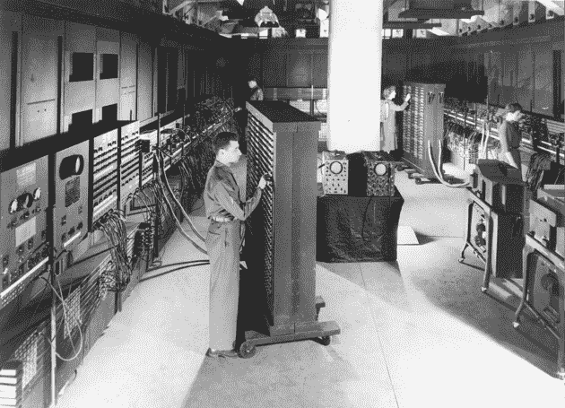
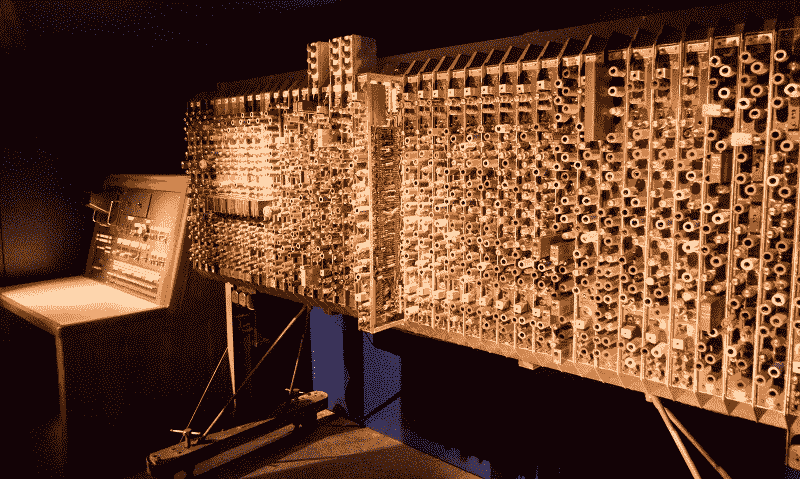
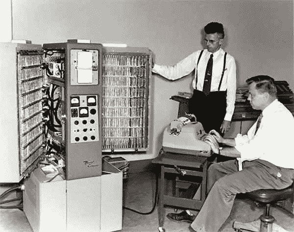
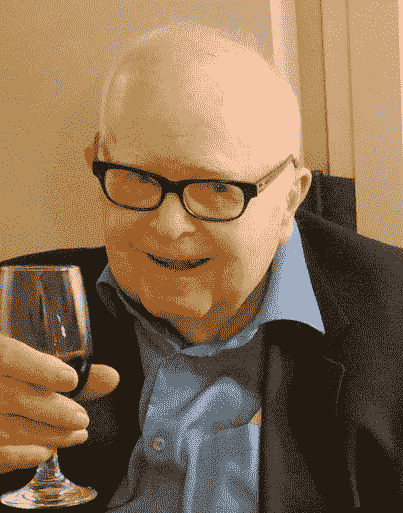

# 世界上最早的计算机设计师之一哈里·哈斯基的惊人一生

> 原文：<https://thenewstack.io/amazing-life-harry-huskey-one-worlds-first-computer-designers/>

本月，科技媒体对世界上第一位计算机设计师哈利·哈斯基的职业生涯感到惊叹，他于 4 月 9 日去世，享年 101 岁。“哈利基本上经历并参与了电子计算的整个历史，”计算机历史博物馆的馆长告诉《纽约时报》 。赫斯基生于 1916 年，活了一个多世纪，对世界的影响至今仍能感受到。他参与了 ENIAC 和 Alan Turing 的自动计算引擎——尽管像任何成功的故事一样，它始于卑微的起点。

《T4 时报》记得他的父亲在全家搬到爱达荷州的一个牧羊场之前，在北卡罗莱纳州经营了一家冰淇淋店和一家木材厂，哈利是他们家第一个上大学的人。作为一名数学系学生，他实际上在 20 世纪 40 年代在俄亥俄大学短暂学习期间曾试图设计一台计算机，但“我没有完成它，因为我认为它太贵了，而且没有任何用处。”但他确实娶了他的一个学生——维尔玛·罗斯，她后来“写了一些关于计算机的文章，并帮助她的丈夫在印度和其他发展中国家建立了计算中心……”

哈斯基博士和他的第一任妻子正在研究阿达·洛芙莱斯的传记，这位 19 世纪的英国数学家被认为是第一位计算机程序员，她去世了。这本书从未完成。”

这个月回到硅谷，圣何塞水星新闻 [将 Huskey](http://www.mercurynews.com/2017/04/21/harry-huskey-dies-in-santa-cruz-eniac-pioneer-also-designed-first-pc/) 铭记为“20 世纪 40 年代创建先锋 ENIAC 计算机的团队中最后幸存的成员之一。”据《纽约时报》报道，在第二次世界大战中期，Huskey 一直在宾夕法尼亚大学担任数学老师，并加入了军队资助的项目，为家人赚取额外的钱。“这是他第一次正式接触计算机，也是他在数字信息时代前沿 50 年职业生涯的开始。”

建造这台 30 吨重、100 英尺长的计算机花了数年时间。(维基百科收集了它的[令人印象深刻的规格](https://en.wikipedia.org/wiki/ENIAC#Components)——17468 个真空管、70000 个电阻和大约 500 万个手工焊接接头。)它的输出被存储在穿孔卡上——直到 1953 年它才拥有自己的存储器——而且 Huskey 的工作“是让机器的穿孔读卡器工作，”BBC[回忆道。](http://www.bbc.com/news/technology-37307825)

哈斯基还承担着为这台巨型机器编写操作手册的重要工作。(曾经*科普* [分享了一个谣言](https://books.google.com/books?id=-TKv7UHgoTQC&pg=PA74&dq=ENIAC&hl=en#v=onepage&q=ENIAC&f=false)说每次 ENIAC 打开时费城的灯光都会变暗，尽管事实上这台巨大的计算机甚至有自己的发电机。)*大英百科全书*报道称，计算机的第一次计算是为了制造氢弹。但是《纽约时报》记得它是“美国第一台通用可编程电子计算机”(也是“一个绝密的联邦政府项目”)，报道称，战后这项工作使哈斯基于 1947 年在特丁顿为艾伦·图灵的自动计算引擎工作了一年。

它是伦敦的第一台电子计算机，图灵档案馆网站记得，并且“它的时钟速度为 1 MHz，在一段时间内保持了世界上最快的计算机的地位。”1950 年，Huskey 回到美国，为美国国家标准局设计 SWAC 计算机。

但是还有更多的事情要发生…

《圣荷西水星报》 [记起了另一个里程碑](http://www.mercurynews.com/2017/04/21/harry-huskey-dies-in-santa-cruz-eniac-pioneer-also-designed-first-pc/)，重印了 1988 年的一篇文章，讽刺道“史蒂夫·乔布斯和史蒂夫·沃兹尼亚克，当心:你在计算机史上的地位岌岌可危……似乎哈里·d·哈斯基在 1954 年为本迪克斯公司开发了一台个人电脑，该公司售出了 400 台。”这篇文章提到*这台*计算机，Bendix G-15，有两个冰箱那么大——其中一个只是用来装大容量的磁带驱动器——它使用了 350 个真空管(加上一台电传打字机而不是屏幕)。“这是当时你能做的最好的事情，”Huskey 告诉该报，在一份简介中，他记得在加州大学伯克利分校教授计算机科学时，Huskey“设计了一台不需要住在特殊的空调房间里的计算机，周围都是穿着白大褂的人。”

根据这篇文章，G 代表一般用途，“本迪克斯在 15 上加了一个字母，让顾客以为周围有很多这样的字母，”哈斯基说。史密森学会(Smithsonian Institution)的一位历史学家称该设备“在许多方面都领先于时代”，而他们在 1990 年举办的一场关于计算机的展览的策展人则称其为“从大型主机计算机转向当今微型计算机的里程碑式设备”。

在 20 世纪 80 年代使用一台较小的个人电脑，Huskey 告诉报纸“我从来没有意识到市场会有多大。令人惊讶。”

那时，计算机还是一种新奇的舶来品，这使得 Huskey 在 1950 年出现在格劳乔·马克斯的广播节目《你赌上你的生命》中。(“你有电子大脑？”Groucho 淘气地问…)当被问及*它计算什么时，Huskey 回答说，“嗯，它只是被组装起来而已。我们还有一些零件要放进去。它还没有计算*任何东西*格劳乔称它为“一个巨大的混音大师”，然后开玩笑说它会吸引节目的另一个参赛者——一个垃圾人。后来，格劳乔甚至让收破烂的人对它进行评估，收破烂的人问“它有多重？”在出价 100 美元之前。*

[https://www.youtube.com/embed/sB9mmiKnxSM?start=950&feature=oembed](https://www.youtube.com/embed/sB9mmiKnxSM?start=950&feature=oembed)

视频

Huskey 耐心地解释了这个装置的工作原理，描述了它是如何将二加二的。你必须告诉机器二进制数在它的存储器中的什么位置，你要把这些数相加，以及结果要放在机器存储器的什么位置。

格劳乔插话道，“脱掉鞋子，用脚趾数数，不是更简单吗？”但他最终承认，Huskey 的电脑是“一项有价值的工作，它将使我们所有人的生活变得更轻松、更美好。”

在加州大学伯克利分校教了 12 年书后，Huskey 搬到了加州大学圣克鲁斯分校，在那里他继续教了 22 年书——直到 1986 年——并且一直是加州大学圣克鲁斯分校的名誉教授。

2013 年，97 岁的他在计算机历史博物馆被授予“致力于第一台计算机[并继续工作](http://techland.time.com/2013/04/30/living-history-computing-pioneer-harry-huskey-is-honored-at-97/)的人”的荣誉他和鲍勃·泰勒(上个月去世的另一位先锋)以及图形先锋艾德·卡姆尔(皮克斯现任总裁)一起成为了博物馆的研究员。

当他 99 岁的时候，加州大学圣克鲁斯分校为他举行了一个仪式，纪念他 48 年前是该校计算机科学系的创始教员。巴斯金计算机工程教授 Patrick Mantey 说:“我很高兴我们邀请 Harry 来这里，看看他帮助种植的种子和培育的 T4 已经长出了什么。”。

现在，他的家人和朋友已经在加州大学圣克鲁斯分校建立了哈里·哈斯基国际工程教育基金会。

* * *

## WebReduce

<svg xmlns:xlink="http://www.w3.org/1999/xlink" viewBox="0 0 68 31" version="1.1"><title>Group</title> <desc>Created with Sketch.</desc></svg>