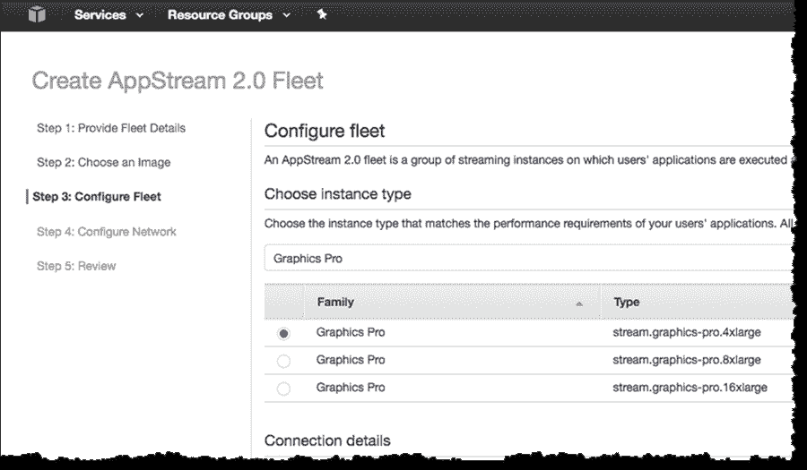

# Amazon AppStream 2.0 部署 GPU 来加速基于云的桌面应用

> 原文：<https://thenewstack.io/amazon-appstream-2-0-deploys-gpus-speed-cloud-based-desktop-apps/>

如果使用超高速电脑运行工程或高性能应用程序是一件成本高昂的头疼事，那就把它转移到云吧。这是亚马逊网络服务公司用其 [AppStream 2.0](https://aws.amazon.com/appstream2/) 应用流媒体服务做出的[推介](https://aws.amazon.com/blogs/aws/new-gpu-powered-streaming-instances-for-amazon-appstream-2-0/)，该服务现在有 GPU 通过云渲染高端图形。

使用 AppStream 2.0 就像使用远程桌面一样，应用程序从亚马逊的 AWS 云交付，而不是本地服务器。从 AppStream 流式传输的应用程序将在 HTML5 浏览器中运行。这项服务有其优势——它可以在 Windows 和 Linux 电脑或 Chromebooks 上运行，而且不需要购买昂贵的硬件。

亚马逊正在为 AppStream 2.0 添加 GPU 实例，以支持能够消耗大量马力的软件。GPU 已经从处理游戏发展到运行高性能应用、可视化、渲染和模拟。AppStream 2.0 利用云服务器上 CPU 和 GPU 的联合计算能力，提供部署在 AWS 云中的 Windows 2012 R2 操作系统应用程序的虚拟实例。

云服务中的 GPU 仍然需要客户端有一台好的 PC。大多数参与图形和设计的工程师可能在他们的电脑上有强大的 GPU，在这种情况下，AppStream 2.0 充当团队合作项目的管道。亚马逊通过使用 Nice Software 的 DCV(桌面云可视化)技术来避免瓶颈，尽最大努力减轻流媒体图形的负载。该协议将图形虚拟化，并分解像素，以交付给多个云客户端。

## 向量处理

将 GPU 放在云端并不新鲜。脸书、谷歌、亚马逊和微软正在使用图形处理器来提高云服务的速度并收取额外费用。微软也在使用 FPGAs(现场可编程门阵列)来加速 Cortana、Bing 和其他本土服务。最近，由于能够挖掘加密货币，GPU 的销售一直在增长。

Nvidia 是亚马逊 AppStream 2.0 GPU 的主要供应商，它有一个宏伟的计划，通过云服务器向 PC 和电视提供游戏。Nvidia 的[网格服务器](http://www.nvidia.com/object/nvidia-grid.html)就是为此而生，可以配备数十个图形处理器。

亚马逊提供了一些 AppStream 2.0 GPU 加速的例子:日产将其用于汽车设计，康奈尔大学将其用于运行 Autodesk 软件。

根据您购买的 AppStream 服务，云服务将支持包括 CUDA 和 OpenCL 在内的框架，这些框架用于图形和高性能应用程序，以及 DirectX 和 OpenGL，这些框架主要用于图形。

AppStream 2.0 GPU 产品包括入门级的“图形桌面”包，其中实例配备了 15GB 的内存和八个虚拟 CPU，价格从每小时 0.50 美元起。更强大的“图形专业人员”可以运行高性能应用程序，配备高达 488GB 的内存和 64 个虚拟 CPU，其价格从每小时 2.05 美元起。

Graphics Pro 软件包基于亚马逊最近基于 GPU 的 EC2 G3 实例，这些实例基于 Nvidia 的 Tesla M60 GPUs，是 G2 类型的升级。Tesla M60 是一款基于 Maxwell 架构的旧 GPU，但仍能提供高达 10 TFLOPs 的单点浮点性能。Nvidia 此后发布了基于 Pascal 架构的新 GPU，可能会出现在 AppStream 图形流媒体服务的升级中。

该服务现已推出。亚马逊表示，其图形流实例系列可以在美国东部(北弗吉尼亚)、美国西部(俄勒冈州)、欧盟(爱尔兰)和亚太地区(东京)使用。

特征图片:AVEVA 的 Everything 3D app，通过 AppStream 交付给用户的浏览器。

<svg xmlns:xlink="http://www.w3.org/1999/xlink" viewBox="0 0 68 31" version="1.1"><title>Group</title> <desc>Created with Sketch.</desc></svg>