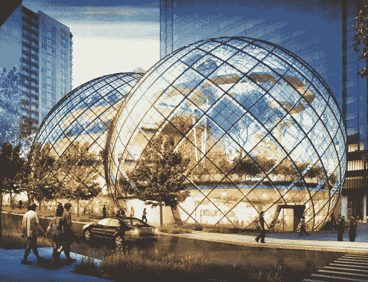
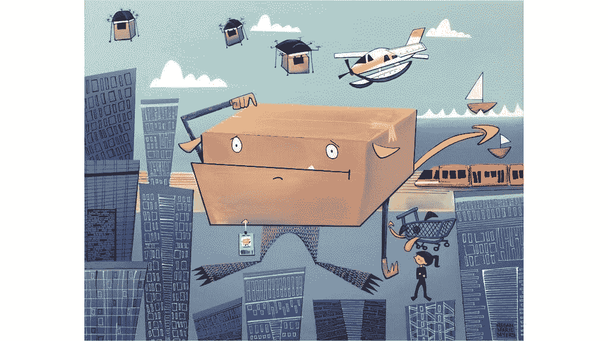
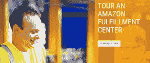

# 亚马逊为什么要在西雅图建一个巨型生物圈？

> 原文：<https://thenewstack.io/amazon-building-giant-biosphere-seattle/>

亚马逊在西雅图市中心建造的期待已久的三个巨型生物圈已经开始施工。可以看到工人们在钢架上安装玻璃面板。“当你有一个 65000 平方英尺的玻璃穹顶时，谁还需要一个无聊的办公园区呢？”快公司的共存网站开玩笑说。

彭博将这三个交叉的圆顶描述为“在他们新的 500 英尺高的办公大楼的阴影下，类似于[融化在一起的牛奶哑弹](http://www.bloomberg.com/news/features/2016-06-29/prime-real-estate-amazon-has-swallowed-downtown-seattle)的巨大球体。”每个都将有 100 英尺高，它们将共同拥有来自世界各地的植物——超过 300 种不同的物种，其中许多濒临灭绝——甚至树木。“[一个]植物丰富的环境有许多积极的品质，这些品质在典型的办公室环境中并不常见，”[亚马逊规划文件](https://www.scribd.com/doc/142786781/Amazon-s-new-HQ-design#download)说，承诺一个三个街区的区域，在那里员工可以“在更自然、像公园一样的环境中社交”——气温在 68 到 72 度之间。

除了植物，亚马逊的生物圈还将包括工作空间——算是吧。“亚马逊人将能够从日常工作中解脱出来，沿着吊桥漫步在绿荫之中，”彭博报道说，“并爬进类似栖息在成熟树上的鸟巢的会议空间。”它将包括吃饭、聚会或在绿荫中休息的地方。很明显，它更像是一个树林般的静修处，而不是一个高压锅。工人们可以自由出入，所以它不会像斯蒂芬·金的《穹顶之下》那样，将整个城镇包裹在里面，困住居民。玛格丽特·阿特伍德的粉丝们也可能会发现这个新穹顶让他们想起她 2003 年的反乌托邦科幻小说《羚羊与秧鸡》

虽然它要到 2018 年才开放，但它已经回避了一个问题:亚马逊到底想干什么？彭博表示，这个想法是一种新趋势的一部分，大型科技公司坚持住在城市校园，因为这是千禧一代员工最想住的地方。LinkedIn 在 3 月份将分散在旧金山的员工整合到了一座 26 层的大楼里。Salesforce.com 将成为几英里外一栋 61 层摩天大楼的主要租户。”优步、通用电气和麦当劳都在将员工转移到市中心。亚马逊的杰夫·贝索斯可能认为这是他可以给他的员工的额外津贴，只要雇佣合适的建筑师来设计一块合适的地产。

但也许这才是真正的问题。完工后，亚马逊的园区将在西雅图市中心蔓延超过 10 个街区，占据该市超过 15%的办公空间。西雅图太空针塔的所有者已经在抱怨游客们甚至不能在很多时间*看到*太空针塔，因为它被西雅图所有的新办公楼挡住了。一名西雅图本地的极客甚至正在创作一本描述亚马逊鬼城的儿童图画书[，书中一个友好的怪物(带着一只名叫“Prime”的小狗)在城市中旅行，帮助一个名叫佐伊的小女孩找出太空针去了哪里。](https://www.kickstarter.com/projects/jeffreifman/zoe-and-the-amazocalypse-daddy-wheres-the-space-ne)

当然，并不是每个人都对新建筑不满。一位读者在 Slashdot 上发帖称:“我们每年夏天都会去太空针塔吃周年纪念晚餐，我们认为南湖联合建筑热潮极大地改善了景观。”。“那曾经是一个破旧的街区，到处都是仓库、废弃的建筑和停车场，现在它实际上是一些有趣和有吸引力的东西。”彭博描述了一个从“汽车经销商和二手商店的大杂烩”转变成一个充满活力的商业区的社区，人们可以在这里工作、生活和闲逛

亚马逊甚至将他们办公楼的一楼租给了一些精心挑选的餐馆、咖啡店和高档酒吧，这要么是城市复兴的一次令人愉快的尝试，要么是企业统治当地社区的一个令人毛骨悚然的例子。

但也许这只是一场更大的魅力攻势的一部分。在某种程度上，亚马逊肯定已经意识到，它的巨型业务会吸引公众的监督，它对自己的公众形象有很大的影响。两年前，亚马逊开始在六个不同的美国城市提供参观他们的履行工厂的服务，现在在德国、西班牙、法国、意大利、波兰和英国也可以提供服务。

现在，亚马逊甚至提供他们主要西雅图总部的旅游，在旅游注册页面上向游客指出亚马逊是“2000 多只四条腿朋友的家”。

《卫报》的一名记者跟随[参加了亚马逊的第一次巡演](https://www.theguardian.com/technology/2016/jul/07/inside-amazon-secretive-tech-company-seattle-hq)，在那里他发现了“闪亮的公关努力——还有免费的香蕉”(由亚马逊的“社区香蕉摊”提供，向任何路过的人提供香蕉):

西雅图联合湖上，一群二十多岁的年轻人正围着一个可以俯瞰帆船的屋顶火坑大笑。一群软件工程师围坐在笔记本电脑旁，坐在扶手椅上喝着拿铁咖啡。一只小小的波士顿梗跑来跑去，吱吱地叫着一个橡胶玩具……”

随着世界的不断变化，卫报的记者似乎想知道亚马逊是否试图成为更多的东西——也许是一个好邻居，或者是一个文化偶像，或者只是比太空针更有趣的东西。他问一位同行的游客——一位自由作家——亚马逊的校园游是否能与西雅图的其他地标竞争，比如第一家星巴克店或太空针塔。

“我看得出来，”作家回答道。"特别是如果它是免费的，在一个小时内完成，而且最后你会得到免费的香蕉."

## WebReduce

<svg xmlns:xlink="http://www.w3.org/1999/xlink" viewBox="0 0 68 31" version="1.1"><title>Group</title> <desc>Created with Sketch.</desc></svg>