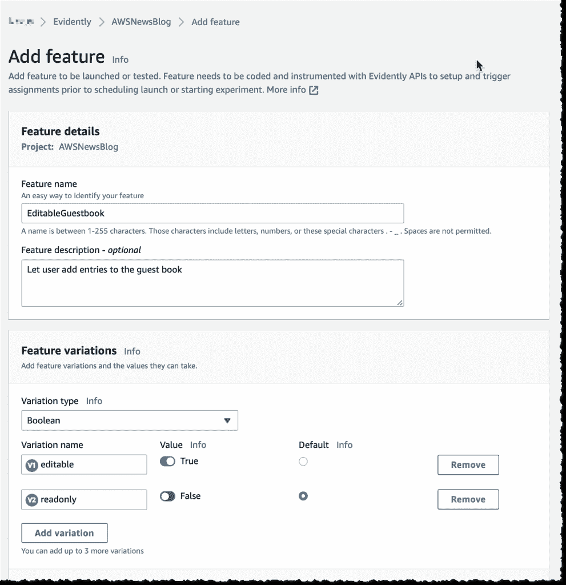
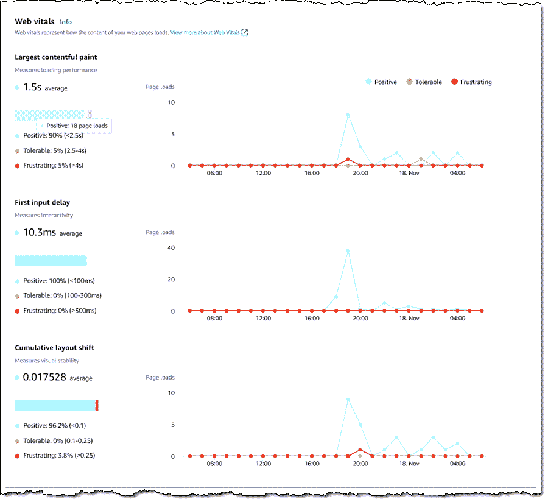

# 亚马逊云观察获得功能标志，基于用户的监控

> 原文：<https://thenewstack.io/amazon-cloudwatch-gets-feature-flags-user-based-monitoring/>

在本周于拉斯维加斯举行的年度用户大会 AWS Re:Invent 上， [Amazon Web Services](https://aws.amazon.com/?utm_content=inline-mention) 宣布，该公司通过功能标志和 A/B 测试，增强了其 [Amazon CloudWatch](https://aws.amazon.com/cloudwatch/) 监控服务，与其他应用程序可观察性平台保持一致。

此外，CloudWatch 已经超越了对 web 应用程序的综合监控，现在可以根据实际使用情况提供性能数据(匿名收集)。

## 功能标志和 A/B 测试

显然，新的亚马逊云观察[功能](https://aws.amazon.com/cloudwatch/features/)为开发者提供了控制向应用用户推出哪些特定功能的能力，或者通过[功能标志](https://thenewstack.io/what-we-mean-by-feature-flags/)和/或 [A/B 测试](https://thenewstack.io/a-perfect-match-a-b-testing-and-business-success/)。

使用功能标志，开发人员可以测试应用程序的新功能，只需将它们推广到一组选定的用户，以测试该功能如何在一小部分用户中运行，而不是推广到整个用户群。一个特性何时出现的特定条件可以通过一组 if-then 语句来确定。然后，随着开发人员对该特性越来越有信心，它可以在更大的用户组中展开，同时监控技术和业务指标。

同样由提供的 A/B 测试功能显然类似于特性标志，但在统计上更加严格。有了这些服务，可以通过多种变化的随机实验来测试功能，允许开发人员测试哪个功能工作得最好。然后可以对每个变化的成功进行统计分析。显然提供了一些统计工具来帮助做到这一点:内置的统计引擎甚至可以在实验运行时提供洞察力，随时提供 p 值和置信区间。

一个电子商务网站可以使用 A/B 测试来评估不同类型的结账按钮——不同的大小、形状或颜色——看哪一个带来更多的收入，AWS 的一篇博客文章[显然是这样假设的。](https://aws.amazon.com/blogs/aws/cloudwatch-evidently/)

虽然另一个 AWS 服务，AWS 系统管理器的一部分，AWS AppConfig，也提供了功能标志，但据 AWS 称，显然该服务提供了更高级的功能。其他公司，如[launch darky](https://launchdarkly.com/?utm_content=inline-mention)和 Optimizely，也长期提供功能标志和 A/B 测试功能。

上面列出的 AWS 博客文章还提供了功能标志和 A/B 测试如何在 CloudWatch 上工作的演练。

## 真实用户监控

除了功能标志和 A/B 测试，CloudWatch now 还使用了 AWS 所谓的“真实用户监控”或 RUM。迄今为止，CloudWatch 已经提供了[合成测试](https://aws.amazon.com/blogs/aws/new-use-cloudwatch-synthetics-to-monitor-sites-api-endpoints-web-workflows-and-more/)，或者从外部观察 web 应用程序可能出现的问题的能力。相比之下，RUM 提供了一种方式来观察各种组件的性能，因为它们是由实际的最终用户部署的。

AWS 首席分析师[杰夫·巴尔](https://aws.amazon.com/blogs/aws/author/jbarr/)在一篇解释这项新服务的博客文章中指出，对于最终用户来说，网站的性能可能会与综合监测提供的综合结果相差很大。浏览器类型、浏览器配置、用户位置、连接性等因素都会以不同的方式影响性能。

部署 RUM 似乎很容易:向 AWS 注册一个应用程序，然后向每个 Web 页面添加一个 JavaScript 片段，它将遥测信息发送回 AWS。您可以选择要监控的组件。

AWS 控制台显示性能指标，以及它们相对于行业标准的表现。这些数据还可以馈入其他亚马逊 CloudWatch 监控服务，如 CloudWatch ServiceLens 或 X-Ray。

每收集 100，000 个事件，朗姆酒的使用成本为 1 美元。

<svg xmlns:xlink="http://www.w3.org/1999/xlink" viewBox="0 0 68 31" version="1.1"><title>Group</title> <desc>Created with Sketch.</desc></svg>