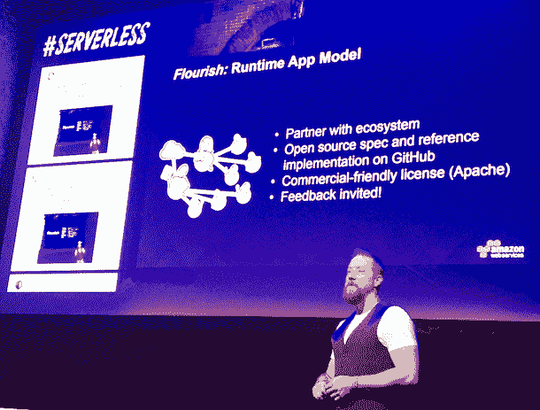

# 亚马逊推出了一个用于无服务器计算的运行时应用程序模型——floride

> 原文：<https://thenewstack.io/amazon-debuts-flourish-runtime-application-model-serverless-computing/>

Amazon Web Services 已经开始为其基于 Lambda 的无服务器基础设施构建支持工具。周四在 Brooklyn 的 [ServerlessConf，](http://serverlessconf.io/)[AWS 无服务器计算(包括](https://twitter.com/timallenwagner) [AWS Lambda](https://aws.amazon.com/lambda/) 和[亚马逊 API 网关](https://aws.amazon.com/api-gateway/))总经理 Tim Wagner 宣布了一个新的开源项目，旨在创建一个完整的无服务器运行时应用环境。

瓦格纳在他的主题演讲中说:“蓬勃发展的目标是发展一个运行时应用程序模型，类似于 [SwaggerHub](https://swaggerhub.com/) 今天为 API 所做的那样。”

无服务器模式的关键要素之一是功能是部署和扩展的单位。Wagner 认为平台即服务是制造可扩展应用程序的错误抽象层次，因为它对系统隐藏了请求。这就是无服务器显示其优势的地方，因为引入了简单性，Wagner 说:

*   请求可以扩展，因此不会出现服务器容量供应过剩或不足的情况。
*   应用提供商不会为闲置的计算能力买单。
*   该系统是隐式容错的，因为它不依赖于管理机器服务器。
*   语言运行时是开放的，因此开发人员可以用他们喜欢的语言编写代码。
*   指标和日志记录成为所有应用程序开发人员都应该拥有的普遍权利。

Wagner 说，虽然这是一个优势，但无服务器应用程序需要以可组合的形式构建，而不仅仅是管理一个功能。

“当您构建了一个使用大量 API 和数百个功能的微服务时，会发生什么？”他问道。瓦格纳说，为了实现这种增长水平，代码优先和设计优先的解决方案应运而生。他将 AWS 的无服务器框架作为代码优先的例子，并将 SwaggerHub 如何构建 API 作为设计优先的例子。

Wagner 希望 Flourish“将代码功能和 API 接口定义放在同一个模型中”

他宣称，fluorescent 不会复制 monolith 以前的应用程序问题，因为功能仍将保持独立，并将作为单独的组件而不是大规模的代码块进行更新。功能将被分组到 floride 模型中的集合中:“floride 是一个版本化的集合，它支持回滚，而不会将功能变成一个整体部署。”他说，蓬勃发展将能够组合在一起“不仅是功能，而且 NoSQL 数据存储，API，以及组成无服务器应用程序的所有部分。”

瓦格纳认为，这是将无服务器趋势发展到一个开发者生态系统推动创建无服务器应用程序(包括聊天机器人和语音应用程序)的必要条件。他记录了许多生态系统工具，需要创建这些工具来帮助推动无服务器应用程序范式的采用，包括开发工具、框架、数据处理和监控等。

“我最感兴趣的事情之一是数据处理:随着我们在堆栈中的位置越来越高，我们将需要更多以应用为灵感的解决方案，例如，分割视频和运行面部分析。我们将需要分散-聚集范式，”瓦格纳告诉挤满了会议的观众。“我们现在处于框架和开发工具阶段，生态系统正在发展，并使公司能够开始他们自己的无服务器之旅。在下一阶段，我们希望通过“繁荣”,接触到大量开发者，在那里有一个自我实现的循环，推动充满活力的生态系统。”

蓬勃发展将是开源的，并将在未来几周内作为一个项目在 GitHub 上推出。

https://twitter.com/trieloff/status/735839549729996800

<svg xmlns:xlink="http://www.w3.org/1999/xlink" viewBox="0 0 68 31" version="1.1"><title>Group</title> <desc>Created with Sketch.</desc></svg>