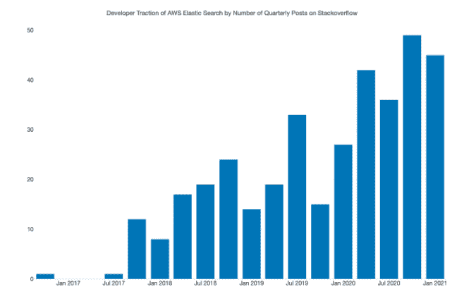

# Amazon，Elastic 和在企业中争取开源自由

> 原文：<https://thenewstack.io/amazon-elastic-and-the-fight-for-open-source-freedom-in-the-enterprise/>

[亚马逊网络服务](https://aws.amazon.com/?utm_content=inline-mention)最近决定将 [Elasticsearch、](https://www.elastic.co)一个流行的分析引擎和 [Kibana](https://www.elastic.co/kibana) 合并，并提供其所谓的 OpenSearch 项目，这引起了社区中一些人的惊讶和担忧，原因有很多。然而，其他观察人士表示，AWS 此举是必要的，以对抗 Elasticsearch 使用这些开源项目的商业模式。

AWS 当然可以合法地获得多年来致力于开源项目的投入和辛勤工作所构建的代码，同时重塑开源工具和平台的品牌，并提供付费服务来帮助使用和管理代码(取决于许可证)。然而，一些观察人士表示，这个云巨头面临着被视为背叛其客户和帮助创建这些项目的人的风险。

在 Elastic [首席执行官 Shay Banon](https://www.linkedin.com/in/kimchy) 的眼中，AWS 的举动似乎代表了一种敌意攻击。“没有驱动力的愿景，或者生来就建立在错误信息和消极性基础上的分叉往往会失败。这种早期特征使社区的基础变得薄弱，并直接抑制了创新的速度和质量——这不是成功的开源产品——fork 或其他产品——的构建方式，”巴农在一封电子邮件回复中说。“令人失望的是，亚马逊决定将他们的企业利益置于客户的最佳体验之上，而不是与我们合作并参与我们蓬勃发展的社区。”

AWS 没有通过第三方 AWS 通信代表对新堆栈的询问做出回应。在一篇关于此次发布的博客文章中，AWS 的卡尔·梅多斯、朱尔斯·格雷比尔、凯尔·戴维斯和迈胡尔·沙阿共同写道:

*我们 OpenSearch 项目的目标是让尽可能多的人和组织在他们的业务、产品和项目中轻松使用 OpenSearch。无论您是独立开发人员、企业 IT 部门、软件供应商还是托管服务提供商，ALv2 许可证都授予您对 OpenSearch 的充分理解的使用权。*

## AWS 的意图

一些观察家推测，在 Elasticsearch 开始将其开源项目商业化后，AWS 决定提供 OpenSearch。这样的举动并不奇怪。

巴农说，事实上，Elasticsearch“期待”AWS 的举动“已经有一段时间了”。巴农说:“当我们今年早些时候改变许可证时，我们是在亚马逊多年来的行为完全不对劲之后才这么做的。”。“我们的许可证变更保留了对我们产品的免费和开放访问，但限制了亚马逊在不反馈或不与我们合作的情况下以服务形式提供我们产品的能力。近年来，其他成功的开源公司也采取了类似的道路。”

理论上，AWS 可以寻求以不平衡的方式为 OpenSearch 开发商业付费服务，而忽略了对开源组件的适当贡献。然而，[企业管理协会(EMA)](https://www.enterprisemanagement.com/) 的分析师 [Torsten Volk](https://www.linkedin.com/in/torstenvolk) 告诉《新堆栈》说，这种情况将代表一种“更糟糕的情况”。Volk 说，这样的策略也不符合其对开源项目的承诺，并且在商业上“没有什么意义”。

“AWS 的举动纯粹是对 Elasticsearch 改变其许可模式的理性回应，该模式不允许亚马逊将 Elasticsearch 作为托管服务提供。Volk 告诉新的 stack，Elasticsearch 对亚马逊来说是云原生分析的一个太多的标准，不能就这样放弃，鼓励客户转向商业替代品“ELK (Elasticsearch，Logstash，Kibana)栈”保持这一势头对于亚马逊在与主要竞争对手谷歌和 Azure 的竞争中显示差异化非常重要。"

沃尔克说，考虑 Elasticsearch 背后的公司 Elastic 最近获得了 1.62 亿美元的风险投资也很重要，“而且像亚马逊一样，不能被视为非营利组织”。

“基本上任何开源公司都是如此，因为软件开发人员有不免费工作的坏习惯。因此，Elastic 需要改变许可模式，使亚马逊更难利用他们的代码贡献，并推动他们自己的托管服务，”Volk 说。“面对这些残酷的现实，Elastic 和亚马逊都没有太多的选择，我认为亚马逊不会比大多数其他软件供应商更有可能通过添加闭源的优质功能来利用他们对开源 Elasticsearch 的新统治。没有必要这样做，因为亚马逊将着眼于更大的图景，让每个人尽可能简单地装载和运行他们的云原生应用程序，并尽可能多地使用亚马逊的大约 300 种服务。”

AWS Elasticsearch 的开发者人气迅速上升(来源:企业管理协会(EMA))。

然而，巴农反驳说——尽管指出该公司“对我们已经取得的成功以及我们如何取得成功感到自豪”——通过围绕其产品建立成功的业务，“我们已经能够进行更多投资，并提供免费使用的世界级产品，并以开放和合作的模式开发，”巴农说。

“我们的目标是支持围绕我们的产品构建的整个生态系统并与之协作，包括公共云提供商。巴农说:“我们与谷歌云、T2、微软 Azure、T4、阿里巴巴、腾讯和像 CleverCloud、T9 这样的小型供应商建立了牢固的伙伴关系，这表明这是可以做到的。”。“事实上，亚马逊在这方面是一个异数——选择创造一个分叉，而不是共同努力给他们的客户最好的体验。”

## 开源精神

2019 年，AWS 开始提供 [MongoDB](https://www.mongodb.com/cloud/atlas/?utm_content=inline-mention) 作为其云产品的一部分，并为 MongoDB 提供商业支持服务，这可以被视为类似的举措，在开源社区引发了争议。与此同时，MongoDB 现在基于其开源堆栈提供商业服务。(MongoDB 拒绝对本文发表评论)。今年早些时候，Elastic 选择[放弃 Elasticsearch 和 Kibana 的 Apache 2.0 许可](https://www.elastic.co/pricing/faq/licensing)，并以“Elastic License”和[服务器端公共许可(SSPL)](https://en.wikipedia.org/wiki/Server_Side_Public_License) 取代，从而开创了 Elasticsearch 更商业化的商业模式。

由于 Elasticsearch 已经将许多服务变为专有，AWS 上周的举动在多大程度上保持了开源精神变得更加模糊，尽管过去可以提供一些关于突发事件的见解。在开源的最初几天，开源软件(OSS)供应商有很多敌意，他们只是将一个项目的某些功能商业化， [Netdata](https://www.netdata.cloud/) 的副总裁罗宾·舒马赫告诉新堆栈。

“很多年前，我代表我所在的 OSS 公司参加了一次会议，有一个人一直对我大喊，‘你应该让所有东西都免费！“对此我最终回应道，‘当你停止领薪水时，我也会。’他明白了我的意思，然后离开了，”舒马赫说。“今天，OSS 社区更能接受有商业部分的供应商，因为他们意识到，如果没有商业部分，生意很可能会失败，OSS 项目也会遭受损失。”

是什么让一个开源项目成为“想法”并忠实于开源的精神，也可能会越来越多地受到争论。例如，虽然注意到 fork 是开源的“自然组成部分”，Banon 也说他“深深相信成功的 fork 的伟大例子是那些努力造福社区或解决特定需求的例子。”

Banon 说:“Hudson 在挑战 Oracle 之后的 Jenkins fork 跃入脑海(作为一个成功的 fork 的例子)。"另一个在我们的历史上占有特殊地位的是格拉夫纳."(格拉夫纳拒绝对本文发表评论)。

几年前，Sun Microsystems(以及后来的 Oracle)“多年前收购 MySQL 时也有类似的事情，尽管亚马逊的举动有所不同，”Schumacher 说。“更能改变游戏规则的是 Mongo 和 Elastic 等公司提出的新许可证，它们试图抵御云供应商有时的掠夺性做法。”

事实证明，甲骨文最终成为了“MySQL 非常好的管家和 OSS 的支持者，所以那些担心没有成为现实，”Schumacher 说。

“我认为亚马逊需要时间以同样的方式证明自己。开放源码软件用户自然害怕大的供应商，他们似乎劫持了一个项目，并不投资于它，而只是利用它来获得纯粹的商业利益，”Schumacher 说。“虽然他们有这样做的自由，但供应商似乎已经认识到，从长远来看，这样的策略并不是最好的。相反，他们以更谨慎的方式行事，他们明智地投资于其 OSS 核心的基础方面，同时将企业/高级功能商业化，即使是最坚定的 OSS 用户也认为值得为其付费。”

<svg xmlns:xlink="http://www.w3.org/1999/xlink" viewBox="0 0 68 31" version="1.1"><title>Group</title> <desc>Created with Sketch.</desc></svg>