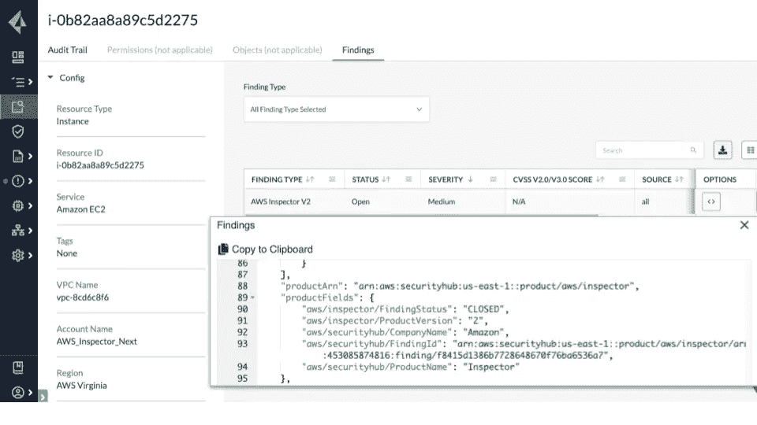

# 亚马逊检查员来到 Prisma Cloud

> 原文：<https://thenewstack.io/amazon-inspector-comes-to-prisma-cloud/>

Palo Alto Networks 的 Prisma Cloud 赞助了我们对 AWS re:Invent 2021 的报道。

由于与亚马逊网络服务公司的合作，帕洛阿尔托网络公司通过[与](https://www.paloaltonetworks.com/blog/prisma-cloud/amazon-inspector-for-enhanced-security/) [AWS 的亚马逊检查员](https://docs.aws.amazon.com/managedservices/latest/userguide/inspector.html)的集成，扩展了其 [Prisma Cloud](https://www.paloaltonetworks.com/cloud-security?utm_content=inline-mention) 云原生安全平台的功能。

帕洛阿尔托网络公司 Prisma Cloud 产品营销总监 Keith Mokris 表示，附加 AWS 安全信息背后的想法是帮助 Prisma 客户加速迁移到 DevSecOps 工作流。这种工具可用于将持续的安全风险评估直接构建到 DevOps 管道中，提供了一种避免潜在安全问题的方法，否则这些问题会在开发周期中引发更多问题。

AWS 推出亚马逊 Inspector is 2015。这个自动化工具评估运行在 AWS 上的应用程序的安全状态，寻找意外的暴露、漏洞和对最佳实践的偏离。该服务支持亚马逊弹性计算云(Amazon EC2)实例和容器映像。它确定了潜在的问题，如从互联网开放访问 Amazon EC2 实例、远程根登录支持和易受攻击的软件版本，包括由通用漏洞和暴露(CVE)数据库确定的那些。

Prisma 云平台提供了广泛的工具，专门用于保护云本地计算部署。它可以扫描来自 [HashiCorp](https://www.hashicorp.com/?utm_content=inline-mention) Terraform、AWS 的 CloudFormation 或其他公司的基础设施代码模板，以检查可能导致资源意外泄露的错误配置。

该平台的第三版[于上个月](https://thenewstack.io/palo-alto-networks-prisma-cloud-adds-advanced-container-image-sandboxing/)发布，使用机器学习来促进高级容器图像沙箱化，从运行时行为构建模型。

通过这种合作关系，AWS 服务向 Prisma 提供了一个详细的安全发现列表，该列表按严重程度排列，可以在 Prisma 云控制台中显示。此外，Prisma 用户可以使用 Prisma 云资源查询语言(RQL)进行搜索，以获得跨组织单位(ou)和成员帐户的受影响资源列表。

Prisma Cloud Resource Explorer 提供了所有调查结果的整合单一窗口视图，包括配置、网络状态、审计跟踪和严重性。借助常见漏洞和暴露(CVE)详细信息和 Amazon Inspector 调查结果，团队可以加快安全漏洞的修复。

在幕后，Prisma Cloud 通过 Amazon EventBridge webhook 接收安全数据。

该公司将于本周在 AWS re:Invent 2021 的 861 号展位上展示这一集成。公司工程师还将在展会上的两个分组会议上发言，主题是促进发展合作，并举办一些互动研讨会。

<svg xmlns:xlink="http://www.w3.org/1999/xlink" viewBox="0 0 68 31" version="1.1"><title>Group</title> <desc>Created with Sketch.</desc></svg>