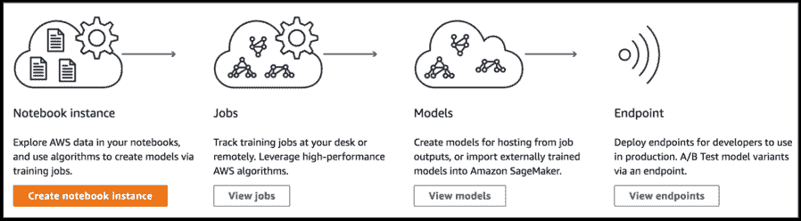
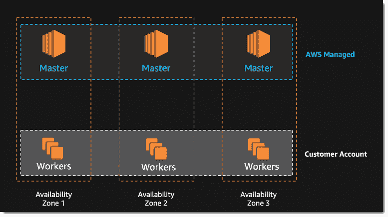
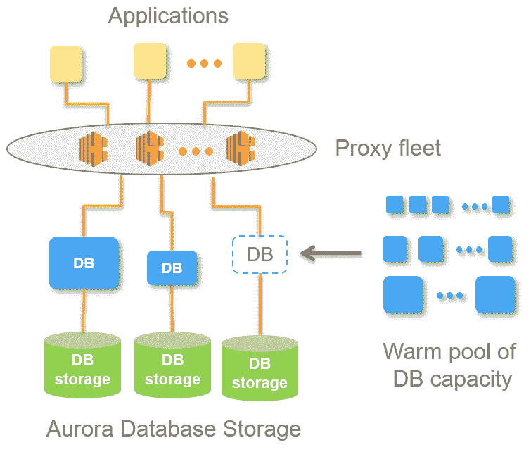
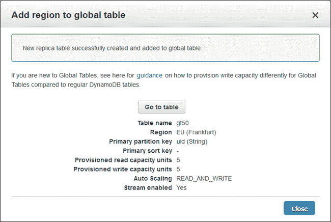

# 亚马逊 SageMaker 自动化了人工智能开发管道

> 原文：<https://thenewstack.io/amazon-sagemaker-automates-artificial-intelligence-development-pipeline/>

随着上周[亚马逊 SageMaker](https://aws.amazon.com/sagemaker/) 的首次亮相，亚马逊网络服务在将机器学习纳入专业开发和部署管道方面取得了很大进展。该公司的一款新摄像机 AWS [DeepLens](https://aws.amazon.com/deeplens/) ，旨在帮助开发人员[更好地理解如何创建人工智能和人工智能技术](https://aws.amazon.com/blogs/aws/deeplens/)。

该公司在本周在拉斯维加斯举行的 Re:Invent 用户大会上展示了这些新的人工智能技术。

SageMaker 背后的想法是加速开发/精炼机器学习模型的过程，并将它们集成到开发管道中。在 SageMaker 中，机器学习模型的初步编辑是在 [Jupyter 笔记本](https://thenewstack.io/jupyter-notebooks-challenge-reproducibility/)中完成的，并在 AWS 虚拟机上进行测试，无论是通用实例还是基于 GPU 的各种虚拟机。从 AWS 的[简单存储服务](https://aws.amazon.com/s3/) (S3)桶中读取数据，并将结果——通常称为模型工件的数据相关模型参数——放回 S3。该服务的第三部分通过可伸缩的 HTTPs 端点提供模型托管，应用程序可以调用该端点来获得实时推理。

在活动中，我们采访了 AWS 产品营销总经理 [Lowell Anderson](https://www.linkedin.com/in/lowell-anderson-8384a91a/) ，以了解更多关于 SageMaker 的信息。在来 AWS 之前，Anderson 为 [Parallels](https://www.parallels.com/) 运行虚拟机和容器程序。因此，我们询问了他在会议上介绍的其他技术，包括新支持的 [Kubernetes 服务](https://aws.amazon.com/blogs/aws/amazon-elastic-container-service-for-kubernetes/)，Fargate 托管容器服务[，以及](https://aws.amazon.com/blogs/aws/aws-fargate/) [Aurora](https://aws.amazon.com/blogs/aws/in-the-works-amazon-aurora-serverless/) 和 [DynamoDB](https://aws.amazon.com/blogs/aws/new-for-amazon-dynamodb-global-tables-and-on-demand-backup/) 数据库更新。

你能解释一下 SageMaker 如何加快基于人工智能的应用程序开发的生产流程吗？

独自建立和训练(机器学习)模型真的非常非常困难。你需要具备很多专业知识，甚至能够理解你用来训练模型的不同类型的算法，然后为你的特定用例选择这些算法。

一旦你选择了训练算法，你就必须有数据来进行训练。您必须能够设置处理培训所需的所有基础架构，这需要大量的计算节点。

试图独自完成所有这些工作远远超出了任何普通应用程序开发人员的能力。

通过 SageMaker，我们已经在 Jupyter 笔记本电脑中构建并优化了 10 种最常见的型号，您可以选择将其作为服务的一部分。这很简单，只需进入并选择正确的算法，根据您的训练集运行即可。然后，如果您的数据已经在 S3，您不必移动数据。所以它是根据 S3 的数据运行的。

所以这很重要。只要能够做到这一点，就能够对你在 S3 已经拥有的数据进行训练，能够进入 SageMaker 控制台，从已经预先训练好的 10 种不同算法中进行选择，选择你想要在其中运行的框架，设置好所有这些并指向你的数据集，而不必编写任何代码，这是对你今天必须做的事情的巨大改变。

一旦你设置好了，这就像点击“训练模型”一样简单

你必须决定花多少时间和金钱来训练这个模型。您可以选择将多少计算能力用于这项任务。其中一些模型，开发人员可能希望快速迭代，在它后面进行大量计算，这样它就可以快速运行。但是，如果你能等上四五天，让模型运行得相当慢，你只需对它应用几个计算实例，就能省下一大笔钱。

所以，SageMaker 让你做这些选择。然后，您只需点击 train，它就会提供实例，向外扩展实例，将框架部署到这些节点上，在框架内部署算法，将算法指向您已经挑选出来的训练数据集，运行该训练并从中创建输出。然后 SageMaker 为您设置它，以便您能够调谐和测量输出，然后您的模型就完成了。

然后，一旦开发人员有了一个他们认为可行的模型，并且他们想在应用程序中使用它，他们就需要进行推理，根据新的数据做出预测。这本身就需要巨大的计算能力。通常，您必须在[弹性云计算](https://aws.amazon.com/ec2/) (EC2)实例上构建一个集群，在其上部署您的现有模型，构建应用该模型的代码，并在数据流入时将其与数据进行匹配。

我们也为你做这些。您只需在集群上部署您的模型，我们会设置好一切，并为您提供该模型的 HTTP 端点。因此任何应用程序都可以直接写入 HTTP 端点，并从它那里接收推理结果。我们将扩展下面的集群，以便能够根据您的需要尽快返回这些结果。

因此，SageMaker 真正做的是让你能够以非常非常高的推理速度投入生产，而不必管理任何基础设施。

## 容器

**告诉我们 Kubernetes……**的新弹性集装箱服务

大约四年前，我们推出了弹性集装箱服务。那时候 Kubernetes 还不是超级流行。但是在过去的几年里，如你所知，这个充满激情和活力的生态系统已经围绕着 Kubernetes 发展起来了。它有很多好的工具和完善的开发人员社区。因此，我们今天有很多在 AWS 上运行 EC2 上的 Kubernetes 的客户。事实上，今天大约 80%的云 Kubernetes 部署运行在 AWS 上。

这些客户已经在本地部署了 Kubernetes 容器，在开发中使用它们等等。当他们想把它们投入生产时，这非常简单。这就是容器的全部好处，当然是便携性。他们可以在本地安装 Kubernetes，然后将这些容器迁移到云中，在云中的 EC2 上运行 Kubernetes 部署，并使用 AWS 进行扩展。

> 今天，大约 80%的云 Kubernetes 部署运行在 AWS 上。

这就是他们过去几年一直在做的事情。但是，当然，这需要他们管理所有这些 EC2 实例。由于他们需要扩展控制平面的大小，他们需要添加更多的实例。当他们减少应用程序的规模时，他们必须小心地自动取消配置这些实例，这样他们就不会支付不必要的费用。

当你在 AWS 上运行你自己的 Kubernetes 时，你真的必须小心地管理底层基础设施，以确保它的伸缩，你必须保持那些实例得到维护，并建立你自己的弹性负载平衡，以确保它保持平衡。

这是可行的，但是需要一些时间来管理和设置，这真的不是容器的愿景，对吗？容器的愿景是，你不必搞乱基础设施，你把你的应用程序构建到这个漂亮的可移植的容器或任务中，当你想运行它的时候，你就可以运行它。

我们试图为这些客户做的只是让他们保持可移植性，但取消所有基础架构管理。因此，我们对 EKS 服务所做的只是在 AWS 上提供一个完全托管的 Kubernetes 服务。因此他们不必管理或部署任何底层 EC2 基础设施。

**现在，当您说您不必管理资源时，您指的是什么具体要素**？

首先，如果您想在 EC2 上部署它，您必须获得 Kubernetes 软件。你必须建立一个主节点。如果你想让那个主节点冗余，那么你必须做大量的工作来确保那个东西在区域之间是重复的。那需要你做大量的体力劳动。大多数人不会这么做。他们只部署一个主节点，然后在为其他节点扩展时，他们必须提供额外的 EC2 容器。

他们仍然需要维护 Kubernetes 软件。所以只要有 Kubernetes 升级，他们就必须升级。他们必须维护他们的主节点。他们必须确保在扩展控制平面时实例类型的大小和比例是正确的。而且这种增长不会跨越地区和区域。您必须创建另一个不同的主节点，因为 EC2 控制平面或 Kubernetes 控制平面只在一个主节点上运行。

因此，这种架构在本质上限制了您可以扩展的范围。所有这些都随着 EKS 而消失。

我们用一个完全的、高度可用的主节点来设置基础设施。事实上，我们是唯一一家做这项工作的托管 Kubernetes 服务。因此，当您将 EKS 容器部署到 AWS 上时，不会出现单点故障。我们已经构建了底层基础设施，因此 Kubernetes 控制平面高度可用:我们有两个冗余备份主节点，以防任何类型的故障。

我们还管理并保持 Kubernetes 升级到最新的开源版本，因此您也不必担心管理或部署任何实际的 Kubernetes 层。

**Fargate 与 ECS 或托管的 Kubernetes 产品有什么不同**？

因此，现在有了 ECS，当您想要扩展群集时，您必须调配额外的 EC2 节点，然后您必须取消调配。Fargate 所做的就是把这些都拿走，并有效地让它变得没有服务器。

因此，您不必像以前那样按 EC2 节点付费，只需设置想要运行的计算总量，然后我们就可以动态扩展底层基础架构。

这纯粹是我们所谓的任务。您不再担心“我必须部署多少 EC2 实例？我应该部署什么类型的 EC2 实例？”如何设置我的弹性负载平衡器？“一切都会过去的。

因此，编排层(控制和管理容器调度的部分)和底层基础设施本身都被完全抽象掉了。你所要做的就是到我们的控制台指定，“我想运行这样大小的容器，这么多 CPU 和这么多内存。”它将按需扩展。

## 数据库

**在过去的一年中，Aurora 似乎做了很多出色的工作。数据库服务现在可以有多个写主节点？这似乎是某种游戏规则的改变者…**

是啊。所以今天，没有其他云数据库支持多主机读写。

在今天之前，我们对 Aurora 的了解是，我们有一个可以写入的主节点，然后我们有多个读取节点。在这种情况下，我们可能会丢失一个读取节点，并且已经为您提供了一个自动备份。如果主写节点出现故障，我们需要大约 30 秒来启动新的主节点。我们这样做的方法是，我们将其中一个读取节点重新配置为写入节点，即主节点。

30 秒非常快，没有任何本地数据库可以做到这一点。但是，如果您正在运行一个关键的 web 应用程序，您不希望您的应用程序宕机 30 秒。

因此，我们创建了一个完全冗余的多主机，它始终在线并随时准备备份。现在，您可以丢失一个读取节点或一个写入节点，并且可以自动备份，实现零应用程序宕机。如果这个写节点发生故障，一个新的写节点将在不到一百毫秒的时间内取代它。

对于几乎所有面向客户的应用程序来说，停机时间是他们从未见过的。因此，通过我们发布的多主机、多节点多主机，我们真正地将 Aurora 转变为 MySQL 的高可用性数据库，用于读取和写入，这是目前唯一能够做到这一点的基于云的数据库。

**另一个有趣的升级:DynamoDB 现在提供全局表**？

客户将 DynamoDB 大量用于高度可伸缩的全球 web 应用程序。但是直到今天，DynamoDB 表还仅限于一个地区。因此，如果你想扩展一个在后端使用 DynamoDB 的全球应用程序，你必须在不同的地区创建不同版本的 DynamoDB，并且你必须在这些不同的版本之间复制数据。

我们所做的只是移除所有这些。现在，您在自己的区域部署一个表，然后您可以选择想要复制到的任意多个区域，所有区域都会自动缩放。您可以有效地拥有一个跨越每个 AWS 区域的表，并部署一个全局应用程序，而不必进行任何数据库复制或任何表复制。

【T2

它使 DynamoDB 从支持一个简单的地区网站扩展到一个巨大的全球组织，而不必为他们做任何后端基础设施管理。这是一个巨大的转变。目前没有其他非关系数据库产品能够做到这一点。

## 包裹

**我们讲述了很多关于开源技术作为传统企业专有系统替代方案的内容。云的使用持续增长，但是考虑到你所提供的产品的范围和深度，你在采用方面有变化吗？在你自己的数据中心内将开源技术串联起来似乎更难。**

哦是的。在 AWS，我们只是继续相信，从长远来看，将会有非常非常少的公司想要在现场运行任何东西。我们认为云的最大好处就是能够变得敏捷。这就是你所看到的，能够快速行动的公司拥有巨大的竞争优势。如果你是一个组织的开发人员，你想尝试另一个 SQL 数据库，你可以明天再做。除此之外，你还能在内部做什么？你就是不能。

我们每年进行 1300 次升级。我们每天为顾客提供三次半的升级。因此，你可以创新的速度和推动新的创新给你的客户只是你不能得到的东西。

<svg xmlns:xlink="http://www.w3.org/1999/xlink" viewBox="0 0 68 31" version="1.1"><title>Group</title> <desc>Created with Sketch.</desc></svg>