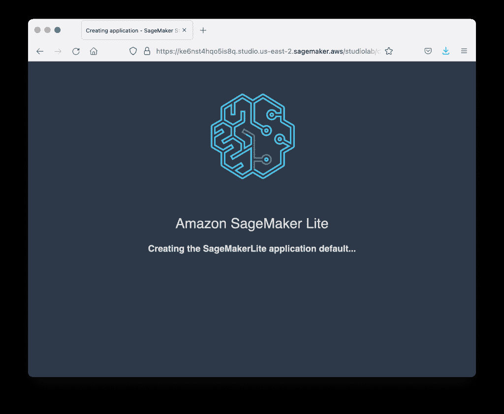
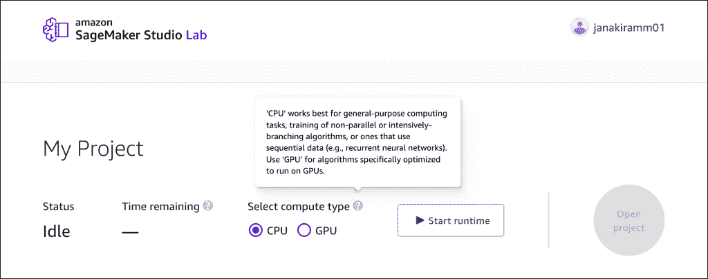
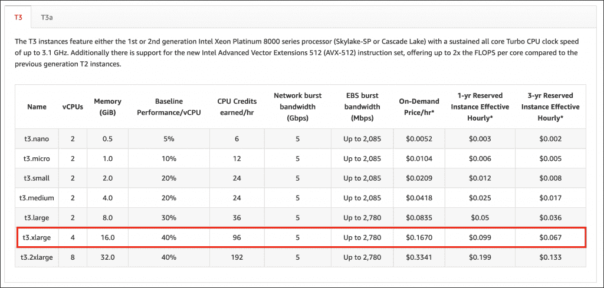
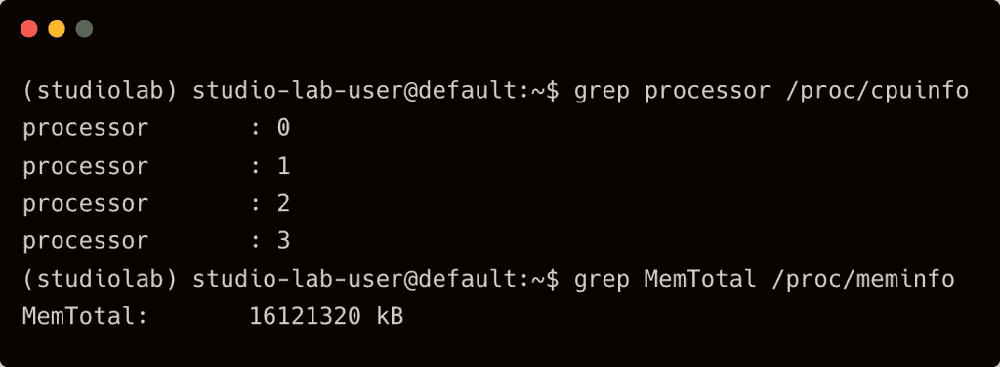
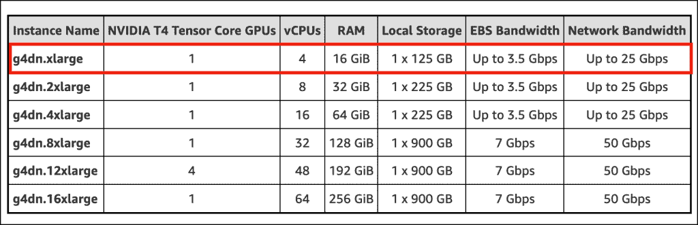
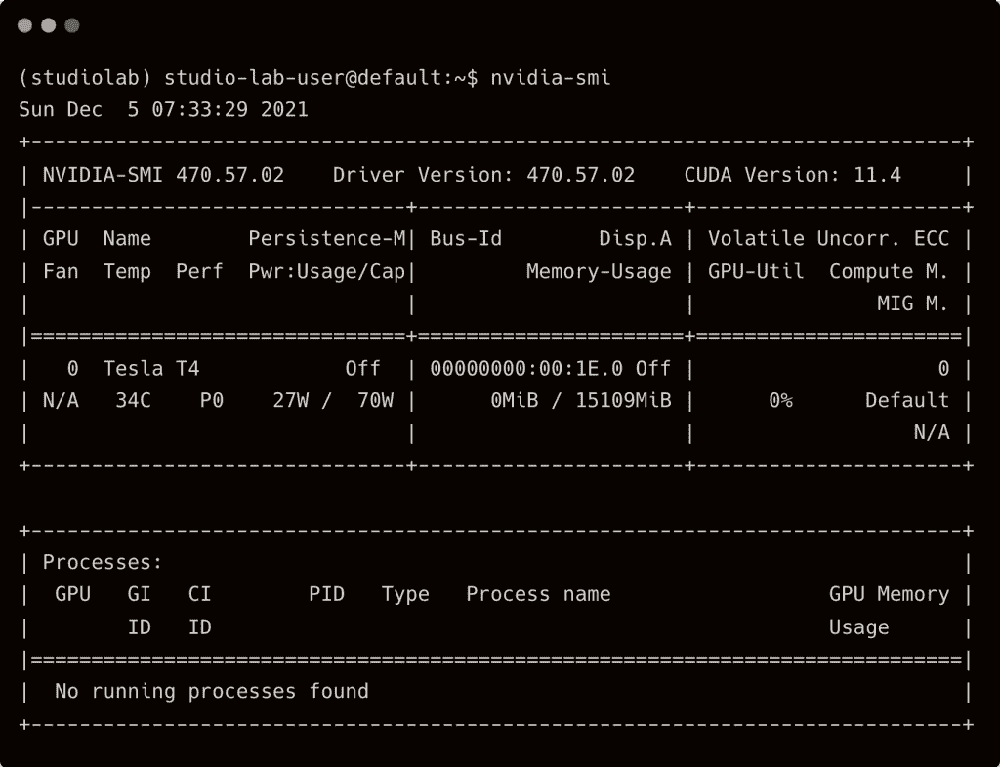
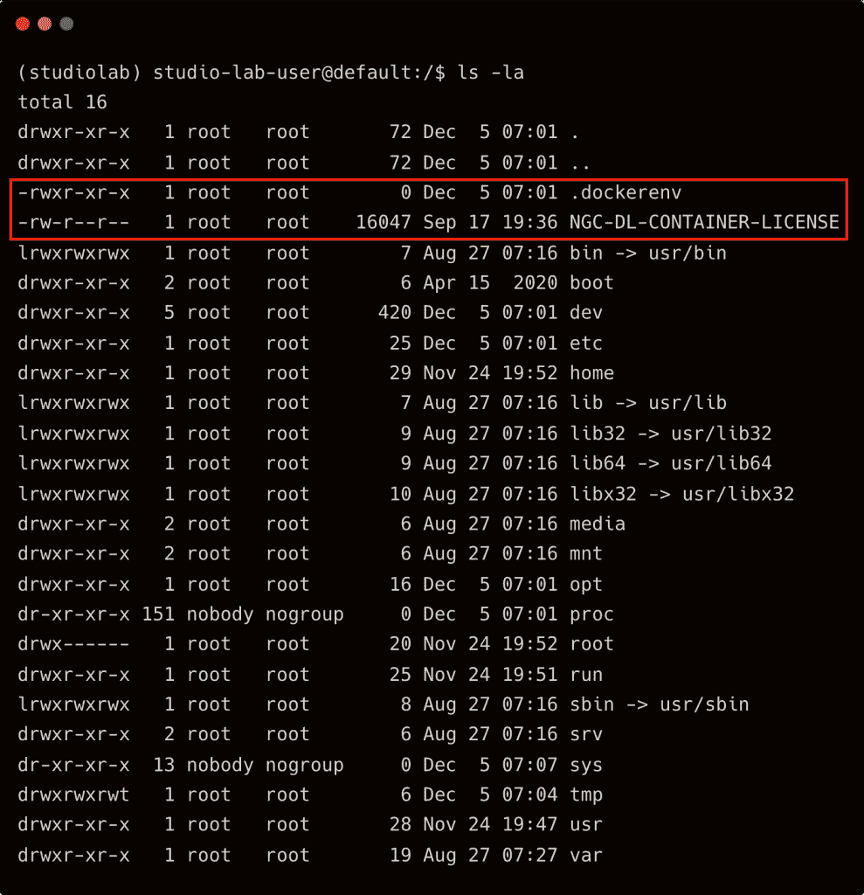
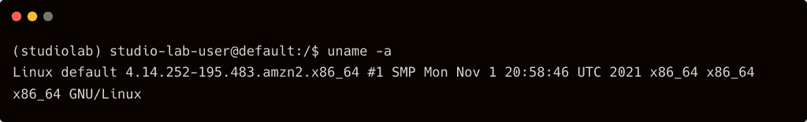
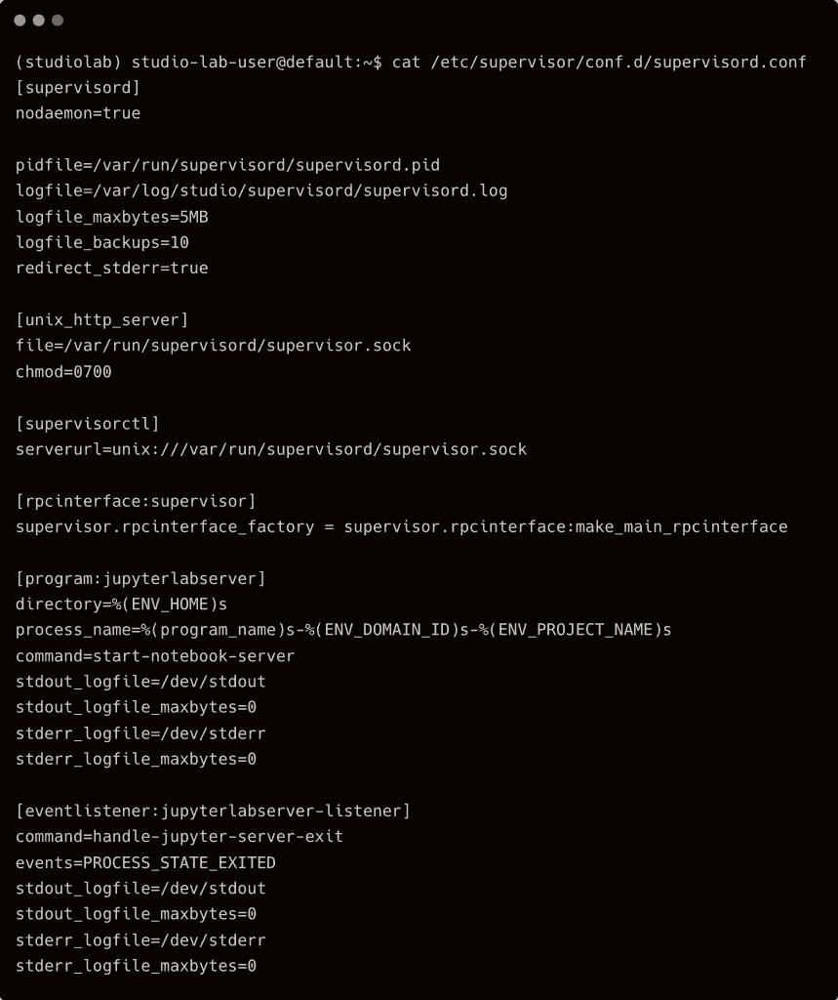
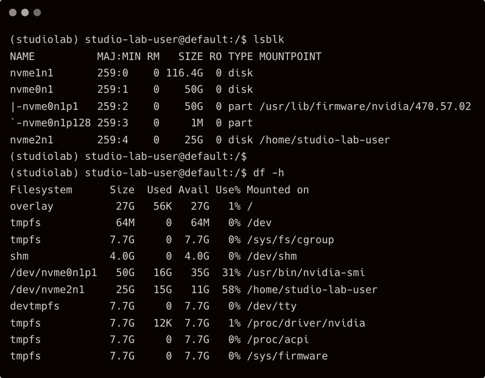

# MLOps 工程师眼中的亚马逊 SageMaker 工作室实验室

> 原文：<https://thenewstack.io/amazon-sagemaker-studio-lab-from-the-eyes-of-an-mlops-engineer/>

在[亚马逊网络服务](https://aws.amazon.com/?utm_content=inline-mention)re:Invent 2021 大会上，亚马逊人工智能副总裁 [Swami Sivasubramanian](https://www.linkedin.com/in/swaminathansivasubramanian) 的一份声明引起了我的注意——亚马逊 SageMaker 工作室实验室的启动。

自从在 re:Invent 2015 上首次推出[亚马逊机器学习服务](https://aws.amazon.com/about-aws/whats-new/2015/04/introducing-amazon-machine-learning/)以来，AWS 一直在不断改进托管的 ML 平台和工具。SageMaker 平台的推出，以及随后 Autopilot 和 JumpStart 等服务的加入，使 AWS 成为构建和部署机器学习和深度学习的首选云。API 已经成熟，基础设施和平台服务也是如此。

亚马逊 SageMaker Studio 实验室在很多方面都是独一无二的。首先，这是一个独立的服务，不依赖于 AWS。任何有电子邮件账户的人都可以注册这项服务。其次，完全免费。亚马逊开放了一个 IDE 和环境，用于构建机器学习模型，没有任何附加条件。这可能是第一个存在于 IAM 领域之外的 AWS 服务，具有无限的免费层小时数。

除了品牌推广，服务几乎和 SageMaker 没有任何关系。该环境基于流行且熟悉的 [JupyterLab](https://jupyter.org/) 笔记本电脑。JupyterLab 是 Studio Lab 和 Studio 之间唯一可以从 AWS 控制台获得的通用性。

在探索过程中，我发现了闪屏，暗示亚马逊试图将其品牌化为 SageMaker Lite，老实说这是一个不错的主意。

任何人都可以注册这项服务。但是在进入之前你会被列入等待名单。一旦获得批准，您就可以登录并开始培训模型。我在公告发布后立即申请，并在数小时内获得批准。

与 Google Colab 相比，SageMaker Studio Lab 让您有宾至如归的感觉。这在很大程度上是由于原生 JupyterLab 笔记本的可用性，更重要的是，用于数据集、笔记本和模型的专用存储。

在花了很长时间为 ML 模型的训练、实验和部署提供环境之后，我很想看看 SageMaker Studio 实验室的幕后发生了什么。

## 在 SageMaker 工作室实验室的引擎盖下

简单地说，SageMaker Studio Lab 是一个运行在预先提供的 Amazon EC2 实例中的 JupyterLab 应用程序。假设您有一个 EC2 实例，每当您想要尝试您的机器学习项目时，它会停止但会启动。与 SageMaker Studio Lab 的唯一区别是，如果您的会话基于 CPU，它会在第 12 个小时的顶部强制停止，如果是 GPU，它会在第 4 个小时强制停止。

在撰写本文时，该服务提供俄亥俄州(美国东部-2)地区的所有资源。

当您启动一个基于 CPU 的会话时，JupyterLab 在一个***T3 . xlage***EC2 实例中运行。根据官方的 EC2 规范，这个实例类型带有 4 个 vCPUs 和 16GB RAM。

登录环境后，我查看了 CPU 数量和可用内存，确实是一台 ***T3.xlarge*** 机器。

在 GPU 的情况下，您会得到一个由英伟达 T4 TensorCore GPU 支持的 ***G4dn.xlarge*** 实例，它带有 2560 个 CUDA 内核、320 个 Tensor 内核和 16GB 内存。

运行`nvidia-smi`命令确认 T4 GPU 的存在。

有趣的是，英伟达 T4 GPU 是为了推理而不是训练。但是，我不会抱怨它是免费的。

GPU 和 CPU 运行时获得 15GB 的持久存储，足以存储大型数据集、笔记本和模型。

这是否意味着 SageMaker Studio Lab 的每个用户都会得到一个专用的***T3.xlarge/G4dn.xlarge***？没有机会。AWS 显然很好地利用了 Docker，将多个容器打包到一个 EC2 实例中。本质上，每个会话都映射到一个容器。

在操作系统方面，它是一个运行 JupyterLab 容器映像的 Amazon Linux 2 AMI。

为了确保 JupyterLab 进程一直在运行，它被包装在`supervisord`中。

当您按下 **Start Runtime** 按钮时，SageMaker Studio Lab 从一个热池中找到一个 EC2 实例，并调度该容器，并将存储附加到它上面。我不确定 AWS 是否利用 Spot 实例来提供服务。

谈到存储，该环境由 NVMe 磁盘提供支持。设备`/dev/nvme2n1`被映射到主目录`/home/studio-lab-user`

我感觉这个服务运行在 Fargate 之上，用 Amazon ECS 来编排容器的生命周期。如果这个用例作为 Fargate Spot 的案例研究出现在未来的 re:Invent 会议上，这并不奇怪。

shell 作为`studio-lab-user`运行，不访问根目录。显然，您不能在 shell 中使用`sudo`。包括`yum`在内的软件包管理器被禁用。你能找到的工具只有`pip`、`conda`和 AWS CLI。

当然，对于使用 SageMaker Studio 实验室进行培训和实验的数据科学家或 ML 工程师来说，这些细节并不重要。通过对 git 的内置支持和 AWS CLI 的可用性，很容易将平台与外部环境连接起来，包括 Amazon SageMaker Studio。

在从头开始构建环境之后，我知道配置一个多租户、基于 GPU 的 ML 测试床的痛苦。感谢 AWS 为我们提供了一个可用、完整、强大、免费的数据科学环境，最重要的是，每个人都可以访问。

我训练了一个卷积神经网络(CNN)用于图像分类，然后在 SageMaker 中部署了该模型，通过最近宣布的[无服务器推理端点](https://aws.amazon.com/about-aws/whats-new/2021/12/amazon-sagemaker-serverless-inference/)将其暴露出来。在本系列的下一部分中，我将带您完成其中的所有步骤。敬请关注。

<svg xmlns:xlink="http://www.w3.org/1999/xlink" viewBox="0 0 68 31" version="1.1"><title>Group</title> <desc>Created with Sketch.</desc></svg>