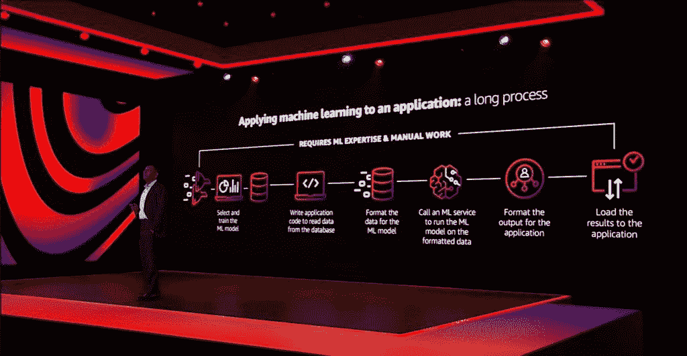
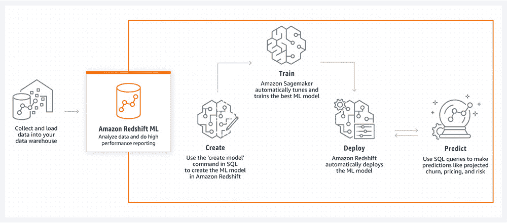

# 亚马逊网络服务将机器学习引入数据运营

> 原文：<https://thenewstack.io/amazon-web-services-brings-machine-learning-to-dataops/>

还记得那句老话吗，“如果山不向穆罕默德走来，那么穆罕默德必须走向山”？嗯，亚马逊网络服务希望将更多的机器学习带到全球开发社区。

在过去的几年里，[亚马逊网络服务](https://aws.amazon.com/)已经投入了大量的工程努力，将围绕创建和完善机器学习模型的过程整合到现代开发生命周期中，开发了一个平台[亚马逊 SageMaker](https://thenewstack.io/amazon-sagemaker-automates-artificial-intelligence-development-pipeline/) ，以简化这一过程。

现在，该公司正在采取下一步措施，将 ML 工作流直接集成到数据源中。在今年的年度虚拟用户大会上，[AWS Re:Invent](https://reinvent.awsevents.com/)AWS ML/AI 服务管理人 [Swami Sivasubramanian](https://twitter.com/SwamiSivasubram) 表示，该公司已经将其用于自动创建 ML 模型的工具 SageMaker Autopilot 整合到其许多首席数据管理服务中。

这个想法是为 AWS 数据存储、数据库和数据仓库工具的用户提供用所有数据库管理员都知道的接口创建模型的能力:结构化查询语言(SQL)。

“机器学习是一个非常迭代的过程。你准备一些数据，训练模型，然后检查模型是否以正确的方式收敛。AWS ML 副总裁 [Bratin Saha](https://www.linkedin.com/in/bratin-saha-05824b3/) 在向新堆栈解释为什么 AWS 将数据准备与 SageMaker 及其机器学习基础设施集成时表示:“在这个过程中，你经常会意识到需要改变数据准备，比如在数据中加入新标签，在数据中加入新功能，或者以不同的方式组合这些功能。”。“当你在处理数百个模型时，你真的需要这种紧密耦合，所以这是一个单一的工具，团队使用单一工具会变得更有效率。”

这项工作实际上始于去年，AWS 为关系数据库开发人员在 Amazon Aurora 中集成了 ML。这个新特性允许他们通过一个简单的查询将 ML 功能添加到企业应用程序中。那一年，它的交互式查询服务 Athena 做了类似的事情，允许开发人员直接从 Athena 特别查询访问内置或定制的 ML 模型。

今年，整合仍在继续。该公司的 Redshift 数据仓库已经配备了机器学习功能。正如该公司[在博客文章](https://aws.amazon.com/blogs/big-data/bringing-machine-learning-to-more-builders-through-databases-and-analytics-services/)中解释的那样:

*Amazon Redshift 现在使您能够在 Amazon Redshift 数据上运行 ML 算法，而无需手动选择、构建或训练 ML 模型。Amazon Redshift ML 与 Amazon SageMaker Autopilot 配合使用，该服务可以根据您的数据自动训练和调整最佳 ML 模型进行分类或回归，同时允许完全控制和可见性。*

*当你在亚马逊红移中运行 ML 查询时，选中的数据会从亚马逊红移安全导出到[亚马逊简单存储服务](http://aws.amazon.com/s3)(亚马逊 S3)。然后，SageMaker Autopilot 对训练数据进行数据清理和预处理，自动创建模型，并应用最佳模型。亚马逊红移、亚马逊 S3 和 SageMaker 之间的所有交互都被抽象出来并自动发生。模型定型后，就可以作为 SQL 函数供您使用了。*

甚至亚马逊的图形数据库 Neptune 也有一些 ML 智能。图形数据库可以用来检查不同实体之间的联系，揭示通过检查实体本身无法严格识别的模式。据该公司称，Neptune 的新更新带来了图形神经网络(GNNs)，这是一种与传统方法相比将预测准确性提高 50%以上的技术。

“Neptune ML 使用 Deep Graph Library (DGL ),这是一个开源库，AWS 为其做出了贡献，使其易于开发和应用图形数据上的 GNN 模型。因此，您现在可以在几个小时而不是几周内创建、训练和应用 Neptune 数据上的 ML，而无需学习新的工具和 ML 技术。现在，任何在 Neptune 中拥有数据的开发者都可以很容易地在他们的图上使用 ML。

<svg xmlns:xlink="http://www.w3.org/1999/xlink" viewBox="0 0 68 31" version="1.1"><title>Group</title> <desc>Created with Sketch.</desc></svg>