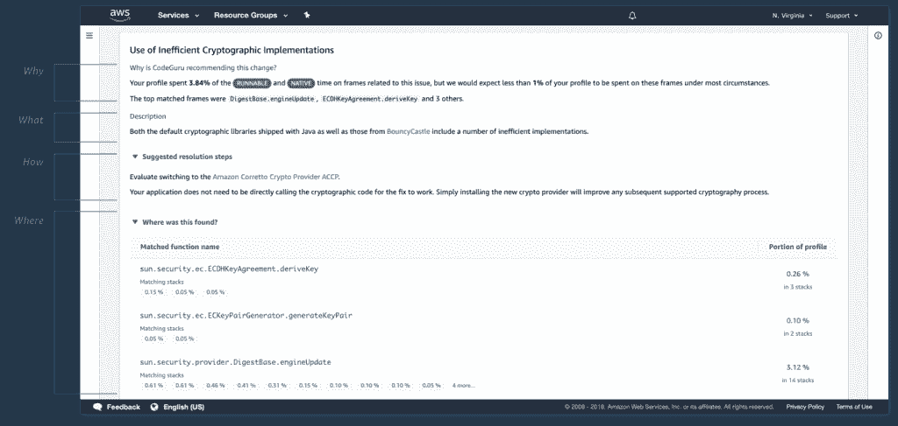

# AWS 的代码专家会指出你的代码有什么问题

> 原文：<https://thenewstack.io/amazon-web-services-codeguru-will-point-out-whats-wrong-with-your-code/>

Amazon Web Services 希望将机器学习(ML)的全部力量用于代码开发。在该公司的年度用户大会上，该公司推出了一项名为 [CodeGuru](https://aws.amazon.com/codeguru/) 的新服务，旨在自动化代码审查并提供应用性能建议。

AWS 首席执行官 [Andy Jassy](https://twitter.com/ajassy) 在本周于拉斯韦加斯举行的会议主题演讲中承认，手工代码审查是一种痛苦。公司开发人员必须留出时间来审查代码，即使是最严格的审查也会遗漏一些元素。CodeGuru 可以找到许多常见的，但很难注意到的错误，甚至可以突出应用程序中低效(即昂贵)的代码行。

该服务之所以引人注目，是因为它是首批基于 ML 的代码审查和分析工具之一，分析师[贾纳吉姆·MSV](https://www.linkedin.com/in/janakiramm?originalSubdomain=in)说，并补充说，当它与主流 ide(如 Visual Studio、VS Code 和 IntelliJ)集成时，它对开发人员有潜在的吸引力(回头看看新的堆栈，因为贾纳吉姆将在活动结束后为我们更深入地研究这项服务)。

CodeGuru 可以很容易地加入到开发过程中:将 CodeGuru 添加为 pull 请求的接收者之一。当开发人员提交代码时，CloudGuru 参考其模型和算法，以人类可读的形式提供代码评估，指出有问题的代码行。

该软件本身源于亚马逊的内部代码审查过程，并借鉴了 GitHub 开源项目的 10，000 个应用程序配置文件。它可以查明资源泄漏、原子性违规、潜在的并发竞争情况、未初始化的输入、浪费的 CPU 周期以及难以查明的线程安全类，等等。

Jassy 说，它还被设计来定位“你的最低效、最无用、最昂贵的代码行”。该服务通过机器学习驱动的分析器来实现这一点，该分析器需要在应用程序中嵌入一个小代理。“CodeGuru 会观察您的应用程序，每五分钟就会创建一个配置文件。它告诉你诸如延迟和 CPU 利用率之类的东西，并且它帮助你识别你的应用程序中最昂贵的代码行，”Jassy 说。

Jassy 说，亚马逊自己已经在 80，000 个自己的应用程序中使用了这个分析器，这已经“为我们节省了数千万美元”。亚马逊的消费者支付团队在一年的时间里反复使用该工具，并能够将 CPU 利用率提高 325%，节省 39%的运营成本，即使对其服务的需求持续增长。同样，该公司声称，在遵循分析者的建议后，该公司的目录管理服务的 CPU 使用率减少了 67%。

最初，CodeGuru 将支持 Java，尽管将来会支持其他语言。它可以通过 AWS 插入 [GitHub](https://github.com/) 和 [CodeCommit](https://aws.amazon.com/codecommit/) ，未来还会添加更多的库。虽然这项服务现在还处于预览阶段，但当它上线时，AWS 有望以较低的按需定价，因此它可以用于组织内的所有代码审查:CodeGuru 的费用为每个应用程序配置文件每个采样小时 0.005 美元，每月每 100 行代码 0.75 美元。

AWS 不是唯一一个认为扫描巨大的在线代码库以获得一组最佳实践和安全修复具有分析价值的人。GitHub 自己也在用它的 [CodeQL](https://securitylab.github.com/tools/codeql) 语义代码分析引擎做类似的工作，它是在 9 月份收购 Semmle 时收购[的。微软旗下的公司正在使用这项技术生成所有公开回购的语义代码图，这将为理解和改善编码模式、质量和安全性提供巨大的机会，](https://techcrunch.com/2019/09/18/github-acquires-code-analysis-tool-semmle/)[报道玛丽·布兰斯科为新堆栈](https://thenewstack.io/how-code-analytics-could-help-github-decipher-its-semantic-code-graph-of-open-source/)报道。

<svg xmlns:xlink="http://www.w3.org/1999/xlink" viewBox="0 0 68 31" version="1.1"><title>Group</title> <desc>Created with Sketch.</desc></svg>