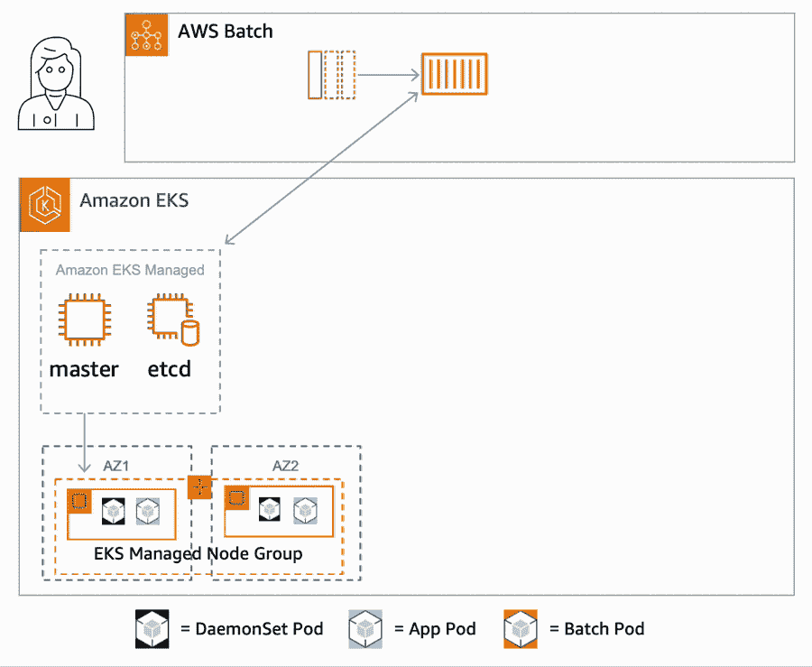

# Amazon Web Services 为批处理工作提供弹性 Kubernetes 服务

> 原文：<https://thenewstack.io/amazon-web-services-gears-elastic-kubernetes-service-for-batch-jobs/>

云巨头[亚马逊网络服务](https://aws.amazon.com/?utm_content=inline-mention)已经为其[亚马逊弹性 Kubernetes 服务](https://aws.amazon.com/eks/)推出了 [AWS 批次](https://aws.amazon.com/batch/)。AWS 开发者倡导者 Steve Roberts 周二发表的博客文章[称，AWS Batch 非常适合那些寻求更简化的工作流程的开发者，他们需要管理 Kubernetes 集群和 pods 以配合他们的批处理作业。](https://aws.amazon.com/blogs/aws/aws-batch-for-amazon-elastic-kubernetes-service/)

AWS 在本周于底特律举行的 KubeCon+CloudNativeCon 北美大会上宣布了这项新服务。

Kubernetes“要求您在定制配置和管理方面投入大量时间，以微调合适的解决方案，”Roberts 在设置和运行批处理作业时写道。AWS Batch for Amazon Elastic Kubernetes Service(亚马逊 EKS)是一项完全托管的  亚马逊弹性计算云(Amazon EC2)服务，可处理复杂的定制批处理工作负载的安装和管理。内置的定制组件、调度程序、无服务器队列和集成提供了更少步骤的批处理作业创建。服务本身是免费的，唯一的相关成本与工作消耗的资源有关。

[Kubernetes](https://thenewstack.io/category/kubernetes/) 更多的是一种[微服务架构](https://thenewstack.io/category/microservices/)的感觉，所以当它的 pod 和集群用于批处理作业时，工作流会稍微繁重一些。这是有意义的——微服务和批处理作业有很大的不同，所以如果一项技术很好地适应了其中一项，那么在另一项上开发完整的功能就需要做大量的工作。

确实存在第三方框架来帮助在 Kubernetes 上运行批处理作业。罗伯茨写道，但是存在差距，而在这些差距之内是构建、配置、维护、调度和扩展定制批处理解决方案的重担。

在深入了解 Amazon 的目标之前，让我们先来了解一下这两者之间的一些基本差异:

[微服务应用](https://thenewstack.io/3-best-practices-ensuring-service-quality-microservice-applications/)倾向于持续运行和可用性，而不是定义了开始和结束的批处理作业。微服务工作负载有望在数毫秒内响应请求。批处理作业对可用性的要求几乎没有时间限制。

最后，微服务作业以更可靠的模式扩展，通常随着负载的增加和减少呈线性增长。批处理作业遵循更多的指数缩放，因为它们往往从零开始，变得更加极端，然后回到零。

## **引入亚马逊 EKS 的 AWS 批次**

这种完全托管的服务使用亚马逊弹性计算云(Amazon EC2)上托管的集群运行批处理工作负载，处理复杂的定制批处理解决方案的安装和管理。

亚马逊 EKS 的 AWS Batch 的一些功能包括:

*   **调度器:**它控制并运行大批量批处理作业，以及评估何时、何地以及如何将作业提交到队列的编排组件。现在，用户只需将请求提交到队列中，而不必协调作业。
*   **无服务器队列:**无服务器队列处理作业排队、依赖性跟踪、重试、优先化、亚马逊弹性计算云(EC2)和亚马逊弹性计算云(EC2) Spot 的计算资源供应以及 pod 提交。
*   **集成:** AWS Batch for Amazon EKS 集成提供了与其他服务的集成，如 AWS 身份和访问管理(IAM)、Amazon EventBridge 和 AWS Step Function 以及 Kubernetes 生态系统中的其他合作伙伴和工具。

## **工作原理**

在亚马逊 EKS 集群上运行批处理作业时，AWS Batch 是提交工作负载请求的主要入口点。Amazon Batch 然后将工作节点启动到集群中，根据排队的作业处理作业。这些节点保存在一个不同的名称空间中，与亚马逊 EKS 中的其他节点组分开。类似地，其他 pod 中的节点与 AWS Batch 中使用的节点是隔离的。

AWS Batch 使用托管的亚马逊 EKS 集群，这些集群需要向 AWS Batch 注册并设置权限。可以在此处找到启动托管集群的说明。权限设置说明位于此处。

用户可以向队列提交作业。提交作业后，将触发以下操作:

*   一旦接收到请求，队列就向配置的计算环境分派对资源的请求。如果 AWS 批处理管理的缩放组尚不存在，则会创建该组。AWS 批处理开始在组中启动 Amazon 弹性计算云(EC2)实例。然后，新实例被添加到集群的 AWS Batch Kubernetes 名称空间中。
*   Kubernetes 调度程序将任何已配置的 DaemonSet 放在节点上。
*   一旦节点准备就绪，AWS 批处理就开始向集群发送 pod 放置请求，使用标签和污点为 pod 做出放置选择，绕过 K8s 调度器的大部分逻辑。
*   重复这个过程，根据需要在扩展范围内扩展更多 EC2 实例。这种情况一直持续到达到最大配置容量。
*   如果排队的作业定义了另一个计算环境，如 Spot 实例，则其他节点将在该计算环境中启动。
*   AWS Batch 从集群中删除节点，并在工作完成后终止实例。

AWS Batch 现在免费提供。与此服务相关的唯一成本是作业消耗的资源。AWS 创建了一个[自助工作坊](https://catalog.us-east-1.prod.workshops.aws/workshops/b67b6665-f7a2-427f-affb-caccd087d50d/en-US)来帮助开发者入门。还有 [AWS 批量用户指南](https://docs.aws.amazon.com/batch/latest/userguide/what-is-batch.html)中的[亚马逊 EKS 主题](https://docs.aws.amazon.com/batch/latest/userguide/getting-started-eks.html)入门。

<svg xmlns:xlink="http://www.w3.org/1999/xlink" viewBox="0 0 68 31" version="1.1"><title>Group</title> <desc>Created with Sketch.</desc></svg>