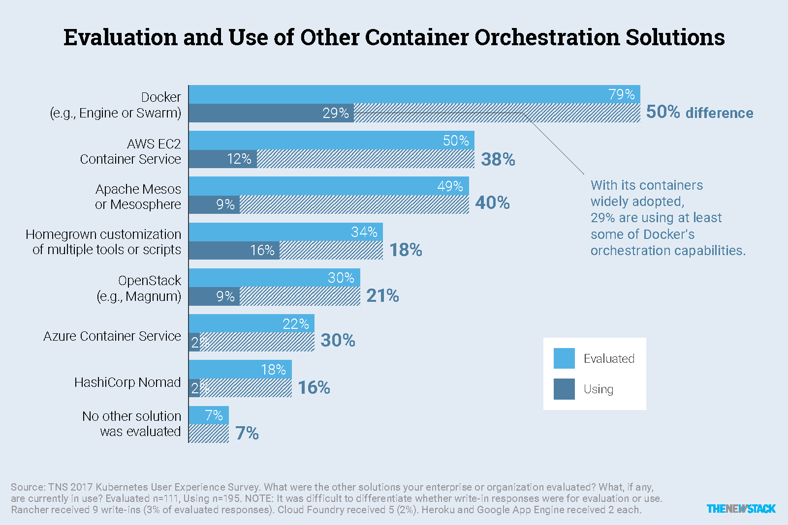

# AWS 加入云计算原生计算基金会，推动 Kubernetes 的发展势头

> 原文：<https://thenewstack.io/amazon-web-services-joins-cloud-native-computing-foundation/>

亚马逊网络服务(AWS)已经加入了[云本地计算基金会](https://www.cncf.io/) (CNCF)，此举表明企业云提供商正在非常认真地对待 CNCF 的旗舰业务流程引擎 [Kubernetes](/category/kubernetes/) ，确实是其专有的基于容器的服务的潜在破坏者。

[阿德里安·科克罗夫特](https://twitter.com/adrianco)在一份声明中写道:“许多 CNCF 项目已经在 AWS 云中运行，我们很高兴加入该基金会，以确保客户继续在 AWS 上运行这些工作负载时获得良好的体验。”。科克罗夫特是 AWS 的云架构战略副总裁，他将加入 CNCF 管理委员会。

作为白金合作伙伴，AWS 是最后一批加入 CNCF 的主要云提供商之一，与微软、谷歌、IBM 和阿里巴巴并列。

CNCF 的旗舰项目 Kubernetes 提供了一个独立于云的平台，用于管理容器的生产规模操作。虽然开源软件最初是由谷歌在 2015 年开发并发布的，但该公司很快[成立了一个基金会](https://thenewstack.io/google-launches-a-separate-foundation-around-container-orchestration/)来独立管理 Kubernetes。

自那以后，CNCF 承担了许多在 Kubernetes 的“[云原生](/category/cloud-native/)”架构中运行良好的[额外开源项目，包括用于监控的 Prometheus、用于日志记录的 Fluentd、用于通信的 gRPC 和用于服务发现的 CoreDNS。](https://www.cncf.io/projects/)

尽管 AWS 在其自己的 [Amazon EC2 容器服务](https://aws.amazon.com/ecs/)中提供了容器编排功能，但组织似乎对使用 Kubernetes 作为一种避免将其运营锁定在单一云提供商的方式越来越感兴趣。

据 CNCF 称，像 Box、Ticketmaster、GolfNow、Comcast、高盛、易贝、Pokémon GO、SAP 和 Wink 等企业都使用 Kubernetes。根据 RedMonk 的数据，超过 71%的财富 100 强使用容器，其中超过一半在 Kubernetes 上运行他们的应用程序。

科克罗夫特[在解释 AWS 加入 CNCF 的原因的博客文章](https://medium.com/@adrianco/cloud-native-computing-5f0f41a982bf)中指出，云原生架构可以为组织提供更多的灵活性和开发人员的生产力。“部署跨多个数据中心的应用程序是一种相对罕见且难以实施的模式，但云原生架构将多区域和多地区部署视为默认设置，”他写道。

在加入 AWS 之前，科克罗夫特是网飞工程团队的一员，该团队使用云原生架构模式[来扩展该公司在 AWS 上的服务。](https://www.slideshare.net/adrianco/yowworkshop-131203193626phpapp01-1)

这不是 AWS 第一次涉足容器标准工作。该公司是 [containerd](https://thenewstack.io/docker-donate-container-runtime-containerd-cloud-native-computing-foundation/) 项目的创始成员，该项目致力于开发一个厂商中立的容器运行时标准，现在也由 CNCF 管理。

TNS 分析师 Lawrence Hecht 为本文做出了贡献。

*关于 AWS/CNCF 的进一步讨论，请在此收听[软件定义的播客专题](http://www.softwaredefinedtalk.com/102):*

<https://aphid.fireside.fm/d/1437767933/9b74150b-3553-49dc-8332-f89bbbba9f92/9ce329aa-2c70-4570-8494-a458bf726f61.mp3?_=2>

[https://aphid.fireside.fm/d/1437767933/9b74150b-3553-49dc-8332-f89bbbba9f92/9ce329aa-2c70-4570-8494-a458bf726f61.mp3](https://aphid.fireside.fm/d/1437767933/9b74150b-3553-49dc-8332-f89bbbba9f92/9ce329aa-2c70-4570-8494-a458bf726f61.mp3)

云本地计算基金会是新堆栈的赞助商。

通过 Pixabay 的特征图像。

<svg xmlns:xlink="http://www.w3.org/1999/xlink" viewBox="0 0 68 31" version="1.1"><title>Group</title> <desc>Created with Sketch.</desc></svg>