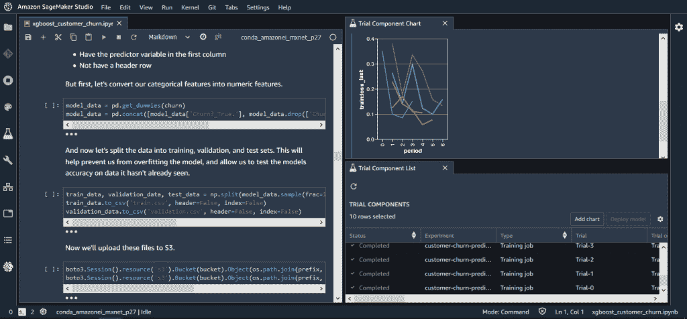
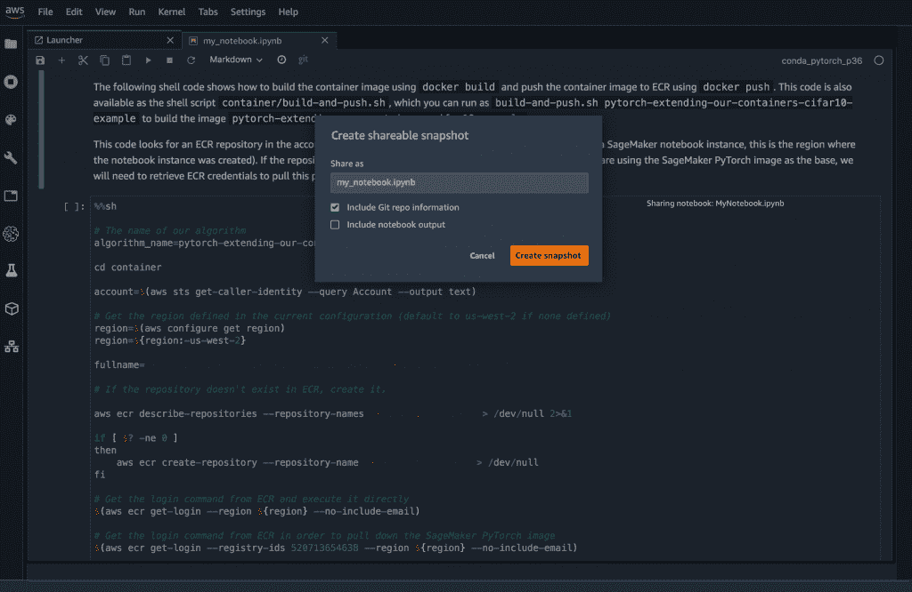
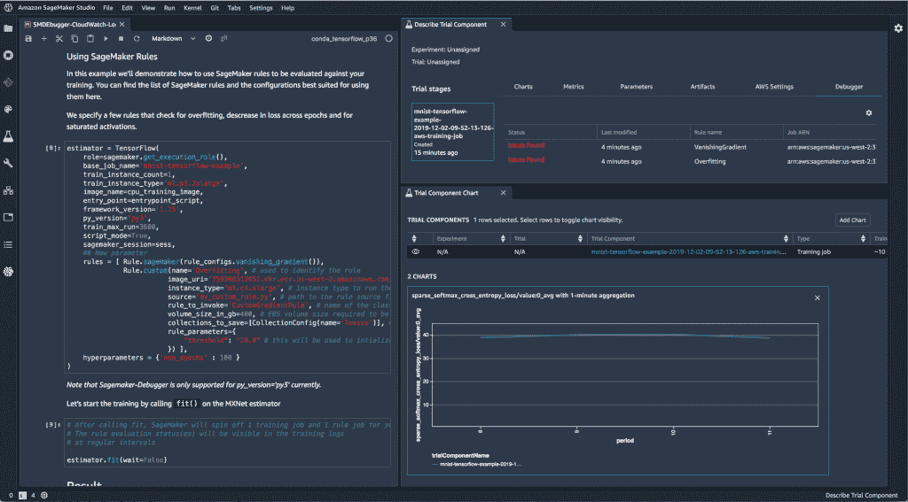
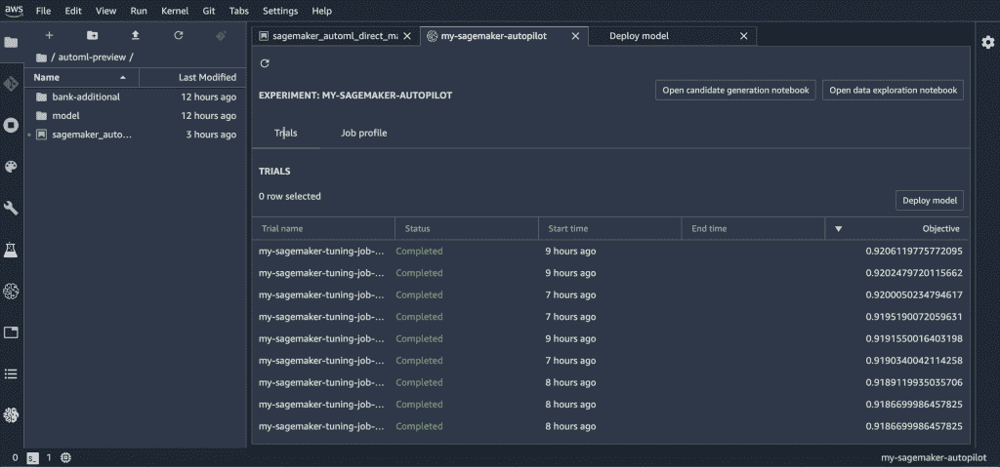

# AWS 推出 IDE 来管理整个机器学习生命周期

> 原文：<https://thenewstack.io/amazon-web-services-launches-an-ide-to-manage-the-full-machine-learning-lifecycle/>

和去年一样，[亚马逊网络服务](https://aws.amazon.com/)将机器学习和人工智能作为其年度 [Re:Invent](https://reinvent.awsevents.com/) 用户大会的一大主题，该大会本周在拉斯韦加斯举行。AWS 首席执行官 [Andy Jassy](https://twitter.com/ajassy) 在他三个小时的主题演讲中花了近一个小时介绍该公司为展会推出的新人工智能/人工智能技术和服务。

也许对开发者来说最值得注意的是，AWS 推出了一个完全集成的开发环境(IDE)，名为 SageMaker Studio，用于管理正在云服务上开发和运行的机器学习作业的完整生命周期。它在 SageMaker 平台的单一用户界面下统一了公司的所有工具，SageMaker 平台是公司[两年前发布的](/amazon-sagemaker-automates-artificial-intelligence-development-pipeline/)。此次发布还包括一些额外的功能，包括调试。监控甚至自动创建 ML 模型。

SageMaker Studio“首次将数十种机器学习工具整合在一个单一的窗格中，”AWS 人工智能副总裁 Matt Wood 也在主题演讲中表示。“我们的目标是将机器学习交给比以往更多的开发人员和数据科学家。”

SageMaker Studio 提供了从中央控制台构建、训练、调整和部署他们的 ML 模型的能力。开发者可以很容易地在步骤之间切换，[公司承诺](https://aws.amazon.com/blogs/aws/amazon-sagemaker-studio-the-first-fully-integrated-development-environment-for-machine-learning/)，这样他们可以更快地迭代。可以创建文件夹来管理和共享给定项目的所有资源。

“SageMaker 的更新是巨大的。AWS 现在有一个端到端和完整的 ML PaaS，”新堆栈贡献分析师[贾纳基拉姆·MSV](/author/janakiram/)在展厅发推文给[。](https://twitter.com/janakiramm/status/1201922272954421249?s=20)

## 概念漂移不再

SageMaker Studio 的原子工作单元将是一个笔记本，一个基于开源 [Jupyter 笔记本](/jupyter-notebooks-challenge-reproducibility/)的代码和评论模板。开发人员可以在 SageMaker 笔记本上工作(目前在预览版中)，当它们运行时，AWS 可以自动分配正确数量的硬件和云服务，消除了开发人员管理基础设施的需要。

由于训练模型需要大量的迭代测试，AWS 组装了 [SageMaker Experiments](https://aws.amazon.com/blogs/aws/amazon-sagemaker-experiments-organize-track-and-compare-your-machine-learning-trainings/) ，它自动捕获每个实验的输入参数、配置和结果，提供了一种实时检查和比较多个训练运行的方法。该公司还推出了[Amazon SageMaker Processing](https://aws.amazon.com/blogs/aws/amazon-sagemaker-processing-fully-managed-data-processing-and-model-evaluation/)，这是一款 Python SDK，可以在完全托管的基础设施上运行预处理、后处理和模型评估工作负载。特别是，这可以帮助完成所有繁琐的预处理工作，例如将数据集转换为输入格式，重新调整或归一化数字特征，以及将数据转换为更丰富的格式，例如用 GPS 坐标替换邮寄地址。

添加了几个工具来提高模型本身的性能。添加了一个新的[调试器](https://aws.amazon.com/blogs/aws/amazon-sagemaker-debugger-debug-your-machine-learning-models/)来仔细检查为什么 ML 模型没有得到最佳结果。它检查您的模型，自动收集操作指标，并提供优化训练时间和提高模型质量的警报和建议。这个 SDK 可以与 TensorFlow、Keras、Apache MXNet、PyTorch 和 XGBoost 配合使用。结果可以直接在 SageMaker Studio 的笔记本上查看。

【T2

另外，SageMaker Model Monitor 也可以提供帮助，它可以在运行时自动监控 ML 模型，在出现数据质量问题时发出警报。Jassy 指出，这种监视器特别擅长检测“[概念漂移](https://machinelearningmastery.com/gentle-introduction-concept-drift-machine-learning/)的问题，即以前成功的模型由于基本训练数据的一些最近变化(例如，房价的突然变化)而不再有用。它在训练期间创建一组基线统计数据，然后用于比较生产中模型的结果。警报可以反馈给 SageMaker Studio 和/或 CloudWatch。你甚至可以将它与 SageMaker Processing 联系起来，在那里它将推断出一个新的模型，它们可以快速旋转起来。

如果你想知道 AWS 是否可以自动完成创建有用的 ML 模型的整个过程，那么看看 [SageMaker Autopilot](https://aws.amazon.com/blogs/aws/amazon-sagemaker-autopilot-fully-managed-automatic-machine-learning/) ，它旨在检查一组原始数据，例如在 S3 存储为对象数据，自动检查一组分类和回归机器学习模型。通过多次迭代和对基础算法的轻微调整，这消除了手动创建预测模型的繁琐工作。从这项工作中，它训练了一个[推理管道](https://docs.aws.amazon.com/sagemaker/latest/dg/inference-pipelines.html)，然后可以在实时端点投入使用，或者为批处理做准备。

除了 SageMaker，该公司还推出了一系列新的计算实例，专门用于 ML 工作负载的推理部分。Jassy 指出，虽然每个人都担心测试阶段，但亚马逊自己发现，ML 工作负载中的大部分硬件成本——如支持 Alexa 语音命令服务——来自工作负载的推理(面向客户)部分。与当前的 [G4 实例](https://aws.amazon.com/ec2/instance-types/g4/)相比， [Inf1 实例](https://aws.amazon.com/about-aws/whats-new/2019/12/introducing-amazon-ec2-inf1-instances-high-performance-and-the-lowest-cost-machine-learning-inference-in-the-cloud/)每个都有多达 16 个基于 ARM 的 AWS 推理芯片，承诺提供 40%的每次推理成本，以及 3 倍的性能。

在主题演讲中，伍德概述了所有自动驾驶仪以及 SageMaker 的其他功能如何用于生产。他想预测美国的房价。他所需要的只是一个包含美国住房销售数据的 CVS 文件，以及每栋房子的特征(卧室数量等)。)AutoPilot 一次最多可以运行 50 个模型。“ML 的肮脏秘密是，你不只是训练一个单一的模型，你训练几十个，然后挑选最好的，”伍德打趣道。自动驾驶仪反复琢磨最佳的算法、数据特征和参数，以提供最佳的可能模型。您可以使用调试工具来了解每个模型是如何创建的，并且，当您选择的模型投入运行时，监控服务将让您知道预测何时开始不同于基线模式，这将表明需要重新构建。

<svg xmlns:xlink="http://www.w3.org/1999/xlink" viewBox="0 0 68 31" version="1.1"><title>Group</title> <desc>Created with Sketch.</desc></svg>