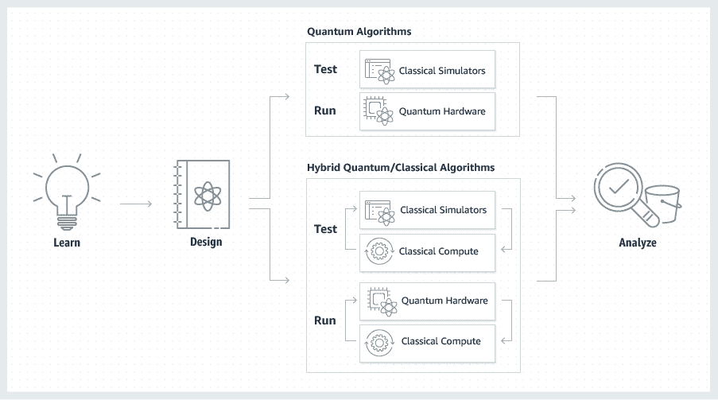
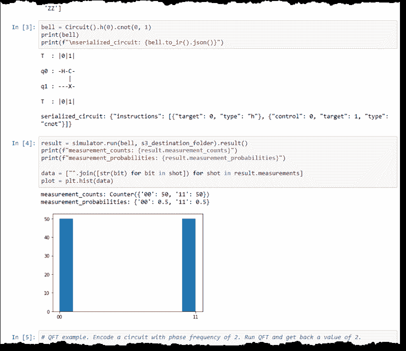

# AWS 推出量子计算即服务

> 原文：<https://thenewstack.io/amazon-web-services-launches-quantum-computing-as-a-service/>

在许多人认为最终将成为一个巨大产业的早期开始，亚马逊网络服务公司推出了一项完全托管的量子计算服务，名为 [Braket](https://aws.amazon.com/braket/) 。

这项服务将成为许多不同量子计算硬件供应商的市场，最初是三家。它以[brake](https://quantumcomputing.stackexchange.com/questions/91/how-does-bra-ket-notation-work)符号命名，通常用来表示量子力学状态。

用户可以编写自己的算法，或者从 AWS 提供的选项中选择。在实际运行之前，您可以使用模拟服务对算法进行测试、验证和故障排除。

三个量子计算机中的每一个都通过低延迟连接连接到 AWS，具有不同的基于量子力学的架构:

*   [D-Wave Systems](https://www.dwavesys.com/) ，提供量子退火超导体计算机。
*   IonQ ，提供离子阱电脑。
*   [Rigetti](https://www.rigetti.com/) ，基于门的超导计算机。

AWS 证明了可以支持所有三种架构的单一开发人员环境。用户在一组管理的 Jupyter 笔记本中定义他们的算法。作业的输出被交付给 AWS S3 实例。用户只为量子计算时间付费，所有的支持软件和服务都由 AWS 管理。

该公司还采取了许多其他举措来帮助用户更好地了解这项具有潜在革命性的技术。AWS 还在加州理工学院附近建立了一个研究中心，以帮助开发量子计算硬件和软件。它还建立了一个连接 AWS 客户和量子计算专家的项目，名为[亚马逊量子解决方案实验室](https://aws.amazon.com/quantum-solutions-lab/)。

## 漫长的时光

与现在的二进制计算相比，量子计算的演变已经发展了很长时间，并面临着许多年的障碍。

物理学家理查德·费曼在 20 世纪 80 年代早期想出了“量子计算”的想法，作为模拟复杂科学问题的一种方式，特别是围绕量子力学的问题(费曼自己发现有必要通过图表来思考问题)。将量子态映射回二进制“数字”态会消耗太多资源。为什么不把量子物理学中的一个问题映射到一个以量子特性为基础的系统中呢？

量子特性可以以量子比特的形式被捕获。它们通常由一个电子或磷原子的原子核锻造而成，可能由一个约瑟夫森结转换。就其本质而言，量子位能够同时保持两种不同的状态，每种状态的程度不同，并以概率表示——非常适合量子建模。

今天有许多复杂的计算工作可以在量子水平上执行。一项工作是优化，比如以最有效的方式安排大量的航班或送货。材料模拟是另一个新兴的用例，量子计算机可以精细地描述材料的特性，如相变。机器学习可能是另一个热点，因为量子计算可以从根本上增加正在使用的模型的大小，甚至可以将多个模型相互比较。

令人惊讶的是，AWS 并不是第一家提供量子计算服务的主要云提供商。微软 Azure [还提供](https://azure.microsoft.com/en-us/services/quantum/)访问，仍处于预览模式，以获得许多基于硬件的量子计算服务，包括 IonQ、霍尼韦尔和微软自己的实验机器。

AWS 在本周于拉斯维加斯举行的年度用户大会 [AWS Re:Invent 2019](https://reinvent.awsevents.com/) 之前宣布了这项新服务。

来自 Pixabay 的 Pete Linforth 的特写图片。

<svg xmlns:xlink="http://www.w3.org/1999/xlink" viewBox="0 0 68 31" version="1.1"><title>Group</title> <desc>Created with Sketch.</desc></svg>