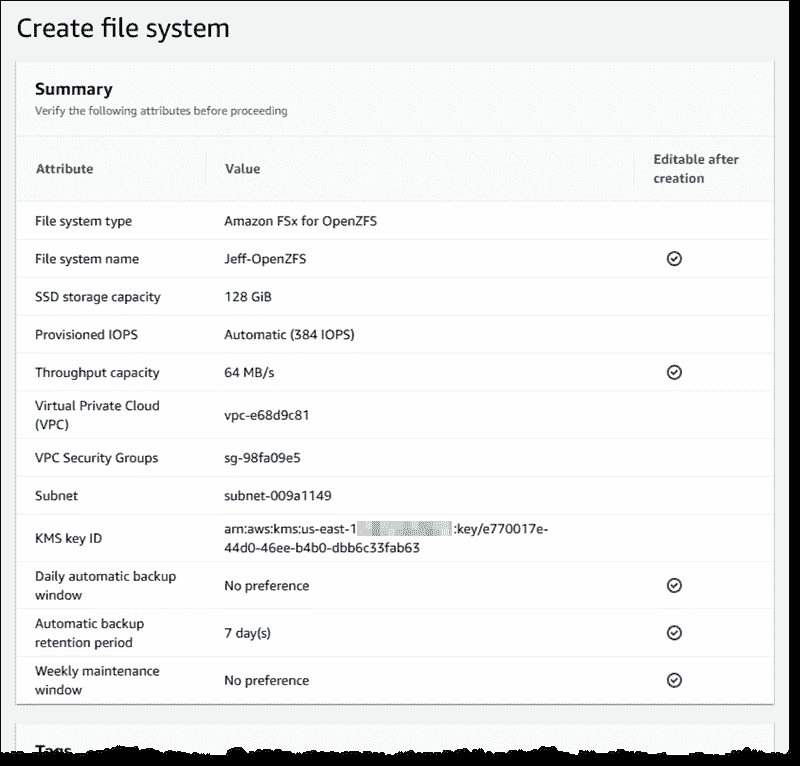
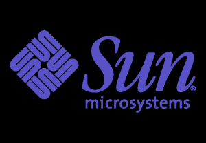

# Amazon Web Services 现在支持 Zettabyte 文件系统

> 原文：<https://thenewstack.io/amazon-web-services-now-supports-the-zettabyte-file-system/>

一个有几十年历史的文件系统，一个有着传奇历史的文件系统，可能会在未来的大容量云计算中发挥关键作用。

云巨头[本周在其年度用户大会 AWS re:Invent 上宣布](https://aws.amazon.com/blogs/aws/new-amazon-fsx-for-openzfs/)，Zettabyte 文件系统(ZFS)已经在[亚马逊网络服务](https://aws.amazon.com/?utm_content=inline-mention)找到了家。

虽然 ZFS 是一项较老的技术，但它有潜力为非常大的延迟敏感型工作负载提供出色的性能。运行在[基于 AWS Graviton ARM 的处理器](https://thenewstack.io/aws-graviton-marks-the-emergence-of-arm-for-cloud-native-workloads/)上，ZFS 可以支持高达每秒 12.5 GB(GB/s)的吞吐量，高达 100 万 IOPS 用于频繁访问的缓存数据，以及 4 GB/s 和高达 160，000 IOPS 直接来自持久存储，所有这些都具有亚秒级延迟。

“这是一个非常棒的文件系统，具有巨大的功能，”AWS 负责存储、边缘和数据治理服务的工程副总裁 Wayne Duso 在接受新堆栈采访时兴奋地说。

这个基于 [OpenZFS、](https://www.openzfs.org/wiki/Main_Page)的 ZFS 实现是通过 [AWS FSx](https://aws.amazon.com/fsx/) 完成的，这是 AWS 创建的一个 AWS 托管文件系统服务，用于在其云环境中采用第三方文件系统。 [FSx for OpenZFS](https://aws.amazon.com/fsx/openzfs/) 可以通过 NFS 协议从 Linux、MacOS 和 Windows 客户端访问卷。

[Sun Microsystems](https://thenewstack.io/sun-microsystems-a-look-back-at-a-tech-company-ahead-of-its-time/) 最初在 21 世纪初设计 ZFS，目的是使它成为第一个具有 128 位地址大小的文件系统。实际上，它可以比 64 位系统多寻址 1.84 × 10 ^(19) 倍[的数据](https://en.wikipedia.org/wiki/ZFS)，有足够的索引空间来管理几乎无限量的数据。

作为一个并行文件系统， [ZFS 可以同时服务于数千个客户端](https://aws.amazon.com/fsx/openzfs/features/)，或者只是向单个客户端发送大量数据。据 AWS 称，它最擅长并行发送大量小文件，因此，它对机器学习、EDA(电子设计自动化)、媒体处理、金融分析和其他用途等工作负载非常有用。

在 AWS 环境中，FSx 为 ZFS 提供的云客户端包括亚马逊弹性计算云(Amazon EC2)实例、亚马逊弹性容器服务(Amazon ECS)和亚马逊弹性 Kubernetes 服务(EKS)集群、亚马逊工作区虚拟桌面以及 AWS 上的 VMware 云。

## 孙遗风

尽管 ZFS 前景光明，但 T4 却经历了一段困难时期。最初是为 Sun 的 OpenSolaris Unix 操作系统设计的，该操作系统在 21 世纪初已经失宠。由于许可的原因，Linus Torvalds 已经[拒绝将其](https://www.realworldtech.com/forum/?threadid=189711&curpostid=189841)移植到 Linux 内核。苹果公司试图将其移植到麦金塔电脑上，但几年后停止了这项工作。

甲骨文在 2010 年收购了 Sun Microsystems，并在此后不久关闭了 OpenSolaris。虽然它继续在 ZFS 上工作，但更新不再是开源的，所以 OpenZFS 项目被创建来继续将文件系统移植到其他平台。

Duso 说，使用 ZFS 作为服务的一个主要优势是最终用户不必担心部署和管理，这在历史上对于如此复杂的文件系统来说并不容易。另一个并行文件系统 [Lustre](https://www.lustre.org/) 也是如此，主要针对高性能计算市场，AWS 也于本周[宣布通过 FSx 支持](https://aws.amazon.com/blogs/aws/enhanced-amazon-s3-integration-for-amazon-fsx-for-lustre/)。AWS 还通过 FSx 为 Windows 文件服务器和 NetApp ONTAP 提供云支持。

Duso 说，FSx 的理念是“将文件系统带给我们的客户，让他们使用现在的文件系统”。“他们围绕这些文件系统构建了自己的工作流”，将数据从一个文件系统移动到另一个文件系统可能会很危险。

“客户说他们喜欢这些功能，但他们不想在 ZFS 上分配员工和时间管理人员，”Duso 说。作为托管服务，ZFS 可以轻松部署。

ZFS 还提供内置的近实时快照功能，允许用户恢复文件的以前版本。FSx 本身也对亚马逊 S3 执行每日文件系统备份。每个 OpenZFS 文件系统可以包含多个卷，每个卷都可以通过单独的属性配额进行管理，如卷存储、每用户存储和每组存储。

AWS 根据存储容量(每 GB 月)、SSD IOPS(每 IOPS 月)和吞吐量容量(每 MBps 月)向用户收取文件系统使用费用。

## 其他存储新闻

ZFS 的消息是本周在拉斯维加斯举行的会议上宣布的一系列存储产品之一。

该公司还为其 Glacier 长期档案存储推出了[新的“即时”层，针对存储对象比常规 Glacier 存储中很少访问的材料访问更频繁，但不足以保证实时存储费用的情况进行了优化。Duso 观察到，这个选项对于一年访问四次左右的资料(如财务数据)来说非常有用。](https://aws.amazon.com/blogs/aws/amazon-s3-glacier-is-the-best-place-to-archive-your-data-introducing-the-s3-glacier-instant-retrieval-storage-class/)

一个新的 EBS 快照归档[已经发布](https://aws.amazon.com/blogs/aws/new-amazon-ebs-snapshots-archive/)，供那些需要将卷快照保留超过其通常保留时间的客户使用。这种方法可以为客户节省高达 75%的将 Amazon EBS 快照保留数月或数年的成本。

Duso 说，所有这些新服务的想法是帮助客户最大限度地利用他们的数据和最具成本效益的价格。能够从数据中获取价值要求用户能够无缝地与数据交互。

“你不必构建工具来移动数据，”Duso 说。“你所要做的就是调用一个 API 来把数据移动到它需要的地方，”他说。

因此，与其认为 ZFS 是一项传统技术，不如说它领先时代十年可能更准确。

<svg xmlns:xlink="http://www.w3.org/1999/xlink" viewBox="0 0 68 31" version="1.1"><title>Group</title> <desc>Created with Sketch.</desc></svg>