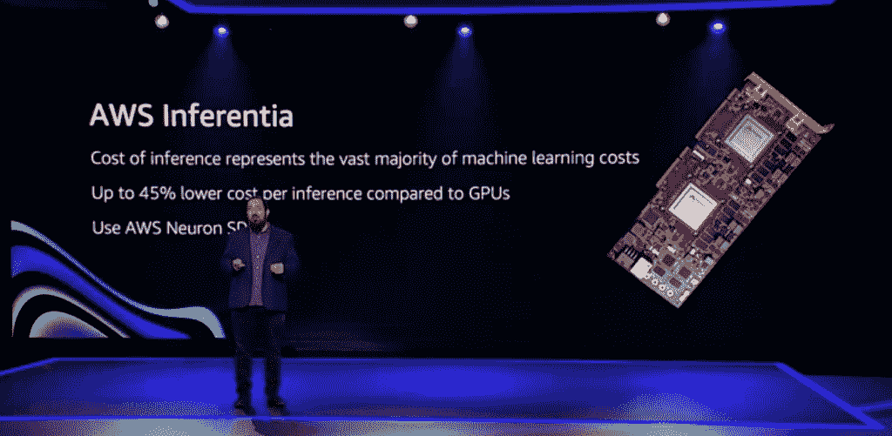

# 亚马逊网络服务将硅战引向云

> 原文：<https://thenewstack.io/amazon-web-services-takes-the-silicon-wars-to-the-cloud/>

亚马逊网络服务(Amazon Web Services)全球基础设施和客户支持高级副总裁 Peter DeSantis 在云巨头 [AWS Re:Invent](https://reinvent.awsevents.com/) 的主题演讲中，年度用户活动断言，与 CPU 巨头 AMD 和英特尔提供的处理器相比，AWS 的处理器和芯片设计在云应用性能方面更胜一筹，同时补充说，AWS 的图形处理器性能优于领先的 GPU 供应商 Nvidia 为机器学习(ML)提供的 GPU。他指的是 AWS Graviton2 处理器，这是亚马逊网络服务使用 64 位 Arm Neoverse 定制的

随着 AWS 以及 Azure 和谷歌云平台(GCP)上可用选项的爆炸式增长尘埃落定，客户可能会越来越多地审查应用程序性能和服务提供的性价比。通过这种方式，底层芯片和服务器基础设施将成为决定云原生应用性能、功耗以及成本的关键因素。

因此，AWS 的旗舰产品 64 位基于 ARM 的 Graviton2 和其他内部设计的处理器将在 AWS 希望让客户提高应用程序性能的过程中发挥重要作用。

“对 AWS 芯片的深度投资真正令人兴奋和变革的是能够跨定制硬件和软件工作，以提供独特的功能，”DeSantis 说。“通过跨整个堆栈工作，我们能够比以往任何时候都更快地实现这些改进。”

## 筹码因素

Graviton2 有望在许多方面进一步提高应用程序的性能。DeSantis 在没有引用英特尔本身的情况下，大胆声明 AWS-design Graviton2 提供了超越传统设计的卓越性能、节能优势和安全性。AWS 还公开表示，graviton 2——支持 Amazon EC2 T4g、M6g、C6g 和 R6g 实例以及基于 NVMe 的本地 SSD 存储的“它们的变体”——与基于 x86 的实例相比——在“各种工作负载”方面提供了高达 40%的性价比

随着基于 Graviton 的亚马逊 EC2 A1 实例的推出，Graviton 最初的目的是让 AWS“与我们的客户和 ISV 合作伙伴合作，了解他们需要什么来在现代 64 位 ARM 处理器上运行他们的工作负载，”DeSantis 说。

DeSantis 解释说，如今用户需要的是将处理器设计与在云环境中运行的高度分布式微服务应用相匹配的能力。如今的开发人员在很大程度上也不再用 C++编写云原生应用程序——德桑蒂斯说他“伴随着 c++长大”——而是用 Go 和 Rust 编写代码，“完全改变了高性能多线程应用程序开发的游戏，”德桑蒂斯说。

“对我来说，最令人兴奋的趋势之一是转向基于服务的架构，从大型整体应用程序转向小型专用独立应用程序。这正是容器和 Lambda 支持的计算类型，”DeSantis 说。“虽然横向扩展计算已经发展到可以利用更高内核的处理器，但[处理器]设计人员从未真正抛弃旧世界。他们试图两者兼得，既满足传统应用程序的需求，又满足现代横向扩展应用程序的需求。”

WS SVP Peter DeSantis 主题演讲:低延迟至关重要，但有时会被低估，尽管它是云应用性能的一个特别关键的指标。[https://t.co/68nBdRGdnP](https://t.co/68nBdRGdnP)[# AWS 发明](https://twitter.com/hashtag/awsreinvent?src=hash&ref_src=twsrc%5Etfw)[# AWS](https://twitter.com/hashtag/aws?src=hash&ref_src=twsrc%5Etfw)[@ the newstack](https://twitter.com/thenewstack?ref_src=twsrc%5Etfw)[pic.twitter.com/pWy1bBl6Eo](https://t.co/pWy1bBl6Eo)

— BC 增益(@ bcamerongain)[2020 年 12 月 10 日](https://twitter.com/bcamerongain/status/1337107860078071808?ref_src=twsrc%5Etfw)

在重申 Graviton2 的设计者“专注于确保每个内核为现代云工作负载提供最真实的性能”的同时，DeSantis 还暗示传统的 CPU 性能基准，如用于衡量 PC 和服务器性能的基准，往往不再适用。“当我说真实世界的性能时，我指的是在实际工作负载上的更好的性能，而不是导致更好的规格表的东西，如处理器频率或性能微基准，它们不能捕捉真实世界的性能，”DeSantis 说。“我们利用我们运行实际横向扩展应用程序的经验来确定我们需要在哪些地方增加功能，以确保最佳性能。”

DeSantis 还表示，Graviton2 的设计旨在通过减少核心数量来节省每个芯片的硅表面，同时降低功耗——核心数量是衡量处理器性能的传统指标，如马力如何用于测量汽车发动机功率。

“我们设计了 Graviton，以适应尽可能多的独立内核——当我说‘独立’时，Graviton 两个内核旨在保持一致的性能，”DeSantis 说。"因此，您不会得到意外的节流—只有一致的性能."

在 Snapchat 的母公司 Snap 的例子中，Graviton2 的设计有助于降低成本和能耗，因为它使用了 [AWS DynamoDB](https://aws.amazon.com/fr/dynamodb/) 和 Snap 的高级工程副总裁 S3、[杰里·亨特](https://theorg.com/org/snap/org-chart/jerry-hunter)。除了依靠 AWS 的 DynamoDB 和 S3 进行存储，以抵消 Snap 否则必须在数据中心基础设施上花费的明显投资，亨特说，他已经看到了 Graviton2 提供的结果，“降低了成本，并在没有太多能源的情况下为我们的客户创造了更好的性能。”

亨特说，他发现 Snap 向 Graviton2 的转移“非常简单”，而 API“与我们以前使用的非常相似”，因此“我们没有花太多时间来迁移代码进行测试，”亨特说。“我们开始与客户一起试用，看它是否有效，我们很喜欢结果。因此，我们将其推广到车队中，并立即实现了 20%的节约，这太棒了，因为我们能够切换负载，并立即实现成本节约和更高的性能。”

## 芯片上的机器学习

虽然他没有透露具体的基准，但 DeSantis 扩展了 AWS-吹捧的相对于 Nvidia 的优越处理器性能，Nvidia 是世界上最大的图形处理器单元(GPU)制造商，用于机器学习。总的来说，与用于支持 ML 的大规模推理基础设施的 GPU 相比，该公司自己的 [AWS 推理](https://aws.amazon.com/machine-learning/inferentia/)提供了“最高的吞吐量，每次推理的成本几乎是一半”，DeSantis 吹嘘道。具体到英伟达，DeSantis 表示，亚马逊 Alexa 最近将其推理工作负载从英伟达基于 GPU 的硬件推理 EC2 实例中移出，并看到成本降低了 30%，延迟改善了 25%。

对于 ML 开发人员，AWS 的 Neuron 团队提供了 TensorFlow、PyTorch 和 Apache MXNet 等框架，用于设计运行在 Inferentia 上的应用程序。DeSantis 说:“开发人员可以利用 Inferentia 的成本节约和性能优势，只需对他们的 ML 代码做很少或不做任何更改，同时保持对其他 ML 处理器的支持。”

没有透露具体细节，DeSantis 说，AWS 的下一个芯片设计将包括明年推出的 AWS Trainium。

“虽然我们对所有客户看到他们的风险感到兴奋，但我们对机器学习芯片的投资才刚刚开始。德桑蒂斯说:“就像 Inferentia 为 inference 所做的那样，Trainium 将提供最低成本和最高性能的方式来运行您的训练工作量。“我期待着向您展示更多关于培训和明年的技术细节。”

对于 ML 开发团队来说，AWS 也在利用机器学习扩展运营，并整合 AWS 的数据库服务，包括 S3 和迪纳摩，以及 [AWS SageMaker](https://aws.amazon.com/fr/sagemaker/) 及其内部和客户的 ML 基础设施。有了正确的芯片基础设施和开发工具，我们的想法是提供一个机器学习平台——撇开性能不谈——可以满足 DevOps 团队的需求，因为他们可以在不改变基础设施和工具集的情况下，从 10 或 100 ML 项目模型扩展到大约 1000 个模型。

“这是一项变革性的技术，如果你现在不开始机器学习，你就无法像使用机器学习的人一样改变你的客户体验。因此，我认为对客户来说，开始机器学习并开始进行概念验证真的很重要，而 AWS 的工具使它变得更容易，”AWS ML 副总裁 [Bratin Saha](https://www.linkedin.com/in/bratin-saha-05824b3/) 告诉新堆栈。“所以，我认为让客户明白机器学习是当下，而不是未来，这一点非常重要。”

亚马逊网络服务公司(AWS)是新堆栈的赞助商。

<svg xmlns:xlink="http://www.w3.org/1999/xlink" viewBox="0 0 68 31" version="1.1"><title>Group</title> <desc>Created with Sketch.</desc></svg>