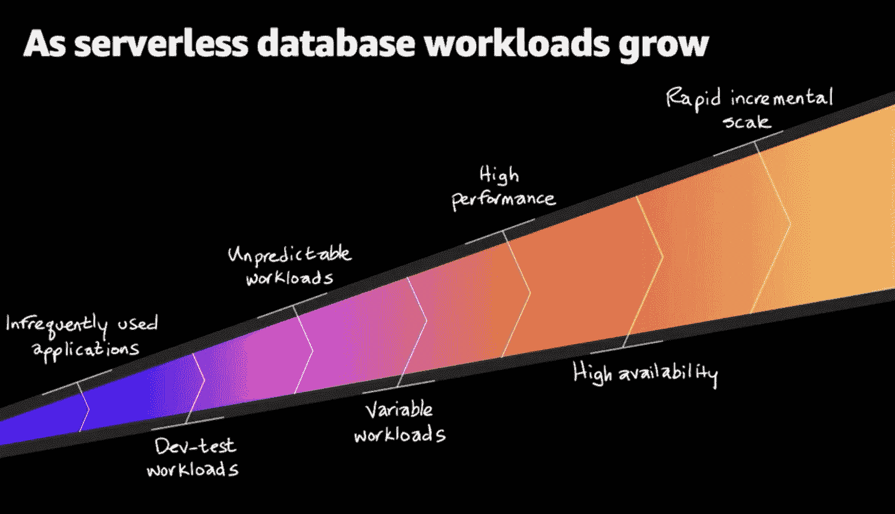

# Amazon Web Services 希望您迁移遗留数据库

> 原文：<https://thenewstack.io/amazon-web-services-wants-you-to-migrate-off-legacy-databases/>

 [理查德·麦克马努斯

理查德是《新书库》的高级编辑，每周撰写一篇关于云原生互联网未来发展的专栏文章。此前，他在 2003 年创立了读写网，并将其打造为全球最具影响力的科技新闻和分析网站之一。](https://twitter.com/ricmac) 

在亚马逊网络服务(AWS)为期三周的虚拟活动 [AWS re:Invent 2020](https://virtual.awsevents.com/) 的第一周，数据库公告纷至沓来。一个共同的主题很快出现了:AWS *真的*想帮助你从微软和甲骨文的遗留数据库系统迁移到它的一系列“专用”云数据库上。AWS 还将无服务器作为一种数据库策略。

将所有这些主题结合在一起的是新版[亚马逊 Aurora 无服务器](https://aws.amazon.com/rds/aurora/serverless/)的发布，这是亚马逊关系数据库产品 Aurora 的按需和自动扩展版本。“Amazon Aurora Serverless v2”是一个相当尴尬的名字，它以支持 Aurora 数据库的即时扩展“到每秒数十万次交易”而闻名它目前处于预览阶段，首先兼容 MySQL 版本也兼容 PostgreSQL，v2 将在 2021 年初添加这一功能)。

v2 的发布是云数据库系统越来越接近传统本地系统功能的最新标志，通过无服务器技术抽象出后端复杂性的额外优势。或者正如 AWS 自己所说的那样，Aurora 无服务器 v2 比 v1 适合“更广泛的应用”。

来源:AWS 数据库副总裁 Shawn Bice 在 re:Invent 2020 上的演讲

v2 的发布也是亚马逊对其所谓的“老牌数据库供应商”的攻击的继续，显然是指微软和甲骨文。当然，亚马逊多年来一直在瞄准这两家公司。但现在不同的是，Aurora 无服务器 v2 似乎有能力支持大型企业客户；当前使用 Microsoft 或 Oracle 的客户类型，最有可能使用传统数据库系统。根据 AWS:

*“例如，Amazon Aurora Serverless [v2]现在可以支持拥有数十万个应用程序并希望管理整个车队的数据库容量的企业，或者支持拥有多租户环境的软件即服务(SaaS)供应商，该环境拥有数百或数千个数据库，每个数据库支持不同的客户。”*

如果这是真的(魔鬼将在细节中，所以现在它只是一个说法)，v2 在功能上比 v1 有了显著的进步。AWS 只推荐 v1 用于“不常用的应用程序”和“开发和测试数据库”如上所述，v2 显然已经准备好支持大规模生产工作负载。

## 让我们帮助您摆脱 Microsoft SQL Server…

在今年的 re:Invent 大会上，我们还清楚地看到，AWS 并不满足于仅仅构建基于云的现代数据库系统。它还积极争取传统厂商的企业客户，特别是微软。

re:Invent 的另一个重大宣布是为 Aurora PostgreSQL 开发的 [Babelfish，这是一个开源翻译层，它使从微软 SQL Server 迁移到 AWS 数据库产品变得容易，而且成本低得多。正如 AWS 的首席工程师贾安娜·多安在 Twitter 上说的那样:“当我在做数据库的时候，想要摆脱 SQL Server 的大客户别无选择，只能投资数百万美元来重写他们的应用程序。”](https://babelfish-for-postgresql.github.io/babelfish-for-postgresql/)

AWS 首席执行官 Andy Jassy 在他的主题演讲中直言不讳地提出了迁移出微软的理由:“停止为你不需要的 SQL Server 许可证付费。”

请注意，Babelfish 在技术上不是一项迁移服务，尽管它肯定会推动客户将他们的数据从 SQL Server 转移到一个等效的 AWS 云数据库上。这是一个直接的翻译服务。[正如](https://aws.amazon.com/blogs/opensource/want-more-postgresql-you-just-might-like-babelfish/) AWS 开源战略和营销负责人 [Matt Asay](https://www.linkedin.com/in/mjasay/) 所解释的，“Babelfish 使 PostgreSQL 能够理解来自为 Microsoft SQL Server 编写的应用程序的数据库请求，包括命令和协议，而无需更改库、数据库模式或 SQL 语句。”

AWS 上的一篇简短的公告文章[说得更简单:“有了 Babelfish，目前运行在 SQL Server 上的应用程序现在可以直接运行在 Aurora PostgreSQL 上，几乎不需要修改代码。”](https://aws.amazon.com/about-aws/whats-new/2020/12/babelfish-amazon-aurora-postgresql-available-preview/)

## 客户:先在 GitHub 上看看吧……

然而，随着 Aurora 无服务器 v2 的发布，证据将在布丁中。

罗伯特·科赫是美国能源和商品交易公司标准普尔全球普氏能源资讯的首席建筑师。在日常工作中，他管理微软 SQL Server 和亚马逊数据库产品(他是 AWS 数据库英雄)。当我问及他对 Babelfish 的看法时，他说“在我们看到它投入使用之前”,肯定会有人对它表示怀疑。但他希望这至少能减轻从本地迁移到云的痛苦。

“在提升和转移、重新架构和/或重建之间，”Koch 解释说，“迁移到云本身就是一个挑战，Babelfish 可能会在这方面提供很大的帮助。如果迫切需要让我们的数据更具弹性，我们可以将我们的 SQL Server 实例复制到 Aurora PostgreSQL，这样就不会错过任何一个机会。”

科赫将密切关注 GitHub 即将发布的开源版本，然后再决定它是否可以投入生产。

“我期待看到 Babelfish 代码登陆 GitHub，见证‘奇迹’的发生，”他说。“到那时，我相信开发商会放心得多。”

(顺便说一句，GitHub 是微软所有的——我打赌 AWS 喜欢这种讽刺！)

关于翻译的彻底程度也有一些公开的问题。在他的文章中，Asay 承认微软 SQL Server 在过去几年中“已经发展到可以满足各种各样的用例”。他指出，Babelfish 无法立即处理所有这些用例，“但将能够处理最常见的应用场景。”

这当然也是 AWS 开源 Babelfish 技术的原因，这样全世界的开发者都能够添加功能，最终覆盖其他用例。但就目前而言，人们怀疑寻求从微软迁移的客户会遇到初期问题。这些 SQL Server 许可证可能还需要一段时间。

## 一系列云数据库

在另一场 re:Invent 会议中，[用 AWS 数据库构建未来](https://virtual.awsevents.com/media/t/1_7agzctza/186983843)，数据库副总裁 [Shawn Bice](https://www.linkedin.com/in/shawn-bice-9205423/) (见专题图片)，将公司所有的数据库公告捆绑成一个总体战略。可以总结为:无论您的数据库需要什么，我们都有适合您的云数据库！

Bice 还强调了无服务器在其数据库战略中日益增长的重要性。他说，随着无服务器数据库工作负载的增长，像 Aurora 无服务器 v2 这样的产品具有随之增长所需的“快速增量规模”。

总的来说，尽管我们还不知道 Aurora Serverless v2 和 Babelfish for PostgreSQL 等新产品将如何为客户服务(尤其是那些拥有大型复杂应用程序的客户)，但 re:Invent 中概述的 AWS 云数据库战略是强大且具有前瞻性的。随着 AWS 继续向无服务器倾斜，随着客户获得更多工具来帮助他们脱离传统数据库系统，云对企业来说变得越来越友好。他们中的许多人无疑将加入 AWS 数据库“大家庭”

亚马逊网络服务是新堆栈的赞助商。

<svg xmlns:xlink="http://www.w3.org/1999/xlink" viewBox="0 0 68 31" version="1.1"><title>Group</title> <desc>Created with Sketch.</desc></svg>