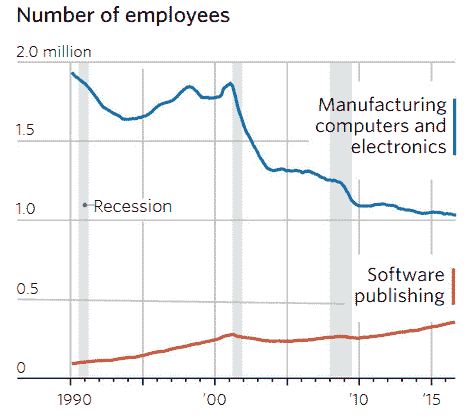

# 假期刺激了亚马逊和沃尔玛之间的仓库机器人战争

> 原文：<https://thenewstack.io/amazons-amazing-army-robots/>

接下来的两个月可能会见证人类历史上最大的网上购物狂欢——亚马逊已经准备好了。它一直在建造机器人仓库，为今年的假日购物季做准备，上周 CNN 的科技记者 Matt McFarland [决定看看这一进展。](http://money.cnn.com/2016/10/06/technology/amazon-warehouse-robots/)

在参观巴尔的摩的一个仓库——前通用汽车工厂——时，麦克法兰报告说，亚马逊的每个“履行中心”都储存着高达 1500 万件商品。亚马逊已经自动化了将它们打包的过程。机器人比人类员工需要更少的操作空间，这意味着亚马逊可以在每个仓库中多装 50%的库存。这也让仓库员工的生活更加轻松。现在，货架不再走向货架，而是向*他们*走来——由小型机动机器人运送，它们像 Roomba 真空吸尘器一样在地板上快速移动，同时携带适当的产品货架。

对于科技记者来说，这一切都代表着一种罕见的新奇:一个几乎完全没有人类的有趣故事。(CNN 在 2014 年拍摄了一个类似的报道，标题是“[见亚马逊的新机器人军队](http://money.cnn.com/video/technology/2014/12/01/amazon-robots.cnnmoney/index.html)”)但是为了理解我们是如何及时到达这一刻的，你实际上需要看看这些机器人的历史。

## 机器人战争

亚马逊机器人是由一家最初名为 Kiva 的公司制造的，Kiva 是一个霍皮语单词，意思是“蚁族的聚会场所”。该公司的创始人 Mick Mountz 曾是 WebVan 的 web processes 团队的成员，web van 是一家失败的 90 年代初创公司，曾承诺快速送货上门。据《福布斯》报道，他认为问题在于履行每份订单的高成本，并与两位工程和机器人专家合作，创造了一种简化流程的方法。这是一个完美的时机，因为机器人技术的成本一直在稳步下降。“在我开始从事这项工作的五年前，Kiva 是不可能出现的。”

[https://www.youtube.com/embed/6KRjuuEVEZs?feature=oembed](https://www.youtube.com/embed/6KRjuuEVEZs?feature=oembed)

视频

2005 年，斯台普斯让他在达拉斯的一个设施中使用 15 个机器人进行了一次试飞员项目，10 周后他们被说服了。不到一年，Staples 在宾夕法尼亚州测试了另外 30 台机器人，发现它们使工人的生产率提高了一倍。到 2007 年底，他们在仓库里使用了 500 个机器人。它变成了一个交钥匙解决方案——一天之内，50 个机器人就可以安装好，支持五个包装站，成本不到 300 万美元。

最终，他们还与其他大型零售商达成协议，如沃尔格林和 Gap，以及 Office Depot 和 Toys“R”Us。但 Kiva 在 2012 年被亚马逊以 7.75 亿美元收购后，开始专门为亚马逊服务——现在它将自己重新命名为“亚马逊机器人”。

*供应链文摘*中的一篇[文章](http://www.scdigest.com/ontarget/14-03-31-1.php?cid=7944)暗示亚马逊曾担心它可能需要与其他提供快速机器人增强递送系统的零售商竞争——尽管这次收购现在反而将竞争对手*排除在使用 Kiva 机器人的*之外。但亚马逊的一名高级经理表示，他们只是利用了 Kiva 的每一点能力，开始积极推动在美国各地建立更多配送中心

今天，这似乎引发了一场机器人战争。路透社[报道称，“在与亚马逊的竞争中，沃尔玛在机器人和仓库上加倍努力”。到今年年底，沃尔玛为其在线业务提供服务的仓库将会增加一倍——从 5 个增加到 10 个——这样他们就可以快速向全国更多地区发货。但它也在自动分拣和改进跟踪的过程中。今年，他们在电子商务和其他数字计划上投资了 11 亿美元，尽管这只占他们销售额的 3%，但在过去五年中，他们已经收购了 15 家电子商务初创公司。](http://www.nbcnews.com/tech/tech-news/fight-against-amazon-wal-mart-doubles-down-robots-warehouses-n660731)

当然，根据路透社从 Channel Advisor 收集的数据，亚马逊有 40 个仓库，超过 100 万平方英尺，并计划在未来六个月内再开设五个新仓库。亚马逊每年处理价值 1070 亿美元的在线销售，而沃尔玛仅处理 137 亿美元。所以亚马逊绝对领先一步。

根据《华尔街日报》本周的一篇文章，亚马逊现在使用大约 45，000 个小型机器人，分布在美国大约三分之一的仓库中。但是也有人工——仅在巴尔的摩的仓库就有超过 3000 人在工作。据 CNN 报道，“亚马逊在 2015 年雇佣了 76，700 名新员工，在 2016 年上半年雇佣了 38，100 名新员工，因为它在全国各地建立了分销网络。

每个亚马逊机器人不到一英尺高[，但可以举起 1000 磅](http://www.forbes.com/forbes/2009/0316/040_bot_time_saves_nine.html)“机器人知道去亚马逊员工的最快路径，”麦克法兰解释道。在 2012 年描述这项技术时，麻省理工学院的技术评论[观察到](https://www.technologyreview.com/s/428436/in-warehouses-kivas-robots-do-the-heavy-lifting/)“从上面看，场景[看起来有点像机器人高峰时间](https://www.technologyreview.com/s/428436/in-warehouses-kivas-robots-do-the-heavy-lifting/)几十个货架在仓库地板上快速移动。”由于员工不在仓库里走动，这让他们有更多的时间专注于从货架上拿东西。在描述该系统的早期版本时，2009 年，福布斯[报道](http://www.forbes.com/forbes/2009/0316/040_bot_time_saves_nine.html)“当一个机器人侧身靠近人类拣货员时，头顶上的激光会在吊舱上的物品上画一个点，人类应该拣货。

“相邻的电脑屏幕闪烁着包装商为完成订单需要放入箱子的数量……”

亚马逊的拣货员会扫描你的商品，然后把它放进一个黄色的箱子里，在那里它会被带走，让其他人打包。他们只做这些。“很快，一个等待轮到的新书架停在了挑选站，就像快餐店里排队的汽车一样，”麦克法兰写道。

那些黄色的箱子也进行了一次相当激动人心的旅程，沿着 8 英里长的传送带开始你的购买之旅。第一站是自动化辅助的包装站。计算机计算出最适合使用的盒子，甚至每条包装带应该有多长。“包装商唯一要做的决定就是要包括多少泡沫包装，”CNN 解释道。"每个包裹与人接触不到一分钟."

麦克法兰写道:“当你从门廊下拿起亚马逊快递，走进你的家，找到一把剪刀，打开棕色盒子时，你已经花了几乎和亚马逊员工一样多的时间来处理包裹。”

甚至连运输标签都是由机器人贴上去的，通常贴在甚至不会停下来的箱子上。当包裹沿着传送带走完最后一英里时，它们会被红色激光扫描，以确定它们应该滑下哪个运输滑道。最后一次有人碰你的包裹是当它从滑槽被提升到运输卡车上的时候。

当然，还有一个专有的软件系统为机器人提供动力，让一切继续进行。福布斯解释说:“该软件不断分析收到的订单，跟踪哪些商品最受欢迎。”“随着时间的推移，软件会指示机器人将最受欢迎的商品移到货架区的前面，将最少订购的商品移到后面。”

当然，这提出了一个不可避免的问题，即机器人是否正在夺走人类的工作。《华尔街日报》周三援引麻省理工学院经济学家埃里克·布林约尔松(Erik Brynjolfsson)的话说，亚马逊的机器人“[还不够灵巧，无法识别不同大小的包裹](http://www.wsj.com/articles/americas-dazzling-tech-boom-has-a-downside-not-enough-jobs-1476282355)，挑选正确的包裹并将其安全地放入盒子中——尽管机器人研究人员正在努力。自 2000 年以来，科技行业的总就业人数一直在稳步下降。展望未来，分析师预测价值 1.2 万亿美元的人类活动[将在未来九年内自动消失](http://www.wsj.com/articles/robots-how-will-they-be-employed-in-the-future-1404390617)。

事实上，一家硅谷公司已经制造了一台机器人守夜人——并且已经在加州山景城的微软园区投入使用。“机器人不会抱怨，”该公司的一位联合创始人说。“没有退休金。而且没有工伤补偿。”

* * *

# WebReduce

特色图片[通过](https://www.youtube.com/watch?v=Vdmtya8emMw)亚马逊。

<svg xmlns:xlink="http://www.w3.org/1999/xlink" viewBox="0 0 68 31" version="1.1"><title>Group</title> <desc>Created with Sketch.</desc></svg>