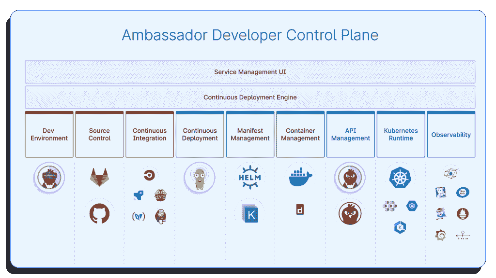

# Ambassador Labs 利用开发人员控制平台应对工具泛滥

> 原文：<https://thenewstack.io/ambassador-labs-combats-tool-sprawl-with-developer-control-plane/>

大使实验室(Ambassador Labs)是负责[使者入口](https://github.com/emissary-ingress/community)和[网真](https://www.telepresence.io/) [云本地计算基金会](https://cncf.io/?utm_content=inline-mention) (CNCF)项目的公司，最近推出了其[大使开发者控制平面(DCP)](https://www.getambassador.io/developer-control-plane/) ，以努力打击首席执行官 [Richard Li](https://www.linkedin.com/in/richardli) 所说的困扰开发者的工具蔓延。

“在 Kubernetes 上开发软件的开发人员，不仅被要求编写代码，还被要求发布和运行这些代码，”李说。“基本上，前提是开发者应该实际拥有这些服务的整个生命周期。这些开发人员被要求管理比以前多得多的工具。以前，您只需要管理编码工具，但现在您必须管理运送软件和运行软件的工具。”

[https://www.youtube.com/embed/HDhWE7g5qG0?feature=oembed](https://www.youtube.com/embed/HDhWE7g5qG0?feature=oembed)

视频

李说，大使实验室本身负责其中一些工具，并看到一些公司一次又一次地试图将它们整合在一起，以使他们的开发人员更容易，然后意识到“我们比任何人都有专业知识来做得更好，因为我们实际上在使用和维护工具。”

利用这一专业知识，Ambassador Labs 创建了 Ambassador DCP，它汇集了开源的 CNCF 项目 Envoy、使者入口、Argo 和网真，以及基于 Envoy 和使者入口构建的专有 Edge 堆栈，为开发人员提供了一个编码、运输和运行其软件的单一位置。虽然 Ambassador DCP 是使用这些工具构建的，但它还结合了许多其他工具，如源代码管理、持续集成、清单和容器管理、Kubernetes 运行时和可观察性工具。

Ambassador DCP 首先通过集成 Telepresence 来帮助开发人员，这使他们可以在本地运行单个服务，同时将该服务连接到远程 Kubernetes 集群。在实践中，这意味着开发人员可以使用他们选择的 IDE，并且可以调试代码，就像代码在他们的机器上本地运行一样——当代码在 Kubernetes 集群上运行时，他们不能这样做。接下来，Argo 帮助开发人员运送代码并执行类似金丝雀部署的事情，李解释说这也需要使者入口和边缘堆栈的帮助。然后，Edge Stack 允许开发人员观察和优化他们服务的流量，其中有许多可观察性解决方案可用。李解释说，所有这些都是通过 GitOps 方法完成的，其中对代码库进行的更改充当了唯一的真实来源。

“从流程编排的角度来看，就在集群中进行更改而言，我们所做的实际上是采用完整的 GitOps 工作流。当您想要更改配置时，您可以使用开发人员控制平面中的用户界面进行更改，但在幕后，开发人员控制平面实际上是在您的源代码控制库中进行拉式请求或更改，”李说。“我们实际上是在与您现有的基于 GitOps 的工作流程集成，我们实际上并不是在接管和成为另一种真相来源或重心。我们只是从根本上简化您管理一切的方式。因此，您实际上可以停止使用控制平面，可以继续手工编写拉取请求，除了工作量增加之外，不会有任何实质性影响。”

至于项目的命名，李说，像、谷歌、Spotify 和 Yelp 这样的公司已经使用内部开发人员控制平面有一段时间了，这些控制平面有各种不同的名称。然而，DCP 大使的名字借用了“控制平面”的云原生趋势，它本身的术语来自网络，李说这是一种寻找中间立场的尝试。

“不是基础设施软件，不是平台即服务，这大概是最接近的比较。它实际上是您的基础架构和平台即服务之间的中间地带，”李解释道。“我们在 Ambassador 中所做的是引入一个交钥匙开发人员控制平台。这并不意味着它是市场上唯一的开发者控制平面。有很多人用 CNCF 工具构建了自己的工具，我们对此非常满意。我们并没有试图从零开始创造这个全新的东西。随着越来越多的开发人员开始在云中使用 Kubernetes，控制平面的概念开始崭露头角。”

目前，DCP Ambassador 在的云上运行 Kubernetes，但李预计今年晚些时候会发布一个内部版本。对于那些考虑 DCP 大使的人，李建议刚刚开始云原生开发的公司实际上推迟，直到他们弄清楚他们真正需要什么工具以及他们需要在哪里集成它们。

Ambassador DCP 可以免费开始使用，然后根据运行的服务数量和所涉及架构的总体规模按年订阅。展望未来，李说，他们“已经收到大量整合堆栈其他部分的请求”，Kubernetes 的 [Flux](https://fluxcd.io/) 是一套连续和渐进的交付解决方案，处于领先地位。

<svg xmlns:xlink="http://www.w3.org/1999/xlink" viewBox="0 0 68 31" version="1.1"><title>Group</title> <desc>Created with Sketch.</desc></svg>