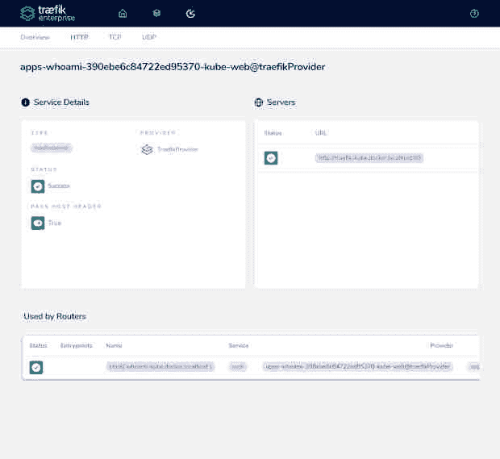

# 通过 Traefik 的动态反向代理，AmeriSave 将其微服务转移到了云端

> 原文：<https://thenewstack.io/amerisave-moved-its-microservices-to-the-cloud-with-traefiks-dynamic-reverse-proxy/>

当 AmeriSave Mortgage Corporation 决定转向微服务时，这家金融服务公司正在迈出第一步，对过去十年建立的传统技术进行现代化改造。整个项目(从本地迁移到原生云)将需要更长时间。

早在 2002 年，当公司创始人兼首席执行官 [Patrick Markert](https://www.linkedin.com/in/patrick-markert-017aaba/) 创办 AmeriSave 时，网上只有确定费率的通用指南。该公司首席软件工程师[沙克埃尔·奥斯马尼](https://shakeelosmani.wordpress.com/)说:“那时，金融是非常老派的，有许多纸张和面对面的访问。

但是 Markert 有技术背景，AmeriSave 成为在线提供定制费率的先驱。“技术是我们业务的驱动力，这种 DNA 一直伴随着我们，”Osmani 说。

从那时起，AmeriSave 已经自动创建和处理贷款申请，从而降低了整体运营成本。该公司在 49 个州拥有 6 个主要贷款中心和 5，000 多名员工，持续快速的增长需要高效、灵活的技术体系。

## **云步骤**

由于内部部署了许多容器化环境，公司管理层最初不想迁移到[云原生架构](https://thenewstack.io/category/cloud-native/)。AmeriSave 企业架构高级副总裁 Maciej Miechowicz 表示:“金融行业是对采用云犹豫不决的垂直行业之一，因为与之相关的‘公共’一词引发了安全担忧。

他团队中的大多数工程师都来自已经采用了[微服务](https://thenewstack.io/ebooks/microservices/cloud-native-microservices-2018/)的公司，所以这就是他们开始的地方。首先，他们将传统应用移植到部署在 Docker Swarm 环境中的微服务中，同时继续使用传统反向代理解决方案 NGINX 进行路由。

Miechowicz 说:“然后我们开始看到更加分布式的 Docker 平台的一些局限性，主要是网络运行的方式，以及由于内部网络流量增加而在该环境中出现的一些瓶颈。

该团队希望迁移到企业级云环境，以获得更大的灵活性和可靠性，因此下一步是将微服务迁移到微软的 [Azure Cloud](https://azure.microsoft.com/) 平台。Azure 的 [Red Hat OpenShift](https://www.openshift.com/try?utm_content=inline-mention) ，已经在 Azure 云环境中可用，提供了高性能和可预测的成本。

AmeriSave 的数百个微服务之间的相互依赖要求能够在 Docker Swarm 和 OpenShift 环境之间轻松快速地切换流量，因此该团队希望在本地和云中使用相同的 URL。如果没有这种能力，在迁移其依赖的微服务时，将需要大量停机时间来更新每个微服务的配置。对于超过 100 项服务，该迁移任务会导致严重的业务中断。

首先，团队试用了 [Azure 流量管理器](https://azure.microsoft.com/en-us/services/traffic-manager/)，一个 Azure 本地的、基于 DNS 的流量负载均衡器。Miechowicz 说，但是因为它不是自动化的，所以通过 Azure 本地管理所有这些配置将需要每个服务 300 到 500 行代码的巨大开销。

其中一名首席工程师在他之前的公司使用过动态反向代理 Traefik，并且很喜欢它，因此该团队开始与 Traefik Labs 讨论其用于云原生网络的企业级 Traefik Enterprise。

## **简化的云和微服务采用**

[Traefik 成立](https://thenewstack.io/traefik-a-dynamic-reverse-proxy-for-kubernetes-and-microservices/)是为了给微服务提供一个反向代理，可以动态地自动重新配置自己，而无需离线。

Traefik Labs 创始人兼首席执行官 Emile Vauge 表示，开源的 Traefik Proxy 处理公司基础设施中所有的微服务应用程序网络。这包括所有传入流量管理:路由、负载平衡和安全性。

Traefik Enterprise 就是建立在这个基础上的。“它的附加功能包括高可用性和可扩展性，高级安全性，以及将流量路由到应用程序的高级选项，”他说。它还集成了 API 网关功能，并连接到传统环境

Vauge 在开发一个基于中间层的微服务平台时，开始了 Traefik 的开源项目工作。“我想在上面自动化 2000 个微服务，”他说。“但当时微服务并不多，尤其是边缘路由。”

他在 2016 年创建了 Traefik Labs，该软件现在是 GitHub 上下载量最高的 10 个软件包之一:它已经被下载了超过 30 亿次。

“整个云原生运动是由开源推动的，我们认为一切都应该基于开源，”他说。“我们以简单为原则构建一切:我们希望简化所有企业对云和微服务的采用。我们希望自动化网络堆栈的所有复杂性。”

## **多层布线消除了停机时间**

通过合作，Traefik 的团队和 Miechowicz 的团队集思广益，提出了在本地 Docker Swarm 和基于云的 OpenShift 之间对同一 URL 进行动态路径路由的想法。这意味着在迁移依赖微服务时，不需要更新服务。

在 Traefik Enterprise 中，通过将路由从 OpenShift 重定向回本地 Docker Swarm、纠正问题并重定向回 OpenShift，可以快速修复任何与迁移相关的问题。此外，没有必要更新任何其他服务的配置。

Traefik Enterprise 的多层路由工作方式使这成为可能。“Traffic Enterprise 的第 1 层动态收集第 2 层中配置的基于路径和基于主机的路由，”Miechowicz 说。“在我们的案例中，我们有两个第 2 层来源:本地 Docker Swarm 和基于云的 OpenShift。然后，第 1 层将流量定向到与主机/路径标准相匹配的源，并且定义了更高的优先级。从 OpenShift 到 Docker Swarm 的回滚只包括降低 OpenShift 路由的优先级。我们做了一个概念验证，它运行得完美而快速。”

这与 NGINX 的工作方式形成对比。“你可以配置它路由到一百个服务，但如果一个服务没有出现，NGINX 将无法启动，并导致所有服务的路由中断，”Osmani 说。但是 Traefik Enterprise 将检测到一个服务失败并停止路由到它，而其他服务继续正常工作。然后，一旦受影响的服务恢复运行，Traefik Enterprise 会自动重新建立路由。

Osmani 说，NGINX 也没有 Traefik 的其他功能，如在同一个 URL 上路由，它只适合少量的服务。Azure Traffic Manager 和 Traefik 都必须进行维护和管理，但使用 Traefik 要容易得多。

## **不再有服务中断**

奥斯马尼说，采用 [Traefik Enterprise](https://traefik.io/traefik-enterprise/) 是团队在过去一年中做出的最佳决定之一，因为它消除了许多痛点。

“当我们在现场时，我们负责管理一切——我们经常半夜起来修理有人弄坏的东西，”他说。"但是有了 Traefik，你只能在那个时候关闭你正在影响的服务."

奥斯马尼说:“从商业角度来看，最重要的是迁移。“因为我们是一个活生生的呼吸系统，客户会直接受到影响。在在线抵押贷款业务中，如果一项服务中断，人们会直接转到下一个抵押贷款公司的网站。现在我们不会遇到服务中断。除此之外，我们别无选择。”

Miechowicz 说:“对于我们组织中的开发人员来说，结果就像魔术一样。“我们只是在服务中添加了一些标签和 Traefik 企业路线。随着我们的开发人员将服务转移到云中，他们中没有人见过像这样简化和自动化的解决方案。”

<svg xmlns:xlink="http://www.w3.org/1999/xlink" viewBox="0 0 68 31" version="1.1"><title>Group</title> <desc>Created with Sketch.</desc></svg>