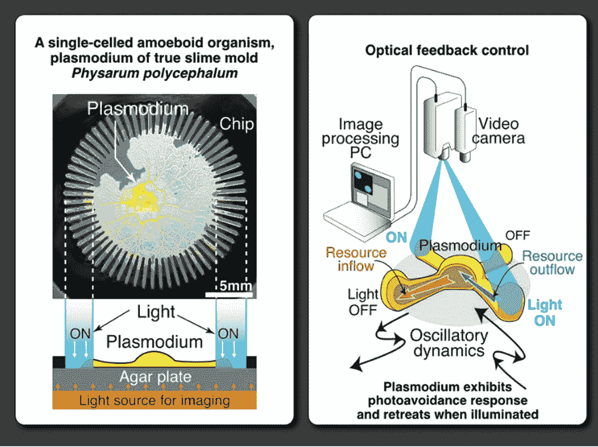
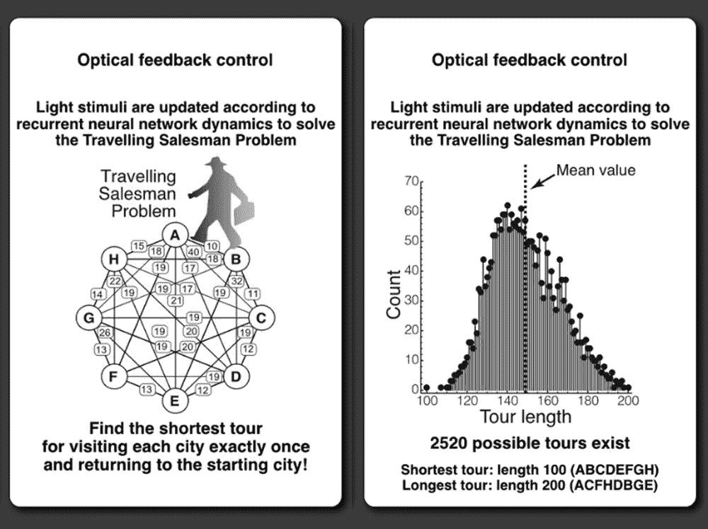
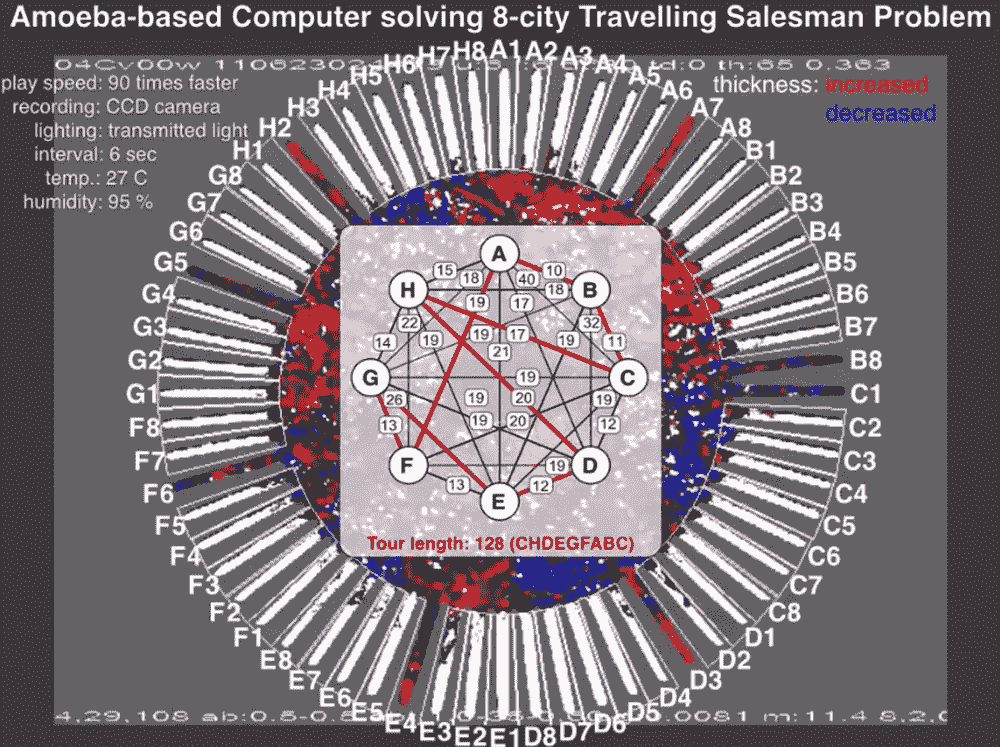
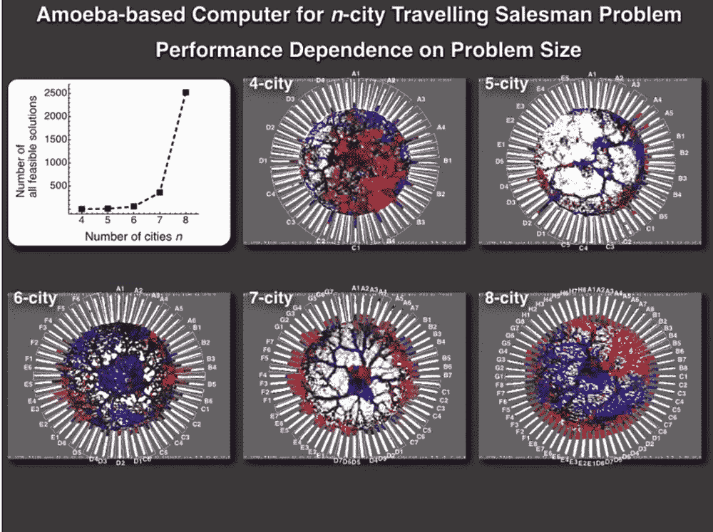

# 基于变形虫的计算机解决旅行推销员难题

> 原文：<https://thenewstack.io/amoeba-based-computer-solves-traveling-salesman-puzzle/>

大多数人可能不会高度重视变形虫:这些简单的生物通常由一个单细胞组成，它们最出名的是其特有的缓慢运动，这是由它们无定形地伸出细胞质产生的——这种现象也被称为伪足(“假脚”)。

但是根据日本东京庆应义塾大学的研究人员所做的一项研究，这些不起眼的生物能够为一个众所周知的数学难题产生解决方案，该难题被称为“[旅行推销员问题](https://en.wikipedia.org/wiki/Travelling_salesman_problem)”(TSP)，因此，有一天可能有助于形成节能的[生物计算机](https://thenewstack.io/mit-explores-analog-computing-cell-inspired-circuits/)的基础，该计算机使用生物成分，如 DNA 或蛋白质，进行计算过程。

[https://www.youtube.com/embed/8GCJq-HQbyk?feature=oembed](https://www.youtube.com/embed/8GCJq-HQbyk?feature=oembed)

视频

## 阿米巴优化

旅行推销员问题是评估[优化](https://thenewstack.io/optimization-the-secret-weapon-of-ai-modeling-at-scale/)算法的著名测试。它问了这个看似简单的问题:“给定一个城市列表和每对城市之间的距离，旅行推销员在返回出发城市之前可以使用的最短路线是什么？”

只有四个城市，解决方案只有三条可能的路线。但是随着城市数量的增加，可能的答案的数量呈指数增长:对于六个城市，这将是 360 条路线；对于八个城市来说，这个数字会膨胀到 2520。TSP 被归类为 NP-hard 问题([非确定性多项式时间](https://en.wikipedia.org/wiki/NP_(complexity) "NP (complexity)")困难)，这意味着随着城市数量的增长，传统计算机解决它所需的时间也呈指数增长，因为它的复杂性增加了。

这项工作发表在最近一期的《皇家学会开放科学》杂志上，描述了研究人员如何能够通过将 12 毫克的变形虫样本放在星状芯片上，获得一种*多头绒泡菌*变形虫或“真正的黏菌”来解决这个复杂的问题，星状芯片是一个圆形板，有 64 个狭窄的通道从中心向外辐射。变形虫可以移动，但被限制在通道的边界上，每个通道都代表推销员旅途中的一个城市。此外，每个通道都可以单独点亮，以影响变形虫的移动方式。

变形虫和它的芯片然后被放在营养丰富的琼脂平板上。有机体将自然地扩张并投射自身的部分，以朝向积极的刺激(例如食物)，或远离消极的刺激(在这种情况下，光)，以便最大化营养吸收。因此，该实验利用了变形虫的自然变形能力，并将其转化为“基于变形虫的计算系统”，在该系统中，它“试图变形为最佳形状，最大限度地增加身体面积，以最大限度地吸收营养，同时最大限度地降低暴露于讨厌的光刺激的风险。”

此外，研究人员使用神经网络模型每六秒钟照亮特定的芯片通道。该模型解析关于每对“城市”之间的距离和变形虫位置的数据，以确定哪些通道需要被照亮。例如，如果变形虫的一部分已经在频道“B3”中，神经网络将照亮其他“B”频道，以及任何其他编号为“3”的频道将被照亮，以防止变形虫不止一次地访问相同的城市。

## 线性时间内的解

虽然这种基于变形虫的计算系统的想法起初可能看起来可疑，但值得注意的是，系统计算 TSP 最优解的时间以线性方式增长，即使可能的答案数量以指数方式放大，变形虫似乎是通过并行而不是串行处理信息来做到这一点的，尽管该团队仍然不太确定到底是什么使该系统以这种方式工作。

“变形虫如何保持近似[解](https://phys.org/tags/solution/)的质量，即短路线长度的机制仍然是一个谜，”该研究的主要作者 Masashi Aono 告诉【Phys.org*T2。*“看来位于遥远通道的变形虫分支部分的时空相关运动是关键。这些分支中的每一个都在振荡着它的音量，带有一些关于被照亮的经历的暂时“记忆”。分支组执行同步和去同步以共享信息，即使它们在空间上相距很远。”

虽然普通计算机仍然能够比变形虫更快地解决较小版本的 TSP，但这项研究的结果表明，模拟计算机有可能发展成能够在线性时间内以分散的方式解决更复杂的计算优化问题。该团队目前正致力于开发一个能够解决更高级优化问题的系统。

图片:庆应义塾大学

<svg xmlns:xlink="http://www.w3.org/1999/xlink" viewBox="0 0 68 31" version="1.1"><title>Group</title> <desc>Created with Sketch.</desc></svg>