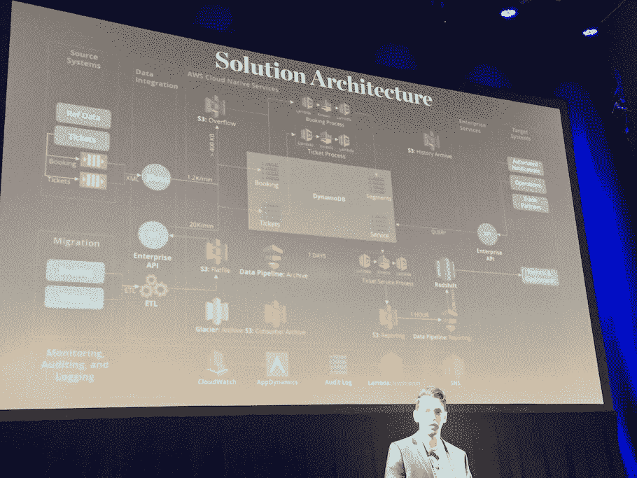

# 美国国家铁路客运公司越过集装箱进入无服务器基础设施

> 原文：<https://thenewstack.io/amtrak-rolls-past-containers-serverless/>

[德勤](https://www2.deloitte.com/us/en.html)云战略和技术顾问加里·阿罗拉 断言:“无服务器充分降低了进入壁垒，因此目前使用裸机或虚拟机的公司可以完全跳过基于容器的架构，直接进入功能即服务和事件驱动的模式。”。

在最近于纽约州举行的无服务器会议上，阿罗拉分享了一个案例研究，在这个案例中，他通过从遗留系统中采用[无服务器](/category/serverless/)来领导美国客运铁路服务公司美国国家铁路客运公司。他说，与一个由(最多)15 名美国国家铁路客运公司员工组成的团队合作，主要数据系统得到了升级，以实现实时仪表盘，整个项目从最初的项目讨论到投产都将在 6 个月内完成。

美国国家铁路客运公司的挑战对任何一个站在佩恩车站，直到火车即将离开前两分钟，还在等待站台通知的人来说都是熟悉的。这种困惑并不仅限于纽约。其他美国国家铁路客运公司铁路枢纽也有类似的陈旧系统，这意味着乘客只在最后一刻才被告知他们需要去哪里登机。

美国国家铁路客运公司的传统数据库可能会在几秒钟到一小时后作出响应，管理网络的分析和商业智能仪表板每天都会刷新，这意味着进入报告的数据总有一天会过时。这影响了美国国家铁路客运公司根据乘客负荷优化列车车厢的能力，无法启动营销活动来出售多余的空位，或协调站台到达和离开。

就像企业中的单片系统(以及快速建立单一代码库的初创公司)的常见情况一样，现有系统被技术债务压得喘不过气来，新功能的评估通常只考虑它们的实施费用，而不是它们能够产生的客户价值，这意味着大多数新功能提案都被拒绝。

随着时间的推移，他们的传统数据库逐渐建立起来，美国国家铁路客运公司也早已失去了唯一的数据来源。数据冗余、缺乏一致性和非标准化的数据存储都是常见问题。

## 采用无服务器技术堆栈

当考虑采用无服务器方法将数据接收和报告纳入当前列车运行实时仪表盘的机会时，首要任务是选择数据库设计和数据库。

美国国家铁路客运公司的团队评估了关系数据库(现有开发人员更熟悉)和 NoSQL，后者虽然需要新的内部专业知识，但被认为更合适，因为它允许灵活的数据模式，因此是经得起未来考验的。但是美国国家铁路客运公司没有选择 NoSQL 典型的均值堆栈模式，而是选择了亚马逊网络服务的 dynamo db NoSQL 服务，而不是 MongoDB 和 Couchbase。

Arora 说，有了这两个决定，现在就有可能为无服务器数据流建立理想的架构:

团队的第一项任务是将数据标准化。“所有数据都进入 DynamoDB，经过 Kinesis 并存储在 RedShift 中，”阿罗拉说。这有助于创建未来数据真实性的单一来源，并且是无服务器迁移中涉及的最大工作组件之一。“数据迁移是一个需要大量重构的庞然大物，”他说。

随着将各种 AWS 组件与 AWS 的无服务器服务 Lambda 一起使用，美国国家铁路客运公司能够实时创建全球预订仪表板。“他们现在能够预测和动态定价模型，可以管理运输需求，并确保供应优化，”阿罗拉说。

向无服务器迁移带来的价值包括:

*   能够每天处理多达 100 万笔交易(峰值速率为每分钟 2，000 笔交易)，并提供近乎实时的报告。
*   降低了维护成本，无需负载平衡或服务器维护，并且能够停用数据库，因为所有数据现在都是通过 DynamoDB 获取的(不过，阿罗拉很快警告说:“仍然需要 [DevOps](/category/devops/) 工作)。
*   通过单一的事实来源、经得起未来考验的数据模式以及通过 JSON RESTful 服务轻松输入数据，提高了数据的准确性。

尽管有这些好处，但 Arora 也很快指出了无服务器的局限性，必须了解这些局限性，以确保任何迁移的期望值不会过高:

*   如果调用时函数执行不成功，有一个指数后退算法用于重试，这样函数将在两秒内重试，如果仍然不起作用，它将在四秒内重试，然后八秒，以此类推。
*   重要的是，对于此类物联网后端类型用例，使用 lambdas 的身份和访问管理与现有的 IAM 安全策略相分离，因此，尽管在任何概念证明中使用 god 模式可能是有用的，但在任何生产用例中明确定义 IAM 角色以确保架构的安全性是至关重要的。

对于寻求实施类似解决方案的企业领导者，Arora 表示，需要做出的最重要的努力是鼓励企业利益相关者改变思维模式，他们通常不愿意并谨慎对待可能需要的潜在资本投资。Arora 建议从小处着手，构建“原型堆”,以展示迁移可以创造的价值。

只要有可能，无服务器架构应该尽可能重用和集成现有工具。在美国国家铁路客运公司的案例中，这意味着利用运输提供商的微服务引擎和他们现有的 BI 工具( [Tableau](https://www.tableau.com/) )来构建仪表板。

虽然不适合企业内长期运行的复杂计算任务，或者在计算期间需要大量 RAM 的情况下，但 Arora 敦促企业考虑无服务器机会，特别是对于 web 应用程序、移动和物联网后端项目以及实时分析和数据处理。

特征图像:美国国家铁路客运公司。

<svg xmlns:xlink="http://www.w3.org/1999/xlink" viewBox="0 0 68 31" version="1.1"><title>Group</title> <desc>Created with Sketch.</desc></svg>